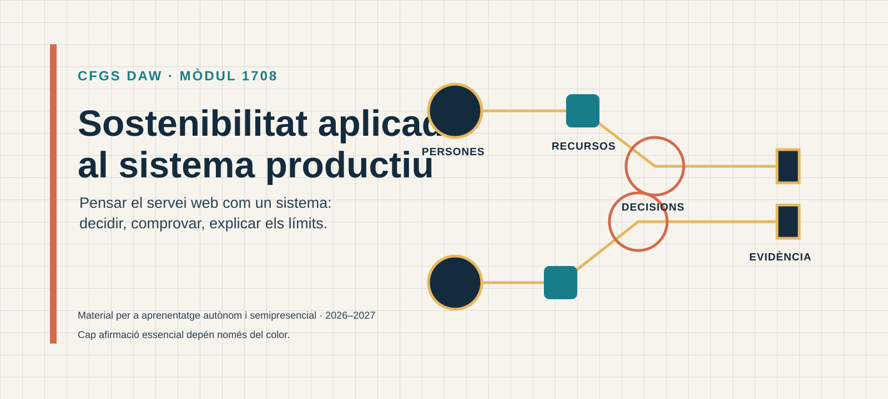
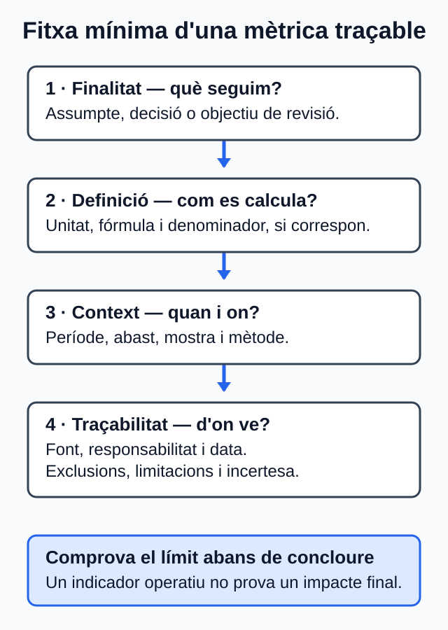
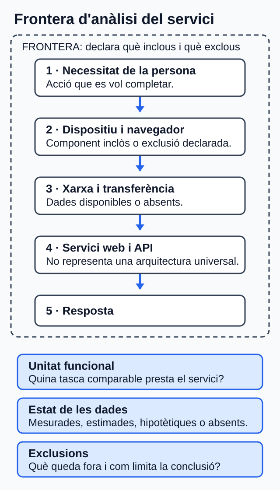
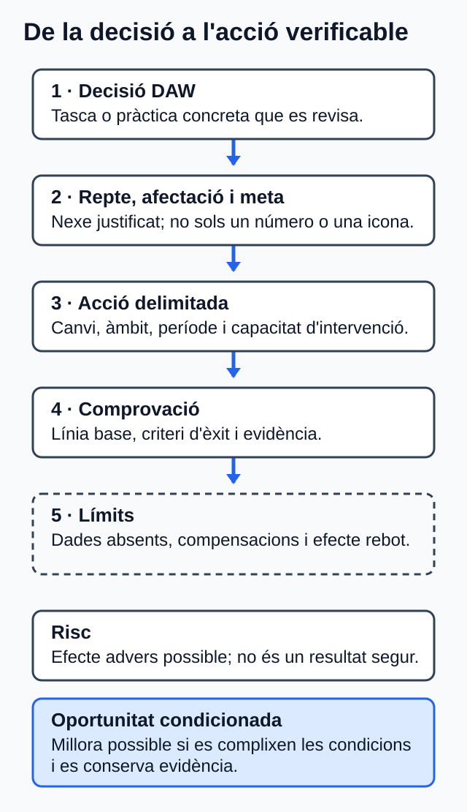
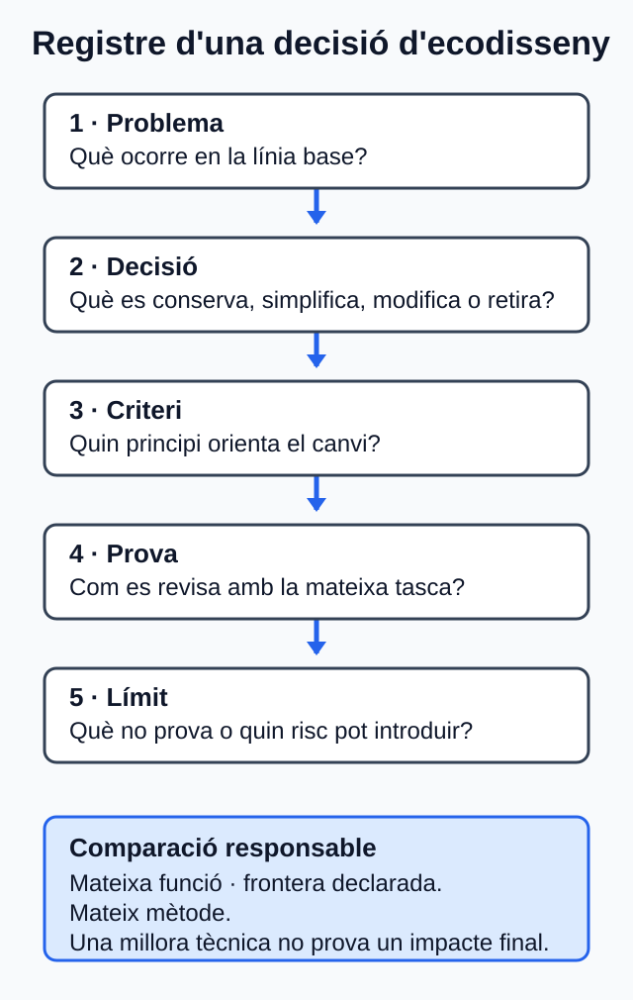
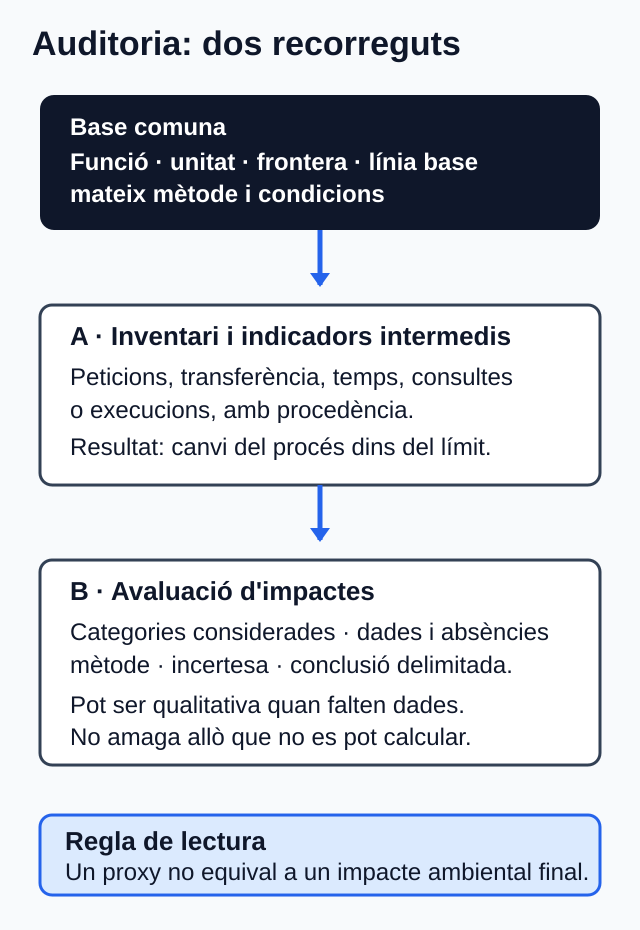
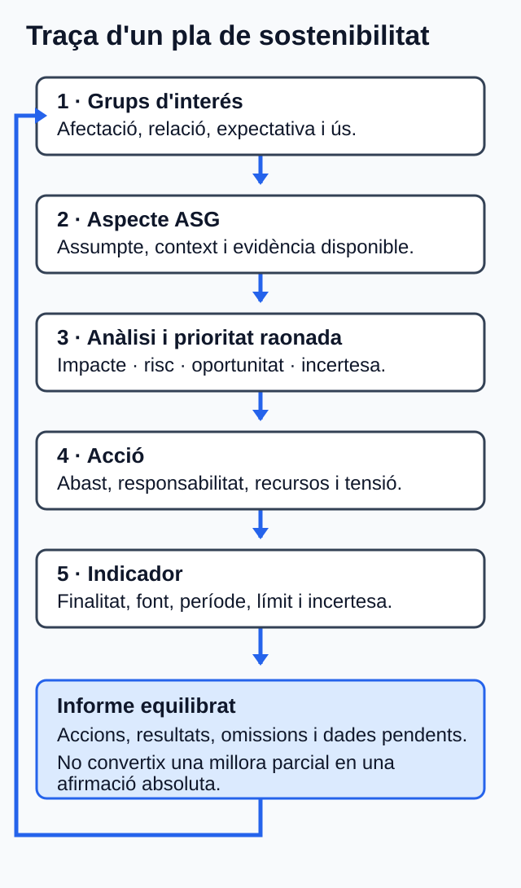

# Sostenibilitat aplicada al sistema productiu

Material d'aprenentatge del mòdul 1708 per a segon de CFGS Desenvolupament
d'Aplicacions Web, curs 2026-2027. El recorregut està pensat perquè pugues
avançar de manera autònoma entre les tutories.

*Portada de la publicació. Il·lustració original, equip de disseny del projecte, CC0 1.0.*

> **Comença per una unitat.** Cada pàgina presenta primer el propòsit, l'itinerari
> i l'activitat; els detalls curriculars i les referències completes es mantenen
> disponibles al final en seccions desplegables.

## Les sis unitats

## Itinerari del curs

- **1a avaluació**
- **[U01 · La sostenibilitat en les organitzacions](unitats/u01.md)** · 6 h · RA1
- **[U02 · Reptes ambientals i socials](unitats/u02.md)** · 6 h · RA2
- **[U03 · Els ODS en l'acompliment professional i personal](unitats/u03.md)** · 6 h · RA3
- **2a avaluació**
- **[U04 · Economia verda i circular](unitats/u04.md)** · 6 h · RA4
- **[U05 · Activitats sostenibles i medi ambient](unitats/u05.md)** · 5 h · RA5
- **3a avaluació**
- **[U06 · El pla de sostenibilitat](unitats/u06.md)** · 5 h · RA6

La planificació prevista suma **34 h**. Esta càrrega no equival necessàriament a
34 sessions ni fixa dates: consulta els avisos d'Aules per conéixer el calendari
i els terminis concrets.

En cada unitat trobaràs primer el propòsit, l'itinerari i el temps orientatiu;
després, les idees clau, el cas guiat, l'activitat i l'autoavaluació. Un avís
visible indica quan el material d'origen està en esborrany o pendent d'auditoria.

## Abans de començar

Consulta la [guia del mòdul](guia-modul.md) i l'[itinerari i la càrrega
orientativa](curs/itinerari.md) per situar les unitats. Els materials, activitats
i avisos es publicaran en Aules. Les dades de calendari, tutories i qualificació
aplicables seran les que comunique el centre.

La informació sobre resultats d'aprenentatge, criteris, planificació, estats i
traçabilitat està disponible a [Informació curricular i traçabilitat](curs/matriu-curricular.md).
