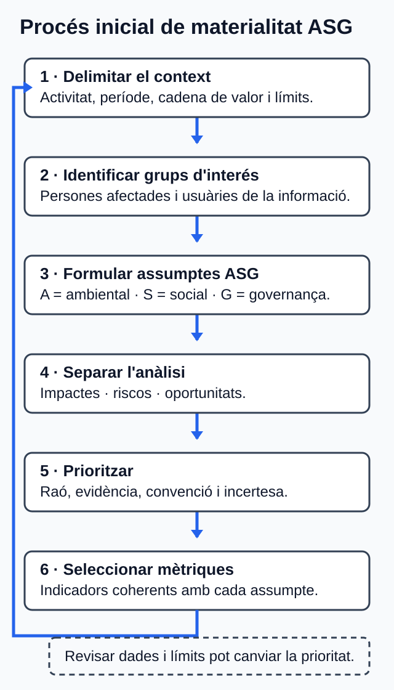

<!-- Fitxer generat per scripts/sincronitza_mkdocs.py; no l'edites manualment. -->

# U01. La sostenibilitat en les organitzacions

## Com treballar esta unitat

<strong>Primer, orienta't; després, practica.</strong>
No cal memoritzar els detalls abans de saber quin producte elaboraràs.

1. **Orientació.** Consulta el propòsit, els prerequisits i el temps orientatiu.
2. **Idees clau.** Llig els blocs de contingut i contrasta'ls amb el cas guiat.
3. **Acció.** Revisa l'activitat i els criteris d'èxit abans de començar el producte.
4. **Comprovació.** Respon l'autoavaluació i obri el solucionari després.

!!! tip "Per a avançar:"
    conserva els dubtes i usa la proposta de tutoria o el treball
    autònom equivalent. El canal docent concret l'ha de confirmar el centre.

La informació curricular, la traçabilitat i les referències completes es pot
consultar al final de la pàgina en seccions desplegables.

!!! note "Idees clau per començar"
    Este resum procedeix literalment del material de la unitat; el desenrotllament complet apareix més avall.

## :material-text-box-check-outline: Resum

- La sostenibilitat integra decisions i impactes ambientals, socials i de
  governança amb una perspectiva intergeneracional.
- Els marcs internacionals tenen naturaleses diferents: informe, resolució,
  tractat, principis o orientacions. No tots creen obligacions empresarials.
- Els ODS s'han de vincular amb metes i efectes concrets; no són una
  certificació.
- Els assumptes ASG d'una empresa web inclouen energia i dades,
  accessibilitat, privacitat, treball, cadena de subministrament i qualitat de
  les afirmacions.
- Materialitat d'impacte i materialitat financera són perspectives distintes;
  la doble materialitat integra les dos sense sumar puntuacions mecànicament.
- Una mètrica útil declara unitat, període, abast, font, mètode, denominador i
  limitacions. MB, kWh o una puntuació no proven per si sols sostenibilitat.
- ESRS, VSME, GRI, IFRS/SASB, GHG Protocol, WCAG i WSG tenen funcions i
  caràcters diferents.
- Inversors, analistes, agències i índexs poden impulsar informació i decisions
  ASG, però les seues puntuacions o seleccions no són certificacions integrals.

Referències completes i fonts

### Referències

Les etiquetes E01-E28 conserven els identificadors del dossier documental. Totes
les fonts es van consultar el **30 de juliol de 2026**.

- **E01.** Consell de la Generalitat Valenciana. *Decret 114/2025, de 29 de
  juliol*; DOGV-V-2025-29742. Annex IX, pp. 118-119.
  https://dogv.gva.es/datos/2025/08/04/pdf/2025_29742_va.pdf
- **E02.** Govern d'Espanya; Ministeri d'Educació i Formació Professional.
  *Reial decret 659/2023, de 18 de juliol*; BOE-A-2023-16889, text consolidat.
  Art. 100 i annex VIII, mòdul 1708.
  https://www.boe.es/eli/es/rd/2023/07/18/659/con
- **E03.** Comissió Mundial sobre Medi Ambient i Desenrotllament; Nacions
  Unides. *Our Common Future*, A/42/427, 04.08.1987. Annex, cap. 2, §1 i §15.
  https://digitallibrary.un.org/record/139811/files/A_42_427-EN.pdf
- **E04.** Assemblea General de les Nacions Unides. Resolució A/RES/70/1,
  *Transforming our world: the 2030 Agenda for Sustainable Development*,
  25.09.2015. Preàmbul; §§18 i 55; pp. 14-28.
  https://documents.un.org/doc/undoc/gen/n15/291/89/pdf/n1529189.pdf
- **E05.** Conferència de les Parts de la Convenció Marc de les Nacions Unides
  sobre el Canvi Climàtic. *Acord de París*, adoptat el 12.12.2015. Annex de la
  decisió 1/CP.21, arts. 2.1(a), 4.1 i 4.2.
  https://unfccc.int/documents/9097
- **E06.** United Nations Global Compact. *The Ten Principles of the UN Global
  Compact*. Principis 1-10.
  https://unglobalcompact.org/what-is-gc/mission/principles
- **E07.** Oficina de l'Alt Comissionat de les Nacions Unides per als Drets
  Humans. *Guiding Principles on Business and Human Rights*, HR/PUB/11/04,
  2011. Principis 11-24, pp. 13-26.
  https://www.ohchr.org/sites/default/files/documents/publications/guidingprinciplesbusinesshr_en.pdf
- **E08.** Organització Internacional del Treball. *ILO Declaration on
  Fundamental Principles and Rights at Work* (1998), esmenada en 2022. Apartat
  2, pp. 7-8.
  https://www.ilo.org/sites/default/files/wcmsp5/groups/public/@ed_norm/@declaration/documents/normativeinstrument/wcms_716594.pdf
- **E09.** Comissió Europea. Reglament delegat (UE) 2023/2772, de 31.07.2023.
  Annex I: ESRS 1, §§3.1-3.6 i AR 16; ESRS 2, SBM-2 i IRO-1.
  https://eur-lex.europa.eu/eli/reg_del/2023/2772/oj/eng
- **E10.** Parlament Europeu i Consell. Directiva (UE) 2022/2464, de
  14.12.2022, sobre informació corporativa en matèria de sostenibilitat. Arts. 1
  i 5. https://eur-lex.europa.eu/eli/dir/2022/2464/oj/eng
- **E11.** Parlament Europeu i Consell. Directiva (UE) 2025/794, de 14.04.2025,
  «stop-the-clock». Art. 1.
  https://eur-lex.europa.eu/eli/dir/2025/794/oj/eng
- **E12.** Comissió Europea. Recomanació (UE) 2025/1710, de 30.07.2025, sobre
  l'estàndard voluntari d'informació de sostenibilitat per a pimes. Annex I,
  mòdul bàsic B1-B11.
  https://eur-lex.europa.eu/eli/reco/2025/1710/oj/eng
- **E13.** Global Sustainability Standards Board; Global Reporting Initiative.
  *GRI 3: Material Topics 2021*. Seccions 1-3, pp. 8-15.
  https://www.globalreporting.org/pdf.ashx?id=12453
- **E14.** International Sustainability Standards Board; IFRS Foundation.
  *IFRS S1 General Requirements for Disclosure of Sustainability-related
  Financial Information*, emés el 26.06.2023. Objectiu, fluxos d'efectiu,
  finançament, cost de capital i àrees de divulgació; pàgina oficial «About» i
  «Standard history».
  https://www.ifrs.org/content/ifrs/home/issued-standards/ifrs-sustainability-standards-navigator/ifrs-s1-general-requirements.html
- **E15.** International Sustainability Standards Board; IFRS Foundation.
  *SASB Standard: Software & IT Services* (`TC-SI`), edició de desembre de
  2023. Pp. 3-4: `TC-SI-130a`, `TC-SI-220a`, `TC-SI-230a`, `TC-SI-330a`,
  `TC-SI-520a` i `TC-SI-550a`.
  https://www.ifrs.org/content/ifrs/home/issued-standards/sasb-standards.html
  https://navigator.sasb.ifrs.org/sector/TC/industry/TC-SI
  https://d3flraxduht3gu.cloudfront.net/latest_standards/software-and-it-services-standard_en-gb.pdf
- **E16.** W3C Sustainable Web Interest Group. *Web Sustainability Guidelines
  (WSG)*, W3C Group Note Draft, 29.07.2026. §§1.3-1.4 i directrius citades.
  https://www.w3.org/TR/2026/DNOTE-web-sustainability-guidelines-20260729/
- **E17.** World Wide Web Consortium. *Web Content Accessibility Guidelines
  (WCAG) 2.2*, Recomanació, 12.12.2024. §§5.1-5.3 i criteris d'èxit.
  https://www.w3.org/TR/2024/REC-WCAG22-20241212/
- **E18.** Parlament Europeu i Consell. Reglament (UE) 2016/679, de 27.04.2016
  (RGPD). Arts. 2-5, 12.3, 25 i 32-35.
  https://eur-lex.europa.eu/eli/reg/2016/679/oj/eng
- **E19.** Organització per a la Cooperació i el Desenrotllament Econòmics.
  *OECD Guidelines for Multinational Enterprises on Responsible Business
  Conduct*, 08.06.2023. Cap. II, A.10-A.15; cap. IV-IX.
  https://www.oecd.org/content/dam/oecd/en/publications/reports/2023/06/oecd-guidelines-for-multinational-enterprises-on-responsible-business-conduct_a0b49990/81f92357-en.pdf
- **E20.** World Resources Institute i World Business Council for Sustainable
  Development. *The Greenhouse Gas Protocol: A Corporate Accounting and
  Reporting Standard*, edició revisada, 2004. Caps. 3-8.
  https://ghgprotocol.org/sites/default/files/standards/ghg-protocol-revised.pdf
- **E21.** Parlament Europeu i Consell. Directiva (UE) 2024/825, de 28.02.2024,
  per a empoderar els consumidors per a la transició ecològica. Arts. 1 i 4.
  https://eur-lex.europa.eu/eli/dir/2024/825/oj/eng
- **E22.** Principles for Responsible Investment. *What are the Principles for
  Responsible Investment?* Principis 1-6.
  https://www.unpri.org/about-us/what-are-the-principles-for-responsible-investment
- **E23.** Parlament Europeu i Consell. Reglament (UE) 2019/2088, de 27.11.2019,
  sobre divulgació d'informació relativa a la sostenibilitat en els servicis
  financers. Arts. 2.1, 2.17 i 3-9.
  https://eur-lex.europa.eu/eli/reg/2019/2088/oj/eng
- **E24.** Parlament Europeu i Consell. Reglament (UE) 2024/3005, de 27.11.2024,
  sobre transparència i integritat de les activitats de qualificació ASG. Arts.
  1-5, 15-25 i 49.
  https://eur-lex.europa.eu/eli/reg/2024/3005/oj/eng
- **E25.** Parlament Europeu i Consell. Reglament (UE) 2016/1011, de 08.06.2016,
  art. 3.1, punts 1 i 3; modificat pel Reglament (UE) 2019/2089, de 27.11.2019,
  art. 1. https://eur-lex.europa.eu/eli/reg/2016/1011/oj/eng i
  https://eur-lex.europa.eu/eli/reg/2019/2089/oj/eng
- **E26.** Parlament Europeu i Consell. Reglament (UE) 2020/852, de 18.06.2020,
  relatiu al marc per a facilitar les inversions sostenibles. Arts. 1, 3, 9, 17
  i 18. https://eur-lex.europa.eu/eli/reg/2020/852/oj/eng
- **E27.** Consell de la Generalitat Valenciana. *Decret 95/2026, de 19 de
  juny*; DOGV-V-2026-21170. Disposició final primera; annex IV, p. 97.
  https://dogv.gva.es/datos/2026/06/25/pdf/2026_21170_va.pdf
- **E28.** Vicepresidència Segona i Conselleria de Presidència. *Correcció
  d'errades del Decret 95/2026*; DOGV-V-2026-22324, 29.06.2026.
  https://dogv.gva.es/datos/2026/06/29/pdf/2026_22324_va.pdf

Glossari de consulta

### Glossari

| Terme | Definició |
| --- | --- |
| ASG | Aspectes ambientals, socials i de governança vinculats amb impactes, riscos i oportunitats [E01, E09]. |
| Blanqueig ecològic | Comunicació que fa creure que una entitat protegix més el medi ambient del que realment fa [E16, E21]. |
| Desenrotllament sostenible | Desenrotllament que satisfà necessitats presents sense comprometre la capacitat de les generacions futures [E03]. |
| Doble materialitat | Consideració conjunta de la materialitat d'impacte i financera; un assumpte pot ser material des d'una perspectiva o de les dos [E09]. |
| Grup d'interés | Persona o grup que pot afectar l'organització o veure's afectat per les seues activitats [E09]. |
| Impacte | Efecte positiu o negatiu, real o potencial, sobre persones o medi ambient, també en la cadena de valor [E09, E13]. |
| Índex de referència | Índex usat per determinar imports, valor, rendiment o assignació d'actius [E25]. |
| Inversió responsable | Incorporació d'assumptes ASG a l'anàlisi, la decisió i la propietat activa [E22]. |
| Materialitat d'impacte | Rellevància basada en els impactes reals o potencials sobre persones o medi ambient [E09]. |
| Materialitat financera | Rellevància de riscos o oportunitats que poden afectar l'organització o el seu accés al finançament [E09, E14]. |
| Mètrica o indicador | Mesura qualitativa o quantitativa usada per a seguir acompliment, impactes, riscos, oportunitats o objectius [E09, E12-E16]. |
| ODS | Els 17 Objectius de Desenrotllament Sostenible i les 169 metes de l'Agenda 2030 [E04]. |
| Oportunitat de sostenibilitat | Condició ASG que pot generar efectes positius per a l'organització [E09, E14]. |
| Qualificació ASG | Opinió o puntuació sobre un perfil, característiques, riscos o impactes ASG segons una metodologia [E24]. |
| Rendició de comptes | Divulgació traçable de polítiques, accions, mètriques, objectius, límits i resultats [E09-E14]. |
| Risc de sostenibilitat | Condició ASG que pot produir un efecte material negatiu sobre l'organització o una inversió [E09, E23]. |

Solucionari raonat (obri'l després de respondre)

### Solucionari raonat

1. **Perquè velocitat i sostenibilitat no són equivalents.** La velocitat o la
   transferència poden ser indicadors operatius. Per a concloure una reducció
   d'impacte calen límits, activitat, factors, mètode i incertesa, i encara cal
   considerar les dimensions social i de governança [E16, E20].
2. **Opció b.** L'Agenda 2030 conté 17 ODS i 169 metes integrades i indivisibles.
   No certifica empreses ni prescriu una conversió universal per a webs [E04].
3. **Pot travessar les dos.** És social perquè afecta drets de les persones i de
   governança perquè implica finalitat, minimització, conservació, seguretat i
   responsabilitats sobre les dades [E09, E18].
4. **Exemple vàlid:** «La barrera pot excloure persones que naveguen amb teclat;
   s'avaluarà i corregirà el flux, es documentaran criteris, mostra i mètode, i
   es relacionarà amb la meta 10.2 sobre inclusió». Cal afegir que una prova
   automàtica no demostra conformitat completa [E04, E17].
5. **Fals.** En ESRS, un assumpte pot ser material des de la perspectiva
   d'impacte, la financera o les dos. La doble materialitat no és una suma
   mecànica [E09].
6. **Falten el model i els límits de conversió.** La mida d'una pàgina no equival
   directament a emissions. Caldrien, com a mínim, escenari d'ús, activitat,
   infraestructura, energia, geografia, període, factors, abasts, metodologia i
   incertesa [E16, E20].
7. **Opció c.** VSME és voluntari per a pimes no cotitzades i WSG, en la versió
   citada, és un esborrany de nota de grup. ESRS s'aplica segons l'àmbit i el
   calendari normatiu corresponent [E09-E12, E16].
8. **Resposta esperada:** una qualificació ASG és una opinió o puntuació basada
   en una metodologia; un índex és una xifra calculada regularment i pot ser de
   referència segons l'ús; la taxonomia UE classifica activitats econòmiques
   ambientalment sostenibles sota criteris jurídics. Cap dels tres certifica la
   sostenibilitat integral de tota l'empresa [E24-E26].

Si una resposta no coincidix literalment però manté estes distincions, aporta
una justificació traçable i declara els límits, pot considerar-se raonada.

Informació curricular i traçabilitat

### Orientació

### Propòsit i producte final

En esta unitat aprendràs a interpretar la sostenibilitat des de les dimensions
ambiental, social i de governança (ASG) en una empresa que dissenya, allotja i
manté aplicacions web. El producte final serà una **fitxa inicial de
materialitat**: un document breu que relaciona assumptes ASG, grups d'interés,
impactes, riscos, oportunitats, ODS i mètriques.

La fitxa és una primera anàlisi, no un informe de sostenibilitat complet ni un
dictamen jurídic. Tampoc permet afirmar que una empresa o una tecnologia és
«sostenible» sense delimitar l'activitat, les dades, el mètode i les
limitacions.

### Prerequisits

No necessites coneixements especialitzats de sostenibilitat. Només cal que
pugues:

- interpretar un cas breu d'una empresa de desenrotllament web;
- distingir una dada aportada d'una hipòtesi;
- redactar justificacions breus i organitzar informació en una taula o en una
  llista amb encapçalaments.

### Itinerari i temps estimat

Les sis hores són una estimació de treball, no sis sessions ni sis dates. La
distribució concreta de calendari i presencialitat depén del centre.

| Bloc | Què faràs | Temps |
| --- | --- | ---: |
| Orientació | Revisaràs el propòsit, els CA i la ruta de treball. | 10 min |
| 1. Sostenibilitat i marcs | Distingiràs el concepte i la naturalesa dels marcs internacionals. | 25 min |
| 2. ASG i ODS en DAW | Classificaràs assumptes i els relacionaràs amb metes dels ODS. | 30 min |
| 3. Grups d'interés i materialitat | Analitzaràs impactes, riscos, oportunitats i prioritats. | 35 min |
| 4. Estàndards i mètriques | Seleccionaràs referències i indicadors amb límits explícits. | 30 min |
| 5. Inversió responsable | Diferenciaràs el paper dels actors financers. | 20 min |
| Cas guiat | Estudiaràs una fitxa de materialitat resolta. | 30 min |
| Activitat asíncrona | Elaboraràs una fitxa breu i en revisaràs l'alineació amb els criteris. | 1 h 30 min |
| Autoavaluació | Comprovaràs les respostes amb el solucionari raonat. | 30 min |
| Tutoria o alternativa autònoma | Contrastaràs decisions o aplicaràs la pauta equivalent. | 1 h |
| **Total orientatiu** | **Estudi, activitat, autoavaluació i suport.** | **6 h** |

En el conjunt del mòdul, les xifres documentals no són equivalents: 30 hores
corresponen al currículum bàsic estatal, 32 a l'annex curricular valencià i 34
a la seqüenciació valenciana específica de DAW. Per a planificar DAW s'usen 34
hores, de les quals coordinació n'ha assignat sis a esta unitat [E01, E02, E27,
E28].

### Com treballar de manera autònoma

1. Llig els blocs conceptuals en ordre i resol les preguntes breus sense buscar
   informació externa.
2. Compara les teues decisions amb el cas guiat.
3. Fes l'activitat asíncrona amb la plantilla estructural indicada.
4. Usa la llista de criteris d'èxit per a revisar el lliurament.
5. Completa l'autoavaluació i consulta després el solucionari.
6. Anota els dubtes que canvien una decisió de la fitxa en l'apartat «Registre
   de dubtes». Conserva'ls en el mateix fitxer de treball per a poder-los
   contrastar en la tutoria col·lectiva o quan el centre comunique el canal de
   consultes.

No cal cap recurs audiovisual ni interactiu. Tot el contingut necessari està en
format textual. Les taules es poden substituir per llistes amb els mateixos
encapçalaments, i cap instrucció depén exclusivament del color.

### Resultats i criteris treballats

El resultat d'aprenentatge prescriptiu és **RA1**: «Identifica els aspectes
ambientals, socials i de governança (ASG) relatius a la sostenibilitat tenint en
compte el concepte de desenrotllament sostenible i els marcs internacionals que
contribuïxen a aconseguir-los» [E01].

| CA | Evidència que produiràs |
| --- | --- |
| RA1.a | Definició de sostenibilitat i identificació de la naturalesa i funció dels marcs internacionals. |
| RA1.b | Classificació argumentada d'assumptes ambientals, socials i de governança d'una empresa web. |
| RA1.c | Relació justificada entre assumptes DAW, ODS i metes de l'Agenda 2030. |
| RA1.d | Priorització d'assumptes per a grups d'interés, amb impactes, riscos, oportunitats i límits. |
| RA1.e | Proposta de mètriques reproduïbles i explicació del seu paper en la rendició de comptes. |
| RA1.f | Explicació de la inversió responsable i del paper d'inversors, analistes, agències i índexs. |

### Mapa de traçabilitat

| CA | Secció explicativa | Activitat o evidència | Fonts del dossier |
| --- | --- | --- | --- |
| RA1.a | 1. Sostenibilitat i marcs internacionals | Activitat, passos 1 i 8; cas, 6.2 | E01, E03-E08 |
| RA1.b | 2.1. Què significa ASG | Activitat, passos 2 i 8; cas, 6.3 | E01, E06-E09, E12, E15-E20 |
| RA1.c | 2.2. De l'assumpte a la meta ODS | Activitat, passos 3 i 8; cas, 6.2 | E01, E04 |
| RA1.d | 3. Grups d'interés i materialitat | Activitat, passos 4 i 8; cas, 6.3 | E01, E09, E13-E16, E19 |
| RA1.e | 4. Estàndards, mètriques i rendició de comptes | Activitat, passos 5, 6 i 8; cas, 6.4 | E01, E09-E20 |
| RA1.f | 5. Inversió responsable i actors | Activitat, passos 7 i 8; cas, 6.5 | E01, E14, E15, E22-E26 |

## 1. Sostenibilitat i marcs internacionals

### 1.1. Desenrotllament sostenible i sostenibilitat

La formulació clàssica de **desenrotllament sostenible** planteja satisfer les
necessitats presents sense comprometre la capacitat de les generacions futures
de satisfer les seues. El mateix informe assenyala que les decisions han
d'integrar medi ambient i economia [E03].

En esta unitat, **sostenibilitat** és la capacitat d'orientar les decisions i
els impactes ambientals, socials i de governança de manera compatible amb eixe
desenrotllament. Per tant, no equival només a reduir emissions, reciclar o
accelerar una web [E01, E03, E09].

En DAW, una mateixa decisió pot tindre efectes diferents. Comprimir imatges pot
reduir dades transferides, però esta millora operativa no demostra per si sola
una reducció d'emissions ni la sostenibilitat integral del servici. Per a fer
eixa afirmació caldrien límits del sistema, dades d'activitat, factors,
metodologia i incertesa [E16, E20].

### 1.2. No tots els marcs tenen la mateixa naturalesa

Un **marc** ajuda a orientar objectius, principis, decisions o informació, però
el seu efecte depén de la naturalesa documental i de l'àmbit d'aplicació.

| Marc | Naturalesa i funció | Precaució d'ús en una empresa web |
| --- | --- | --- |
| *Our Common Future* | Informe de Nacions Unides que formula el desenrotllament sostenible. | No és una llei empresarial [E03]. |
| Agenda 2030 | Resolució amb 17 ODS i 169 metes, integrades i indivisibles. | Cal arribar a una meta concreta; mostrar un logotip no prova contribució [E04]. |
| Acord de París | Tractat entre parts amb un objectiu de temperatura i contribucions estatals. | No fixa per si sol una mètrica concreta per a l'empresa fictícia [E05]. |
| Pacte Mundial | Iniciativa voluntària de deu principis sobre drets humans, treball, medi ambient i anticorrupció. | Adhesió no significa certificació ni prova de compliment [E06]. |
| Principis rectors sobre empreses i drets humans | Marc sobre respecte dels drets humans i diligència deguda. | Una política no prova l'absència d'impactes [E07]. |
| Declaració de l'OIT | Principis i drets fonamentals en el treball. | Inclou llibertat sindical, eliminació del treball forçós i infantil, no-discriminació i entorn segur i saludable [E08]. |

**Comprovació breu.** Si una empresa diu «complim l'Agenda 2030 perquè la web
mostra tres logotips ODS», la conclusió no és vàlida. Hauria d'identificar les
metes, explicar la relació causal, mesurar l'acció i declarar els límits [E04].

## 2. Assumptes ASG i ODS en una empresa DAW

### 2.1. Què significa ASG

**ASG** designa aspectes ambientals, socials i de governança vinculats amb
impactes, riscos i oportunitats. La classificació ajuda a ordenar l'anàlisi,
però les dimensions poden solapar-se [E01, E09].

| Dimensió | Pregunta orientadora | Assumptes possibles en DAW |
| --- | --- | --- |
| Ambiental | Com afecta l'activitat el medi ambient i els recursos? | Energia d'oficina, equips i infraestructura; emissions amb límits; aigua quan hi haja dades; compra i final de vida d'equips; transferència de dades com a indicador operatiu [E09, E12, E15, E16, E20]. |
| Social | Com afecta les persones i els seus drets? | Accessibilitat, inclusió, privacitat, seguretat, condicions de treball, diversitat, formació, salut i drets en proveïdors [E07-E09, E12, E15, E17-E19]. |
| Governança | Com es dirigixen, controlen i expliquen les decisions? | Responsabilitats, ètica, anticorrupció, polítiques de dades, diligència sobre proveïdors, continuïtat, control d'afirmacions i traçabilitat de la informació [E06, E09, E12, E16, E19, E21]. |

Una qüestió no sempre cap en una sola columna. La privacitat és un impacte
social sobre les persones i també una qüestió de governança de dades. Triar un
proveïdor de núvol pot afectar energia i aigua, drets en la cadena de
subministrament, seguretat i continuïtat del servici [E09, E16, E18, E19].

### 2.2. De l'assumpte a la meta ODS

Els ODS formen un sistema de 17 objectius i 169 metes. No són una llista de
mètriques empresarials ni una certificació [E04]. Una relació útil seguix esta
cadena:

1. **Assumpte concret:** per exemple, barreres d'accés al procés de compra.
2. **Acció o efecte esperat:** avaluar i corregir barreres d'accessibilitat.
3. **Meta ODS vinculada:** per exemple, meta 10.2 sobre inclusió.
4. **Evidència:** criteris avaluats, mostra, mètode, data i resultat.
5. **Límit:** la conformitat tècnica no garantix satisfer totes les necessitats
   de totes les persones [E04, E17].

| Assumpte DAW | Metes que es poden investigar | Justificació mínima necessària |
| --- | --- | --- |
| Eficiència d'infraestructura i dades | 7.3, sobre eficiència energètica. | Explicar l'acció, l'efecte esperat i com es mesura; no equiparar MB amb CO2e [E04, E16, E20]. |
| Treball i condicions laborals | 8.5, sobre treball decent. | Identificar persones afectades, pràctica laboral i evidència [E04, E08]. |
| Accés i inclusió en el servici web | 10.2, sobre inclusió. | Delimitar persones, servici, barrera, acció i evidència [E04, E17]. |
| Ús de recursos i pràctiques d'informació de sostenibilitat | 12.2 i 12.6. | Relacionar l'ús eficient de recursos o l'adopció de pràctiques i informació de sostenibilitat amb una actuació verificable [E04]. |

Les metes 9.c, 13.2, 16.6 i 17.16 no s'usen en esta fitxa com a etiquetes
empresarials genèriques. Respectivament, es referixen a l'accés a Internet en
països menys avançats amb horitzó 2020, a la planificació nacional de mesures
climàtiques, a institucions i a l'Aliança Mundial amb aliances de múltiples
parts. El cas no aporta les dades necessàries per a establir eixes relacions
[E04].

## 3. Grups d'interés, materialitat, impactes, riscos i oportunitats

### 3.1. Conceptes que no s'han de confondre

Un **grup d'interés** és una persona o un grup que pot afectar l'organització o
veure's afectat per les seues activitats. ESRS distingix els grups afectats i
les persones usuàries de la informació de sostenibilitat; també permet
considerar la naturalesa com un grup silenciós [E09].

Un **impacte** és un efecte positiu o negatiu, real o potencial, sobre les
persones o el medi ambient, inclosa la cadena de valor. Un **risc de
sostenibilitat** és una condició ASG que pot perjudicar l'organització. Una
**oportunitat de sostenibilitat** pot afavorir-la. L'impacte sobre el món i
l'efecte financer sobre l'empresa estan relacionats, però no són el mateix
[E09, E13, E14].

La **materialitat** servix per a decidir quins assumptes requerixen atenció i
informació. Hi ha dos perspectives:

- **materialitat d'impacte:** rellevància dels impactes reals o potencials de
  l'organització sobre persones o medi ambient;
- **materialitat financera:** rellevància de riscos o oportunitats que podrien
  afectar el desenrotllament, la posició, el rendiment, els fluxos d'efectiu,
  l'accés al finançament o el cost de capital.

La **doble materialitat** considera material un assumpte des de la perspectiva
d'impacte, la financera o les dos. No consistix a sumar mecànicament dos notes
[E09, E14]. GRI prioritza els impactes; IFRS S1 i SASB se centren en riscos i
oportunitats útils per a inversors; ESRS integra les dos perspectives [E09,
E13-E15].

### 3.2. Procés inicial de materialitat

1. Delimita l'activitat, el període i la cadena de valor que estudiaràs.
2. Identifica grups afectats i persones usuàries de la informació.
3. Formula els impactes amb causa, persona o entorn afectat i evidència.
4. Deriva, sense confondre'ls, riscos i oportunitats per a l'organització.
5. Valora la significació de l'impacte i, si és potencial, la probabilitat.
6. Prioritza amb una convenció declarada i registra dades absents.
7. Selecciona indicadors coherents amb cada assumpte prioritari.

Les fonts no establixen una escala universal per a esta fitxa inicial. Usar
«prioritat immediata», «anàlisi següent» i «seguiment» és una **convenció
didàctica**, no un llindar legal [E09, E13].

!!! note "Figura 1. Esquema textual del procés:"
    context → grups d'interés →
    impactes → riscos i oportunitats → priorització → mètriques → revisió.

    **Text alternatiu proposat:** Seqüència de set passos. Primer es delimita el
    context; després s'identifiquen els grups d'interés i els impactes; a
    continuació es distingixen riscos i oportunitats, es prioritzen els assumptes,
    se seleccionen mètriques i, finalment, es revisen les dades i els límits.

*Figura. Seqüència de treball per passar del context a mètriques revisables; la llista numerada adjacent n'és l'alternativa textual. Il·lustració original, equip de disseny del projecte, CC0 1.0.*

La figura repetix la seqüència numerada anterior. No usa color per a codificar
cap informació.

### 3.3. Preguntes útils per grup d'interés

| Grup potencial | Què cal investigar en un cas DAW |
| --- | --- |
| Plantilla i persones col·laboradores | Condicions, igualtat, formació, salut, participació i organització del treball [E08, E09, E12]. |
| Clients i persones usuàries | Accessibilitat, seguretat, continuïtat i informació honesta [E09, E15-E18, E21]. |
| Persones afectades pel tractament de dades | Informació, minimització, seguretat, conservació i control de dades personals [E16, E18]. |
| Proveïdors de núvol, allotjament i maquinari | Energia, aigua, GEH, drets laborals, materials, seguretat, dependència i qualitat de dades [E09, E15, E19, E20]. |
| Propietat, finançadors i inversors | Riscos, oportunitats, governança, continuïtat i qualitat de les mètriques [E09, E14, E15, E22-E26]. |
| Administracions i reguladors competents | Compliment dins de l'àmbit aplicable i informació no enganyosa [E10, E11, E18, E21]. |
| Comunitats i medi ambient | Externalitats, ús de recursos, cadena de subministrament i final de vida [E07, E09, E12, E19, E20]. |

## 4. Estàndards, mètriques i rendició de comptes

### 4.1. Funcions i caràcter dels principals referents

Un estàndard pot orientar què informar, com delimitar un inventari o com
avaluar un aspecte. No tots tenen el mateix objectiu ni la mateixa
obligatorietat.

| Referent | Funció útil per al cas DAW | Caràcter i límit |
| --- | --- | --- |
| ESRS | Doble materialitat, grups d'interés, impactes, riscos i oportunitats. | Normes adoptades per reglament per a empreses dins de l'àmbit CSRD; cal comprovar entitat i calendari [E09-E11]. |
| VSME | Informació proporcional sobre energia, GEH, circularitat, plantilla, salut, formació i governança. | Recomanació voluntària per a pimes no cotitzades; no és CSRD obligatòria [E12]. |
| GRI 3 | Identificar i prioritzar els impactes més significatius sobre economia, medi ambient i persones. | Estàndard voluntari centrat en impactes [E13]. |
| IFRS S1 i SASB | Informació per a inversors; SASB aporta temes sectorials de *Software & IT Services*: infraestructura, privacitat i llibertat d'expressió, seguretat, plantilla, propietat intel·lectual i competència, i disrupcions tecnològiques. | L'obligatorietat depén de l'adopció jurisdiccional i no cobrix tots els impactes [E14, E15]. |
| GHG Protocol | Delimitar inventaris de GEH, any base i abasts 1, 2 i 3. | Requerix dades d'activitat, factors, límits i metodologia [E20]. |
| WCAG 2.2 | Avaluar accessibilitat amb criteris comprovables A, AA i AAA. | Recomanació W3C; combina avaluació automàtica i humana i no cobrix totes les necessitats [E17]. |
| WSG | Orientar pràctiques sobre codi, memòria cau, compressió, dades, allotjament, accessibilitat, privacitat i afirmacions. | La versió citada és un esborrany de nota de grup, no un estàndard W3C ni una norma jurídica [E16]. |

La CSRD regula informació de sostenibilitat per a les empreses dins del seu
àmbit i preveu l'ús d'ESRS. Determinades onades que havien d'informar en 2026 i
2027 es van ajornar dos anys. Sense dades sobre mida, cotització, mercats i
jurisdicció, no es pot afirmar que l'empresa hipotètica estiga obligada [E10,
E11]. Esta cautela és part de la rendició de comptes: cal separar el requisit
legal comprovat de l'ús voluntari d'un estàndard.

### 4.2. Com construir una mètrica reproduïble

Una **mètrica o indicador** és una mesura qualitativa o quantitativa per a
seguir acompliment, impactes, riscos, oportunitats o objectius. Com a mínim, una
fitxa útil registra:

- nom i finalitat de l'indicador;
- unitat i fórmula, si correspon;
- període i abast organitzatiu o tècnic;
- font i responsable de la dada;
- denominador, quan s'use una intensitat o un percentatge;
- mètode, data i condicions de mesura;
- limitacions, exclusions i incertesa [E09, E12-E16, E20].

*Figura. Llista de control per documentar una mètrica amb finalitat, definició, context, procedència i límits. Il·lustració original, equip de disseny del projecte, CC0 1.0.*

| Assumpte | Indicador candidat | Límit que s'ha de declarar |
| --- | --- | --- |
| Energia | kWh en un període, separant oficina, infraestructura pròpia i dada de proveïdor. | No atribuir consum al núvol sense dada o mètode; l'origen renovable requerix base acreditada [E09, E12, E15]. |
| GEH | tCO2e per abast i, si és reproduïble, intensitat amb denominador funcional. | Indicar activitat, factors, any, geografia i evitar doble recompte [E09, E12, E20]. |
| Transferència web | kB, MB o GB per pàgina, flux o transacció; taxa de memòria cau. | Indicar escenari, dispositiu, repeticions i estat de memòria cau; no equival directament a CO2e [E16]. |
| Accessibilitat | Criteris WCAG avaluats i incidències per severitat i abast. | Indicar versió, nivell, mostra, mètode manual i automàtic, data, excepcions i tercers [E17]. |
| Privacitat i seguretat | Violacions confirmades, persones afectades quan es conega, sol·licituds i terminis. | Zero notificacions no prova zero incidents; no exposar dades personals o sensibles [E15, E18]. |
| Plantilla | Persones, percentatges amb denominador, formació i accidents registrables. | Protegir l'anonimat de grups menuts i no inferir dades de proveïdors [E08, E12]. |
| Cadena de subministrament | Nombre i percentatge de proveïdors crítics sotmesos a diligència documentada. | Definir «crític», criteris, evidència i accions; una autodeclaració no prova absència d'impactes [E07, E19]. |
| Governança d'afirmacions | Afirmacions revisades amb font, període, abast, responsable i data. | Una política o etiqueta no acredita resultats; cal evitar afirmacions absolutes [E06, E09, E12, E16, E21]. |

La **rendició de comptes** consistix a divulgar informació traçable sobre
polítiques, accions, mètriques, objectius, límits i resultats davant dels grups
interessats. No consistix a publicar només els èxits o una puntuació agregada
[E09-E14].

### 4.3. Límits de dades que han de quedar visibles

- Els GB transferits, la mida d'una pàgina, el temps de CPU i els kWh no són
  automàticament emissions. Convertir-los a CO2e exigix factors, geografia,
  període, límits i metodologia [E16, E20].
- Una prova automàtica no acredita conformitat WCAG completa; cal declarar
  mostra i avaluació humana [E17].
- Una política de privacitat, de treball o de proveïdors no prova que s'aplique
  ni que haja eliminat els impactes [E07, E18, E19].
- Una qualificació ASG usa una metodologia determinada; no substituïx les dades
  subjacents [E24].
- La informació disponible no permet determinar obligacions de report d'una
  empresa real. Caldrien, entre altres dades, mida, forma, cotització, mercats,
  tractaments i jurisdiccions [E10, E11, E18].
- El marc europeu reforça la protecció davant afirmacions ambientals enganyoses,
  però no s'ha de deduir una obligació nacional concreta sense comprovar la
  transposició i l'àmbit aplicable [E21].

## 5. Inversió responsable i actors relacionats

La **inversió responsable** incorpora assumptes ASG a l'anàlisi, a la decisió
d'inversió i a la propietat activa. Els sis Principis per a la Inversió
Responsable inclouen integració ASG, exercici actiu de la propietat, demanda de
divulgació, promoció, cooperació i informació sobre el progrés. Són voluntaris;
«responsable» no garantix un resultat sostenible [E22].

| Actor o instrument | Paper | Límit d'interpretació |
| --- | --- | --- |
| Inversors i participants financers | Assignen capital, exercixen drets i, quan entren en SFDR, divulguen riscos, incidències adverses i informació de producte. | SFDR és un règim de transparència financera; no etiqueta automàticament una empresa web [E22, E23]. |
| Analistes | Integren informació financera i ASG i contrasten riscos, oportunitats, mètriques i comparabilitat. | Una puntuació no substituïx la metodologia ni l'evidència [E14, E15, E22]. |
| Proveïdors o agències de qualificació ASG | Produïxen opinions o puntuacions sobre perfils, característiques o exposicions ASG. | Poden usar objectius, pesos i dades diferents; no són certificacions generals [E24]. |
| Administradors d'índexs | Calculen índexs i índexs de referència; hi ha referències climàtiques de la UE. | Pertànyer a un índex no prova sostenibilitat integral [E25]. |
| Taxonomia UE | Classifica activitats econòmiques ambientalment sostenibles amb criteris jurídics. | No classifica tota l'empresa ni cobrix per si sola les dimensions social i de governança [E26]. |

El foment de la sostenibilitat pot produir-se quan estos actors demanen dades
comparables, incorporen riscos i impactes a les decisions, exercixen drets o
milloren la transparència. També hi ha riscos: objectius metodològics diferents,
dades incompletes i ús promocional d'una puntuació o d'un índex com si fora una
certificació [E22-E25].

## :material-school-outline: Cas guiat DAW: fitxa inicial de ByteClar

### 6.1. Dades del cas

**ByteClar és una empresa completament fictícia creada per a l'exercici.**
Dissenya, allotja i manté aplicacions web. No disposa de dades verificades sobre
el consum energètic del núvol ni sobre emissions. Mesura la transferència de
dades d'alguns fluxos, però no ha documentat les condicions de prova. Una revisió
automàtica ha detectat possibles barreres d'accessibilitat, encara sense revisió
humana. El servici arreplega dades personals, però el cas no aporta l'inventari
de dades ni els terminis de conservació. La plantilla demana formació i una
millor definició de les responsabilitats en incidències. No hi ha evidència de
diligència sobre proveïdors de maquinari i núvol. Un client proposa anunciar la
seua aplicació com a «100 % verda».

Les dades anteriors són qualitatives i fictícies. No descriuen una empresa real,
el sector ni el centre.

### 6.2. Resolució del marc i els ODS

**Definició operativa.** ByteClar hauria d'orientar les decisions i els impactes
ambientals, socials i de governança de manera compatible amb la satisfacció de
necessitats presents i futures [E03, E09].

**Marcs seleccionats.** L'Agenda 2030 ajuda a vincular accions amb metes;
l'Acord de París contextualitza l'acció climàtica, però no imposa una mètrica a
ByteClar; el Pacte Mundial, els Principis rectors de l'ONU i la Declaració de
l'OIT orienten drets humans, treball, medi ambient i anticorrupció sense
certificar resultats [E04-E08].

**Relacions ODS justificades.** Corregir barreres d'accés es pot relacionar amb
la meta 10.2 si es delimiten persones, fluxos i evidència. Millorar condicions i
formació es pot relacionar amb la meta 8.5. Mesurar i millorar l'eficiència
energètica, amb dades vàlides, es pot investigar respecte de 7.3. Adoptar
pràctiques i informació de sostenibilitat traçables es pot relacionar amb 12.6.
Estes relacions no proven una contribució neta ni autoritzen l'ús promocional
dels ODS [E04].

### 6.3. Classificació i priorització resoltes

S'usa una escala didàctica de tres nivells: **atenció immediata**, **anàlisi
següent** i **seguiment**. No és una escala legal ni universal.

| Assumpte | Grup i impacte possible | Risc o oportunitat per a ByteClar | Prioritat raonada |
| --- | --- | --- | --- |
| Accessibilitat — S/G | Persones usuàries: possible exclusió en fluxos no delimitats. | Risc de pèrdua d'usabilitat o confiança; oportunitat d'inclusió i qualitat. | Atenció immediata: hi ha un senyal d'impacte, però cal revisió humana i mostra [E09, E16, E17]. |
| Privacitat i seguretat — S/G | Persones afectades: no es coneixen dades ni conservació. | Risc sobre drets, interrupció o confiança; oportunitat de minimitzar des del disseny. | Atenció immediata: falta informació bàsica; no s'afirma incompliment [E15, E16, E18]. |
| Afirmació «100 % verda» — G | Clients: possible informació no verificable. | Risc jurídic o de confiança segons l'àmbit; oportunitat de comunicar amb límits. | Atenció immediata: l'afirmació és absoluta i no té mètrica, font ni abast [E16, E21]. |
| Energia, infraestructura i dades — A/G | Medi ambient i proveïdors: impacte desconegut per falta de dades. | Cost i dependència; oportunitat d'eficiència, compressió i memòria cau. | Anàlisi següent: cal obtindre dades del proveïdor i documentar les proves [E09, E12, E15, E16, E20]. |
| Condicions i formació — S/G | Plantilla: necessitats de competències i responsabilitats. | Risc de conflicte o falta de competències; oportunitat de retenció i entorn segur. | Anàlisi següent: hi ha una expectativa explícita que s'ha de contrastar [E07-E09, E12]. |
| Cadena de subministrament — A/S/G | Persones, comunitats i medi ambient aigües amunt. | Falta de traçabilitat o interrupció; oportunitat de cooperar amb proveïdors. | Anàlisi següent: la falta d'evidència no prova un impacte, però justifica investigar [E09, E15, E19]. |

### 6.4. Mètriques proposades

| Assumpte | Mètrica inicial | Abast i límit |
| --- | --- | --- |
| Accessibilitat | Criteris WCAG 2.2 avaluats i incidències per severitat. | Indicar nivell, mostra de pàgines i fluxos, mètode manual i automàtic, data i contingut de tercers [E17]. |
| Privacitat | Camps de dades personals per formulari i camps eliminats després de revisió. | Delimitar formularis, finalitat i data; no exposar dades personals [E18]. |
| Afirmacions | Nombre d'afirmacions ambientals publicades amb font, període, límit i responsable de revisió. | Una revisió documental no prova l'impacte positiu anunciat [E16, E21]. |
| Transferència | MB per a completar un flux representatiu i taxa de memòria cau. | Documentar dispositiu, escenari, repeticions, estat de memòria cau i data; no convertir directament a CO2e [E16]. |
| Energia | kWh aportats pel proveïdor per període i servici, si la dada està disponible. | Declarar font, assignació i incertesa; si no hi ha dada, registrar «no disponible» [E09, E12, E15]. |
| Proveïdors | Proveïdors crítics revisats amb criteris documentats sobre el total definit com a crític. | Explicar definició, numerador, denominador, evidència i accions; una autodeclaració no basta [E07, E19]. |

Estes mètriques permeten seguir decisions i rendir comptes, però no formen una
puntuació única ni acrediten que ByteClar siga sostenible.

### 6.5. Paper de la inversió responsable en el cas

Un inversor responsable podria demanar a ByteClar informació sobre riscos,
impactes i mètriques; un analista en contrastaria la qualitat i comparabilitat;
una agència podria produir una qualificació amb metodologia pròpia; i un índex
podria aplicar regles de selecció. Cap d'estos resultats és una certificació
integral. La taxonomia, si fora pertinent, classificaria activitats ambientals
sota criteris concrets, no tota l'empresa ni totes les dimensions ASG [E22-E26].

## :material-clipboard-edit-outline: Activitats d'aprenentatge

### Activitat asíncrona: fitxa inicial de materialitat de NovaLínia Web

#### Objectiu i modalitat

Elaboraràs individualment una fitxa que aporte evidència observable dels sis CA.
L'activitat és asíncrona i es pot completar sense connexió contínua ni accés a
fonts externes.

#### Recursos

- estos apunts;
- un editor de text que ja tingues disponible o paper;
- la llista de criteris d'èxit de l'activitat.

No es pressuposa cap plataforma, aplicació de pagament ni ferramenta de mesura.

#### Cas de treball

**NovaLínia Web és una empresa fictícia.** Crea botigues web, contracta
l'allotjament a un proveïdor extern i manté els servicis dels clients. Vol
publicar que les seues webs són «ecològiques», però no aporta límits, dades ni
mètode. Conserva mètriques de rendiment i transferència, encara que no ha
registrat les condicions de prova. Una persona usuària ha comunicat que no pot
completar amb teclat un formulari. El cas no indica si s'ha fet una avaluació
WCAG humana. L'empresa usa analítica de tercers i no aporta en el cas quines
dades tracta ni durant quant de temps. La plantilla sol·licita formació en
accessibilitat i seguretat. Tampoc consta com revisa les condicions ambientals i
laborals dels proveïdors. La direcció estudia buscar finançament.

#### Consigna, producte i temps

El producte és una **fitxa inicial de materialitat breu** de NovaLínia Web amb
els huit encapçalaments indicats més avall. Pots respondre amb frases curtes,
vinyetes o una taula; no cal redactar un informe. Reserva aproximadament 10,
15, 10, 15, 20, 10, 5 i 5 minuts per als passos 1 a 8, respectivament. La suma
és de **90 minuts**, inclosa la revisió final.

#### Passos

1. Definix sostenibilitat i identifica almenys quatre marcs, indicant per a cada
   un la naturalesa, la funció i un límit d'ús.
2. Identifica i classifica almenys sis assumptes del cas. Han d'aparéixer consum
   energètic o dades, accessibilitat, privacitat, condicions laborals, cadena de
   subministrament i risc de blanqueig ecològic. Explica les interseccions ASG.
3. Relaciona almenys tres assumptes amb una meta ODS concreta i justifica la
   cadena assumpte–acció–efecte–evidència–límit.
4. Identifica almenys quatre grups d'interés. Prioritza quatre assumptes amb una
   convenció declarada i diferencia impacte, risc i oportunitat.
5. Proposa una mètrica per a cada assumpte prioritzat. Inclou unitat o estat,
   fórmula quan corresponga, període, abast, font, responsable i limitacions.
   Per a cada mètrica, indica **un referent pertinent** que n'oriente la decisió
   (per exemple, WCAG per a accessibilitat, GHG Protocol per a GEH, WSG per a
   transferència o ESRS, VSME, GRI, IFRS S1 o SASB segons la perspectiva).
6. Explica en dos o tres frases com les mètriques i els referents seleccionats
   donarien suport a la rendició de comptes. Indica si cada referent usat és una
   referència voluntària o tècnica, o una obligació que només podria aplicar-se
   segons l'àmbit comprovat.
7. Afig un apartat sobre inversió responsable que diferencie inversors,
   analistes, agències de qualificació, índexs i taxonomia.
8. Tanca amb «Límits i dades absents» i «Registre de dubtes». No completes els
   buits per inferència.

#### Estructura del lliurament

El document tindrà estos encapçalaments, en este ordre:

1. Definició i marcs.
2. Assumptes ASG.
3. ODS i metes.
4. Grups d'interés i materialitat.
5. Mètriques i rendició de comptes.
6. Inversió responsable i actors.
7. Límits i dades absents.
8. Registre de dubtes.

#### Format i lliurament digital

Prepara la fitxa en un únic fitxer de format obert: `.md`, `.txt` o `.odt`. Usa
els huit encapçalaments requerits i un nom de fitxer identificable, per exemple,
`U01-NovaLinia-Web.odt`. No cal cap aplicació de pagament per a crear estos
formats.

Lliura el fitxer digital mitjançant **Aules (Moodle)**. Conserva'n una còpia
personal. Estos apunts no fixen data de lliurament ni criteris de qualificació:
els ha de comunicar el centre.

#### Temps

90 minuts, inclosa la revisió final i distribuïts en l'apartat «Consigna,
producte i temps».

#### Criteris d'èxit

La fitxa està preparada per a retroacció quan:

- definix sostenibilitat sense reduir-la a la dimensió ambiental i diferencia
  la naturalesa dels marcs;
- classifica els sis assumptes DAW exigits i justifica els solapaments ASG;
- vincula cada ODS amb una meta i una relació causal, no amb un logotip;
- diferencia grup, impacte, risc i oportunitat i declara la convenció de
  priorització;
- formula mètriques reproduïbles amb abast, font i límits, i associa a cada una
  un referent pertinent;
- explica la funció i el caràcter dels referents que ha seleccionat (voluntari,
  tècnic o obligació condicionada a l'àmbit), sense inventar una obligació;
- explica el paper i els límits dels actors de la inversió responsable;
- marca les dades absents i evita conclusions absolutes o no acreditades;
- usa encapçalaments, llenguatge clar i informació que no depén del color.

#### Retroacció prevista

Compara primer la fitxa amb els criteris anteriors i amb el cas resolt de
ByteClar. La retroacció docent s'hauria de centrar en una decisió de
materialitat, una mètrica i una afirmació que necessite més límits, no en una
puntuació agregada inventada. El procediment i els criteris de qualificació els
ha de confirmar el centre.

### Tutoria col·lectiva quinzenal o treball autònom equivalent

Hi ha una tutoria col·lectiva quinzenal regular. Pots usar-la per a contrastar
decisions que admeten judici argumentat: per què un assumpte és prioritari, si
una mètrica és reproduïble o si s'ha atribuït indegudament una obligació. No és
necessari usar la tutoria per a repetir les definicions dels apunts. La
participació no es pressuposa i estos apunts no fixen dates.

Porta un registre amb tres elements per dubte: **decisió presa**, **evidència
usada** i **què podria fer-la canviar**. Les dates i el canal de consultes els
ha de comunicar el centre.

Si no participes en una tutoria, dedica un temps equivalent a esta alternativa:

1. tria dos prioritats de la teua fitxa i intenta formular l'argument contrari;
2. comprova si has separat impacte i risc financer;
3. revisa una mètrica amb la seqüència unitat–període–abast–font–límit;
4. localitza una afirmació absoluta i reescriu-la amb condicions i incertesa;
5. registra les decisions que encara requerixen informació del centre o del cas.

### Alternativa accessible

Pots substituir qualsevol taula de l'activitat per una llista jeràrquica. Per a
cada assumpte, usa els rètols «dimensió», «grup», «impacte», «risc»,
«oportunitat», «prioritat», «mètrica» i «límit». Esta estructura conserva tota
la informació sense disposició visual ni color. Els casos i les instruccions ja
tenen versió textual completa.

## :material-check-decagram-outline: Autoavaluació

Respon abans de consultar el solucionari.

1. **Resposta breu.** Per què una web més ràpida no és automàticament una web
   sostenible?
2. **Tria una opció.** Quin enunciat descriu millor l'Agenda 2030?
   - a) És una certificació empresarial basada en 17 puntuacions.
   - b) Conté 17 ODS i 169 metes integrades; una empresa ha de justificar la
     relació amb metes concretes.
   - c) Imposa directament una mètrica de CO2e a cada web.
3. **Classificació.** La privacitat és només social, només de governança o pot
   travessar les dos dimensions? Justifica-ho.
4. **Aplicació.** Formula una relació correcta entre una barrera de teclat en un
   formulari i un ODS.
5. **Cert o fals.** En doble materialitat, un assumpte només és material si és
   simultàniament material d'impacte i financer.
6. **Detecció d'errors.** Què falta en la mètrica «la pàgina pesa 2 MB, per tant
   emet X kg de CO2e»? La xifra de 2 MB és una dada fictícia d'esta pregunta.
7. **Tria una opció.** Quina afirmació és correcta?
   - a) VSME és obligatori per a totes les pimes.
   - b) WSG és una norma jurídica i una Recomanació W3C.
   - c) L'obligació d'usar ESRS depén de l'àmbit i el calendari de CSRD.
8. **Relació d'actors.** Diferencia una qualificació ASG, un índex i la taxonomia
   UE en una frase per element.