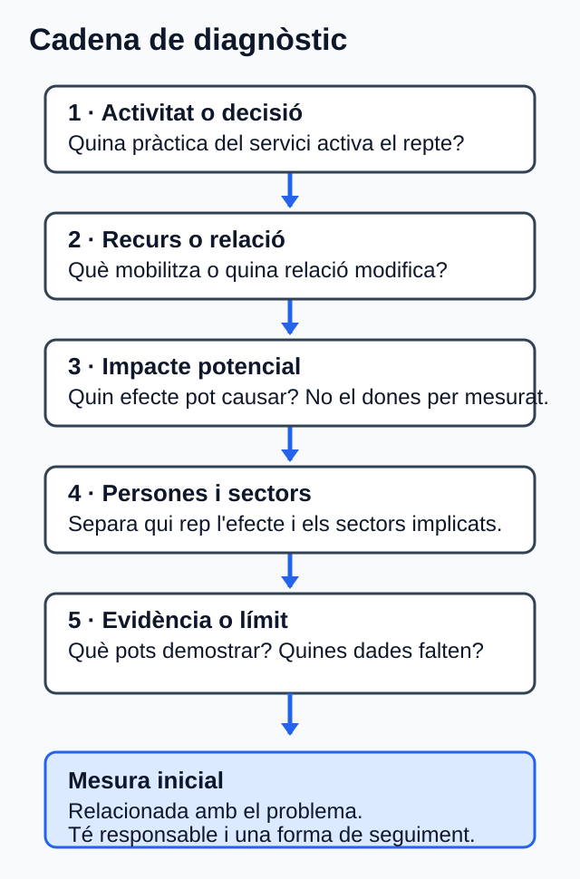

<!-- Fitxer generat per scripts/sincronitza_mkdocs.py; no l'edites manualment. -->

# Reptes ambientals i socials del sector digital

<div class="guia-progresiva" markdown="1">

## Com treballar esta unitat

<p class="lectura-clau"><strong>Primer, orienta't; després, practica.</strong>
No cal memoritzar els detalls abans de saber quin producte elaboraràs.</p>

<div class="passos-lectura" markdown="1">

1. **Orientació.** Consulta el propòsit, els prerequisits i el temps orientatiu.
2. **Idees clau.** Llig els blocs de contingut i contrasta'ls amb el cas guiat.
3. **Acció.** Revisa l'activitat i els criteris d'èxit abans de començar el producte.
4. **Comprovació.** Respon l'autoavaluació i obri el solucionari després.

</div>

!!! tip "Per a avançar:"
    conserva els dubtes i usa la proposta de tutoria o el treball
    autònom equivalent. El canal docent concret l'ha de confirmar el centre.

</div>

La informació curricular, la traçabilitat i les referències completes es pot
consultar al final de la pàgina en seccions desplegables.

!!! note "Idees clau per començar"
    Este resum procedeix literalment del material de la unitat; el desenrotllament complet apareix més avall.

## :material-text-box-check-outline: Resum

- Primer delimita el servici.
- Després separa dades reals, estimades i absents.
- Relaciona cada repte amb una activitat concreta.
- Distingix persones afectades i sectors afectats.
- No inventes xifres per a omplir buits.
- Proposa mesures amb responsable i seguiment.
- Tanca amb una coordinació creïble.


## 1. Delimita el servici abans d'opinar

Si no delimites què estàs analitzant, acabaràs barrejant intuïcions amb dades.

Un **servici web** no és només el codi. També pot implicar navegador, xarxa,
API, base de dades, infraestructura, proveïdors i equips [TEC-03; TEC-16].

Una **frontera** indica què inclous i què exclous.

Una **unitat funcional** és la unitat amb què compararàs el servici: per exemple,
una compra completada, una reserva o una petició resolta.

!!! tip "Idea clau"
    Primer delimita. Després interpreta. Si canvies la frontera o la unitat
    funcional a mitjan anàlisi, la conclusió deixa de ser fiable.

**Lectura visual ràpida de la cadena del servici**

`necessitat de la persona -> dispositiu -> xarxa -> servici web i API -> infraestructura i proveïdors -> resposta`

L'esquema orienta, però no fixa una arquitectura universal.

<div class="recurs-visual" markdown="1">


*Figura. Mapa per declarar què s'inclou i què s'exclou en l'anàlisi d'un servici web; la cadena i els passos adjacents en són l'alternativa textual. Il·lustració original, equip de disseny del projecte, CC0 1.0.*

</div>

!!! question "Pas a pas"
    1. Escriu quina acció vols observar.
    2. Tria una unitat funcional clara.
    3. Anota què entra dins de la frontera.
    4. Anota què queda fora.
    5. Marca quines dades són reals, estimades, hipotètiques o no disponibles.

| Etiqueta de dada | Què vol dir | Què has de fer |
| --- | --- | --- |
| Mesurada | Prové d'observació o telemetria | Indica instrument, període i cobertura |
| Estimada | Depén de supòsits o factors | Explica d'on ix l'estimació |
| Hipotètica | És pròpia del cas didàctic | No la presentes com a dada real |
| No disponible | No tens la font necessària | No inventes el valor |

Esta classificació conserva la diferència entre mesura, estimació i dada absent;
qualsevol quantificació ha de declarar frontera, unitat funcional i mètode
[TEC-03].

!!! warning "Error habitual"
    No convertisques trànsit, pes de pàgina o nombre de peticions en emissions
    demostrades si no tens el model o la telemetria necessaris [TEC-02–TEC-03].

### Microparada

**Pregunta de control.** Si compares dos versions d'un servici, estàs usant la
mateixa unitat funcional en les dos?

## :material-school-outline: Cas guiat DAW: Mercat Obert

### Mini història

Una persona entra a Mercat Obert per fer una compra ràpida. La portada descarrega
imatges originals, el recorregut de compra té barreres de teclat i el formulari
demana més dades de les necessàries. Quan l'equip revisa el cas, veu que no té
dades aplicables sobre electricitat, aigua o emissions del servici.

!!! tip "Clau del cas"
    Totes les dades són hipotètiques. Servixen per a aprendre a raonar, no per a
    descriure el centre ni una empresa real. Ací no cal calcular CO2e ni omplir
    buits amb xifres inventades.

### Què has d'observar

- Pes del catàleg.
- Accessibilitat del recorregut de compra.
- Recollida de dades sense justificació clara.
- Absència de dades ambientals aplicables.

!!! example "Exemple"
    Este cas és útil perquè combina tres errors molt habituals alhora: massa pes,
    barreres d'accés i recollida de dades sense justificació clara.

### Arrancada del diagnòstic

Per a començar, el cas ja fixa algunes decisions importants. La idea és que no
hages de decidir-ho tot des del principi: només has de donar unes bases clares
per a analitzar els reptes.

| Element | Decisió inicial | Per què és útil |
| --- | --- | --- |
| Unitat funcional | Una compra completada | Permet comparar el mateix procés en cada anàlisi |
| Frontera | Navegador, xarxa, CDN, aplicació, API i base de dades | Definix què s'inclou en l'estudi i què no |
| Exclusions | Fabricació del dispositiu de la clientela i qualsevol dada ambiental no disponible | Evita confondre dades desconegudes amb dades reals |
| Límits | No es calcula CO2e i no s'inventen valors absents | Manté la prudència i el rigor del diagnòstic |

### Cadenes d'impacte del cas

| Repte | Què passa en l'activitat | Persones afectades | Sectors afectats | Mesura inicial |
| --- | --- | --- | --- | --- |
| Transferència i recursos | El catàleg mobilitza més dades de les necessàries en cada compra | Clientela amb connexions limitades | TIC, telecomunicacions i infraestructura de núvol | Adaptar formats, dimensions i compressió |
| Accessibilitat i bretxa | El procés de compra posa barreres a la navegació per teclat i pot penalitzar connexions lentes | Persones amb discapacitat o amb accés limitat | Comerç electrònic i servicis digitals d'atenció a clientela | Corregir barreres i revisar pes sense perdre accessibilitat |
| Privacitat | Es demanen dades sense una finalitat ja justificada | Persones compradores | Comerç electrònic, seguretat i gestió de dades | Eliminar camps no necessaris i justificar cada dada |
| Equips i RAEE | No hi ha registre de manteniment ni de final de vida dels equips | Persones que usen o gestionen els equips | TIC, fabricació d'equips i gestió de residus | Registrar manteniment, reutilització i entrega separada |

!!! tip "Idea clau"
    El diagnòstic no acaba en "hi ha un problema". Ha d'arribar, com a mínim, fins
    a una primera mesura viable.

### Context DAW ambiental i social: mapa diagnòstic

Un servici web participa en una activitat econòmica que mobilitza computació,
emmagatzematge, xarxa, equips i proveïdors. Les dades globals ajuden a reconéixer
mecanismes i reptes, però no descriuen Mercat Obert, Cita Clara, el centre ni la
seua clientela [TEC-01–TEC-09].

| Repte que cal considerar | Relació amb l'activitat DAW | Persones o sectors sobre els quals cal investigar l'efecte | Límit de l'evidència |
| --- | --- | --- | --- |
| Electricitat i aigua de centres de dades | L'allotjament i el núvol mobilitzen infraestructura; la demanda i les dades depenen del centre, la càrrega i l'assignació. | Comunitats i sectors energètic, hídric, TIC i de centres de dades. | Una dada mundial o d'un centre no s'atribuïx al servici analitzat [TEC-01; NOR-03]. |
| Transferència de xarxa | Cada flux web genera trànsit, però els bytes no són energia ni emissions. | Persones amb connexions limitades; telecomunicacions, TIC i comerç digital. | Cal frontera, unitat funcional i model abans de quantificar impactes [TEC-02–TEC-03]. |
| Equips i residus electrònics | La compra, l'ús, el manteniment i el rebuig connecten DAW amb materials i final de vida. | Persones treballadores i comunitats exposades; fabricació, reparació i gestió de residus. | Les dades globals no acrediten l'estat d'un equip; la gestió depén de l'àmbit aplicable [TEC-04–TEC-05; NOR-04]. |
| Bretxa digital i accessibilitat | El cost, la connexió, el dispositiu i les barreres de la interfície poden dificultar l'accés o una tasca. | Persones amb discapacitat o amb accés, renda o capacitats desiguals; servicis públics, comerç i atenció digital. | Les diferències globals no es poden inferir per a les persones del cas [TEC-06–TEC-10; NOR-02]. |
| Privacitat | Formularis, analítica i registres poden tractar dades personals. | Persones afectades; sectors de dades, seguretat i servicis digitals. | Cal conéixer finalitat, dades i abast; el RGPD s'aplica si el tractament entra en el seu àmbit [TEC-11; NOR-01]. |
| Ocupació i cadena de subministrament | El desenrotllament, les plataformes, el núvol i els equips impliquen treball i proveïdors. | Plantilles, persones col·laboradores i treballadores de proveïdors; TIC, plataformes i fabricació. | L'evidència sobre plataformes o minerals no descriu tota empresa DAW ni un proveïdor concret [TEC-12–TEC-13]. |

**Evidència observable RA2.a–RA2.c.** Abans del diagnòstic central, completa
sis files breus —tres reptes ambientals i tres socials— amb: (a) el repte
identificat; (b) la decisió o activitat econòmica DAW que el mobilitza; i (c)
les persones i els sectors potencialment afectats, més la dada que falta. Esta
evidència és diagnòstica: no demana encara el redisseny detallat d'U04.

## 2. Relaciona reptes, activitat i efectes

Ara ja no toca fer llistes soltes. Toca unir cada repte amb una activitat del
servici i amb els seus efectes.

La cadena mínima és esta:

`activitat o decisió -> recurs o relació -> impacte potencial -> persones i sectors -> límit o evidència`

<div class="recurs-visual" markdown="1">



*Figura. Bastida per connectar un repte ambiental o social amb afectacions, evidència i una mesura inicial. Il·lustració original, equip de disseny del projecte, CC0 1.0.*

</div>

!!! question "Pas a pas"
    Per a cada repte, completa sempre la mateixa seqüència:

    1. Quina decisió o activitat del servici l'activa?
    2. Quin recurs mobilitza?
    3. Quin efecte pot causar?
    4. Qui el rep?
    5. Què pots demostrar i què no?

| Si estàs mirant... | Pregunta't... |
| --- | --- |
| Electricitat, xarxa o núvol | Tinc dades del cas o només una idea general? |
| Accessibilitat | La barrera està comprovada o només sospitada? |
| Bretxa digital | Estic parlant de persones concretes o d'un mecanisme general? |
| Privacitat | La dada és necessària per a la finalitat declarada? |
| Equips i residus | Sé com es mantenen, es reutilitzen o es retiren? |
| Ocupació o proveïdors | Tinc evidència del cas o estic generalitzant massa? |

!!! warning "Error habitual"
    Evita frases com "això afecta la societat" si no expliques a quines persones o
    a quins sectors afecta, i per quin mecanisme.

!!! example "Exemple"
    "La portada descarrega imatges massa pesades -> augmenta la transferència ->
    pot dificultar l'ús amb connexions limitades -> afecta clientela amb menys
    amplària de banda i operacions de xarxa -> no puc quantificar l'efecte total
    sense dades del cas" [TEC-02–TEC-03; TEC-06–TEC-09].

### Microparada

**Pregunta de control.** En almenys un dels teus reptes, has separat clarament
les persones afectades dels sectors afectats?

## 3. Passa del diagnòstic a l'acció

Una mesura útil ha de tindre tres elements: relació amb el problema, responsable
i forma de seguiment [TEC-15–TEC-16].

| Impacte detectat | Mesura útil | Qui l'ha d'impulsar | Com la seguiràs |
| --- | --- | --- | --- |
| Massa transferència | Optimitzar mitjans i peticions | DAW + disseny + operacions | Comparació en la mateixa unitat funcional |
| Barreres d'accés | Corregir incidències comprovades | UX + DAW + persones usuàries en proves | Revisió dels criteris afectats [TEC-10; NOR-02] |
| Recollida excessiva de dades | Reduir camps i justificar finalitats | Producte + DAW + privacitat | Inventari de dades i revisió del formulari [TEC-11; NOR-01] |
| Vida útil dels equips | Mantindre, reutilitzar i retirar bé | TIC + compres | Registre de manteniment i final de vida [NOR-04] |

!!! tip "Idea clau"
    No busques una solució "perfecta". Busca una mesura defensable i comprovable.

### Coordinació mínima que sí és creïble

No basta dir "l'equip col·labora". Has de concretar qui fa què.

| Actor | Funció |
| --- | --- |
| Producte | Prioritza i decidix compensacions |
| UX | Detecta barreres i prova recorreguts |
| DAW | Implementa millores i registra canvis |
| Operacions | Aporta telemetria i límits d'infraestructura |
| Privacitat o legal | Revisa necessitat i tractament de dades |
| Compres o TIC | Gestiona equips, manteniment i retirada |

!!! question "Pas a pas"
    Quan proposes una coordinació:

    1. Nomena els actors.
    2. Assigna una funció real a cada actor.
    3. Digues quina informació aporta cada un.
    4. Explica com revisaran el resultat.
    5. Deixa visible qui decidix si hi ha compensacions.

!!! warning "Error habitual"
    No assumisques que una millora tècnica resol també accessibilitat, privacitat o
    sostenibilitat global. Cada decisió pot millorar una cosa i empitjorar-ne una altra.

### Microparada

**Pregunta de control.** La teua proposta diu qui decidix si hi ha conflicte
entre rendiment, accessibilitat, privacitat o cost?

## :material-clipboard-edit-outline: Activitat central: diagnòstic de Cita Clara

### Objectiu

Faràs un diagnòstic argumentat d'un servici de reserves web.

### Situació de partida

**Les dades següents són hipotètiques.** Cita Clara permet reservar cites en
línia. La portada descarrega mitjans sense adaptar-los al dispositiu, repetix
consultes i demana més dades de les necessàries. No consta una revisió
documentada d'accessibilitat ni un protocol clar de manteniment o retirada
d'equips. Tampoc hi ha dades aplicables del proveïdor sobre electricitat, aigua
o emissions del servici.

!!! question "Pas a pas"
    1. Delimita la frontera, la unitat funcional i les dades disponibles (10 min).
    2. Completa el mapa contextual de sis reptes: tres ambientals i tres socials
       (20 min).
    3. Selecciona quatre reptes del mapa i completa'n la cadena diagnòstica
       (25 min).
    4. Proposa una mesura amb responsable i seguiment per a cada un (20 min).
    5. Tanca amb una coordinació viable (10 min).
    6. Revisa els límits, les citacions i el registre de dubtes (5 min).

### Plantilla de treball

```text
# Diagnòstic de Cita Clara

## 1. Frontera, unitat funcional i qualitat de dades

## 2. Mapa contextual de sis reptes
| Repte ambiental o social | Activitat econòmica DAW | Persones | Sectors | Dada absent o límit |

## 3. Quatre reptes prioritaris
| Repte | Activitat o recurs | Persones afectades | Sectors afectats | Límit o evidència |

## 4. Mesures
| Repte | Mesura | Responsable | Seguiment |

## 5. Coordinació
| Actor | Funció | Informació que aporta | Decisió o seguiment |

## 6. Conclusions i registre de dubtes
```

### Lliurament i comprovació ràpida

- **Lliurament:** un únic fitxer en `.md`, `.odt` o `.txt`, lliurat en
  **Aules (Moodle)**.
- **Temps orientatiu:** 90 minuts.

| Abans d'entregar | Sí / no |
| --- | --- |
| He delimitat la frontera |  |
| He triat una unitat funcional clara |  |
| He identificat tres reptes ambientals i tres socials |  |
| He relacionat els sis reptes amb activitat, persones i sectors |  |
| He separat persones i sectors |  |
| He evitat inventar dades absents |  |
| Cada mesura té responsable i seguiment |  |

## Tutoria col·lectiva quinzenal o alternativa autònoma

Reserva **30 minuts** per a contrastar una decisió del diagnòstic. La tutoria no
introduïx contingut imprescindible, no té una data fixada en estos apunts i no
se'n pressuposa l'assistència.

Si hi participes, porta una fila del mapa contextual i una cadena diagnòstica.
Explica quina dada falta, quines dos interpretacions consideres i què canviaria
la decisió. Si no hi participes, dedica els mateixos 30 minuts a:

1. contrastar una fila ambiental i una de social amb el mapa de la unitat;
2. escriure una interpretació alternativa per a cada fila;
3. comprovar si has generalitzat una dada global al cas;
4. revisar responsable, seguiment i possibles compensacions d'una mesura; i
5. conservar la decisió provisional en el mateix fitxer.

Usa este **registre de dubtes**: `apartat | pregunta | evidència disponible |
dada absent | opció provisional | què la faria canviar`. Si necessites traslladar
el dubte, usa l'espai habilitat en Aules (Moodle), sense inferir altres canals.

## :material-check-decagram-outline: Autoavaluació

Respon sense mirar les solucions. Són sis preguntes i van al nucli de la unitat.

1. **Opció múltiple.** Quina unitat funcional és millor?
   - a) "El núvol"
   - b) "Una reserva completada"
   - c) "La sostenibilitat del web"
2. **Vertader o fals.** Si una pàgina pesa menys, ja pots afirmar quantes
   emissions has evitat.
3. **Resposta curta.** Quina diferència hi ha entre una dada estimada i una no
   disponible?
4. **Opció múltiple.** Quina frase és més prudent?
   - a) "Tot impacte digital afecta igual totes les persones"
   - b) "Cal distingir persones afectades, sectors afectats i límits de la dada"
   - c) "Si no hi ha telemetria, podem omplir el buit amb una xifra genèrica"
5. **Vertader o fals.** Una coordinació transversal es pot resumir en "DAW ja ho
   arreglarà".
6. **Resposta curta.** Escriu una cadena simple que relacione activitat, impacte
   i mesura.

## :material-folder-information-outline: Annex de suport

### Prerequisits

- Concepte bàsic de sostenibilitat.
- Distinció entre aspectes ambientals, socials i de governança.
- Identificació inicial de grups d'interés treballada en la U01.
- Lectura de taules simples i redacció d'arguments breus.

### Ús autònom i accessibilitat

- Tot el contingut essencial està en text.
- Pots lliurar l'activitat en `.md`, `.odt` o `.txt`.
- Mantín títols jeràrquics i explica les relacions amb paraules.
- Cap instrucció depén exclusivament del color.

### Resultats i criteris treballats

**RA2.** Caracteritza els reptes ambientals i socials als quals s'enfronta la
societat, descriu els impactes sobre les persones i els sectors productius i
proposa accions per a minimitzar-los [CUR-01, annex IX, p. 118].

| CA | Evidència principal en la unitat |
| --- | --- |
| RA2.a | Selecció argumentada de reptes pertinents |
| RA2.b | Relació entre repte i activitat del servici |
| RA2.c | Separació entre persones, sectors, evidència i límits |
| RA2.d | Mesures coherents amb responsable i seguiment |
| RA2.e | Coordinació viable amb funcions definides |

### Glossari mínim

| Terme | Definició curta |
| --- | --- |
| Frontera | Components inclosos i exclosos en l'anàlisi |
| Unitat funcional | Acció amb què compares el servici |
| Dada estimada | Dada construïda amb supòsits o càlcul |
| Dada no disponible | Dada absent que no pots inventar |
| Efecte rebot | Millora per unitat que no assegura menys impacte total |
| Coordinació | Repartiment explícit de funcions, informació i seguiment |

### Mapa de traçabilitat

| CA | Secció explicativa | Evidència o activitat | Font del dossier |
| --- | --- | --- | --- |
| RA2.a | Context DAW i bloc 2 | Mapa de sis reptes i selecció argumentada en Cita Clara | CUR-01; TEC-01–TEC-14 |
| RA2.b | Context DAW i bloc 2 | Relació entre cada repte i l'activitat econòmica DAW | CUR-01; TEC-01–TEC-04; TEC-12–TEC-13 |
| RA2.c | Context DAW i bloc 2 | Persones, sectors, evidència i límits en sis files | CUR-01; TEC-01; TEC-05–TEC-14; NOR-01–NOR-02 |
| RA2.d | Bloc 3 | Taula de mesures i activitat central | CUR-01; TEC-03; TEC-10–TEC-11; TEC-16; NOR-01–NOR-04 |
| RA2.e | Bloc 3 i tutoria o alternativa | Taula d'actors, coordinació final i contrast d'una decisió | CUR-01; TEC-01; TEC-15–TEC-16 |

<details class="publicacio-desplegable" markdown="1">
<summary>Solucionari raonat (obri'l després de respondre)</summary>

### Solucionari raonat

1. **b.** És una acció concreta i comparable. Les altres opcions són massa vagues
   o no funcionen com a unitat funcional.
2. **Fals.** Menys pes no equival directament a menys emissions demostrades si no
   tens el mètode o les dades necessàries [TEC-02–TEC-03].
3. **Resposta esperada.** Una dada estimada naix d'un càlcul o supòsit explicat.
   Una dada no disponible és una dada que no tens i que no pots inventar.
4. **b.** És l'única que obliga a separar receptors i límits abans de concloure.
5. **Fals.** La coordinació necessita actors, funcions, informació i seguiment
   [TEC-15–TEC-16].
6. **Exemple.** "La portada carrega massa pes -> pot dificultar l'ús amb
   connexions limitades -> cal optimitzar mitjans i comprovar el canvi."


</details>

<details class="publicacio-desplegable" markdown="1">
<summary>Referències completes i fonts</summary>

### Referències

Les etiquetes conserven els identificadors del dossier documental d'U02. Totes
les fonts següents es van consultar el **30 de juliol de 2026**.

- **[CUR-01]** Consell de la Generalitat Valenciana. *Decret 114/2025, de 29 de
  juliol*; DOGV-V-2025-29742, annex IX, pp. 118-119.
  <https://dogv.gva.es/datos/2025/08/04/pdf/2025_29742_va.pdf>
- **[NOR-01]** Parlament Europeu i Consell de la UE. *Reglament (UE) 2016/679
  (RGPD)*, articles 5, 24, 25 i 32.
  <https://www.boe.es/buscar/doc.php?id=DOUE-L-2016-80807>
- **[NOR-02]** Corts Generals. *Llei 11/2023, de 8 de maig*, títol I, articles
  1-4 i annex I. <https://www.boe.es/eli/es/l/2023/05/08/11/con>
- **[NOR-03]** Parlament Europeu i Consell de la UE. *Directiva (UE)
  2023/1791*, article 12.1-2 i annex VII.
  <https://www.boe.es/buscar/doc.php?id=DOUE-L-2023-81299>
- **[NOR-04]** Govern d'Espanya. *Reial decret 110/2015, de 20 de febrer, sobre
  residus d'aparells elèctrics i electrònics*, articles 12, 13 i 15.
  <https://www.boe.es/eli/es/rd/2015/02/20/110/con>
- **[TEC-01]** Agència Internacional de l'Energia. *Key Questions on Energy and
  AI*, 2026, resum executiu.
  <https://www.iea.org/reports/key-questions-on-energy-and-ai/executive-summary>
- **[TEC-02]** Unió Internacional de Telecomunicacions. *Facts and Figures
  2025*, «Internet traffic».
  <https://www.itu.int/itu-d/reports/statistics/2025/10/15/ff25-internet-traffic/>
- **[TEC-03]** Green Software Foundation. *Software Carbon Intensity (SCI)
  Specification*, versió 1.1.0, 2024, apartats metodològics citats.
  <https://sci.greensoftware.foundation/>
- **[TEC-04–TEC-05]** UNITAR i UIT. *Global E-waste Monitor 2024*; Organització
  Mundial de la Salut. *Electronic waste (e-waste)*, 2024.
  <https://www.unitar.org/about/news-stories/press/global-e-waste-monitor-2024-electronic-waste-rising-five-times-faster-documented-e-waste-recycling>
  <https://www.who.int/news-room/fact-sheets/detail/electronic-waste-(e-waste)>
- **[TEC-06–TEC-09]** Unió Internacional de Telecomunicacions. *Facts and
  Figures 2025*: ús d'Internet, bretxa de gènere, diferència urbana-rural i
  assequibilitat.
  <https://www.itu.int/itu-d/reports/statistics/2025/10/15/ff25-internet-use/>
  <https://www.itu.int/itu-d/reports/statistics/2025/10/15/ff25-the-gender-digital-divide/>
  <https://www.itu.int/itu-d/reports/statistics/2025/10/15/ff25-internet-use-in-urban-and-rural-areas/>
  <https://www.itu.int/itu-d/reports/statistics/2025/10/15/ff25-affordability-of-ict-services/>
- **[TEC-10]** World Wide Web Consortium. *Web Content Accessibility Guidelines
  (WCAG) 2.2*, Recomanació de 12.12.2024.
  <https://www.w3.org/TR/2024/REC-WCAG22-20241212/>
- **[TEC-11]** W3C Technical Architecture Group. *Privacy Principles*, W3C
  Statement de 15.05.2025. <https://www.w3.org/TR/privacy-principles/>
- **[TEC-12]** Organització Internacional del Treball. *World Employment and
  Social Outlook 2021: The role of digital labour platforms in transforming the
  world of work*. <https://www.ilo.org/publications/flagship-reports/role-digital-labour-platforms-transforming-world-work>
- **[TEC-13]** UIT-T. *Suplement L.Sup21*, aprovat el 27.04.2016, estat «In
  force». <https://www.itu.int/rec/T-REC-L.Sup21-201604-I/en>
- **[TEC-14–TEC-15]** IPCC. *Climate Change 2023: Synthesis Report. Summary for
  Policymakers*, apartats A.1-A.2.7 i C.1.2-C.7.6.
  <https://www.ipcc.ch/report/ar6/syr/summary-for-policymakers/>
- **[TEC-16–TEC-17]** W3C Sustainable Web Interest Group. *Web Sustainability
  Guidelines*, `Group Note Draft`, 29.07.2026; és un esborrany no avalat com a
  Recomanació W3C. <https://www.w3.org/TR/2026/DNOTE-web-sustainability-guidelines-20260729/>


</details>

<details class="publicacio-desplegable curricular" markdown="1">
<summary>Informació curricular i traçabilitat</summary>

### Orientació

### Què aprendràs

Aprendràs a mirar un servici web amb criteri, no amb intuïcions. A partir d'un
cas senzill, delimitaràs què analitzes, detectaràs reptes i els convertiràs en
propostes pràctiques. L'objectiu és que el diagnòstic siga útil, no sols
correcte en teoria.

El producte final serà un **diagnòstic argumentat d'un servici web**. Hauràs de
distingir què saps, què no saps i què no pots afirmar encara.

### Itinerari i temps estimat

| Tram | Què faràs | Temps |
| --- | --- | ---: |
| Obertura | Entendràs el producte final i el recorregut | 10 min |
| Bloc 1 | Delimitaràs el servici i la qualitat de les dades | 40 min |
| Cas guiat | Veuràs com arranca un diagnòstic realista | 20 min |
| Blocs 2 i 3 | Relacionaràs impactes, mesures i coordinació | 70 min |
| Activitat central | Elaboraràs el teu diagnòstic | 90 min |
| Autoavaluació | Comprovaràs si has entés el nucli de la unitat | 20 min |
| Tutoria o alternativa autònoma | Contrastaràs una decisió i registraràs els dubtes | 30 min |
| Tancament | Revisaràs el lliurament, les fonts i el resum | 20 min |
| **Total** | **Estudi, activitat, autoavaluació, suport i revisió** | **300 min (5 h)** |

Per a prerequisits, accessibilitat, glossari, traçabilitat i referències de
suport, consulta l'annex de suport al final del document.


</details>