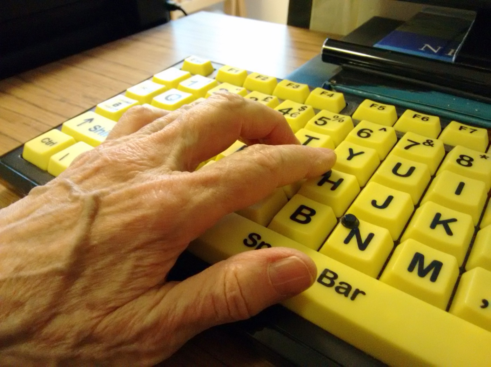

<!-- Fitxer generat per scripts/sincronitza_mkdocs.py; no l'edites manualment. -->

# U03. ODS i exercici professional en DAW

<div class="guia-progresiva" markdown="1">

## Com treballar esta unitat

<p class="lectura-clau"><strong>Primer, orienta't; després, practica.</strong>
No cal memoritzar els detalls abans de saber quin producte elaboraràs.</p>

<div class="passos-lectura" markdown="1">

1. **Orientació.** Consulta el propòsit, els prerequisits i el temps orientatiu.
2. **Idees clau.** Llig els blocs de contingut i contrasta'ls amb el cas guiat.
3. **Acció.** Revisa l'activitat i els criteris d'èxit abans de començar el producte.
4. **Comprovació.** Respon l'autoavaluació i obri el solucionari després.

</div>

!!! tip "Per a avançar:"
    conserva els dubtes i usa la proposta de tutoria o el treball
    autònom equivalent. El canal docent concret l'ha de confirmar el centre.

</div>

La informació curricular, la traçabilitat i les referències completes es pot
consultar al final de la pàgina en seccions desplegables.

!!! note "Idees clau per començar"
    Este resum procedeix literalment del material de la unitat; el desenrotllament complet apareix més avall.

## :material-text-box-check-outline: Resum

- Selecciona una **meta**, no sols un número o una icona d'ODS.
- Justifica la cadena decisió DAW → repte → afectació → meta.
- Formula el risc com un efecte advers possible i l'oportunitat com una millora
  condicionada, no garantida.
- Separa accions professionals i personals i dota-les de període, línia base,
  criteri d'èxit, evidència i límits.
- No convertisques bytes, peticions o temps directament en energia o CO2e.
- Distingix estàndards tècnics, requisits jurídics condicionats i propostes
  pedagògiques.
- Declara les dades absents; no les substituïsques per mitjanes, etiquetes o
  propietats atribuïdes a una organització real.

<details class="publicacio-desplegable" markdown="1">
<summary>Referències completes i fonts</summary>

### Referències

- **[CUR-01]** Consell de la Generalitat Valenciana. *Decret 114/2025, de 29
  de juliol, del Consell, pel qual s'establixen els currículums dels cicles
  formatius de grau mitjà i de grau superior de Formació Professional, en
  aplicació de la Llei orgànica 3/2022*. DOGV-V-2025-29742, annex IX,
  pp. 118-119. <https://dogv.gva.es/datos/2025/08/04/pdf/2025_29742_va.pdf>.
  Consulta: 2026-07-30.
- **[CUR-02]** Govern d'Espanya; Ministeri d'Educació i Formació Professional.
  *Reial decret 659/2023, de 18 de juliol, pel qual es desplega l'ordenació del
  Sistema de Formació Professional*. BOE-A-2023-16889, article 100 i annex
  VIII. <https://www.boe.es/eli/es/rd/2023/07/18/659/con>. Consulta:
  2026-07-30.
- **[CUR-04]** Consell de la Generalitat Valenciana. *Decret 95/2026, de 19 de
  juny, del Consell, pel qual s'establixen els currículums dels cursos
  d'especialització de Formació Professional per a la Comunitat Valenciana, en
  aplicació de la Llei orgànica 3/2022*. DOGV-V-2026-21170, disposició final
  primera i annex IV, p. 97.
  <https://dogv.gva.es/datos/2026/06/25/pdf/2026_21170_va.pdf>. Consulta:
  2026-07-30.
- **[ODS-01]** Assemblea General de les Nacions Unides. *Transforming our
  world: the 2030 Agenda for Sustainable Development*. A/RES/70/1,
  25.09.2015, preàmbul, par. 5, 18 i 54-59 i metes citades.
  <https://docs.un.org/en/A/RES/70/1>. Consulta: 2026-07-30.
- **[NOR-01]** Parlament Europeu i Consell de la Unió Europea. *Reglament (UE)
  2016/679, de 27 d'abril de 2016, relatiu a la protecció de les persones
  físiques pel que fa al tractament de dades personals i a la lliure circulació
  d'estes dades*. Considerants 18 i 78; articles 2.2.c, 5, 25 i 32.
  <https://www.boe.es/buscar/doc.php?id=DOUE-L-2016-80807>. Consulta:
  2026-07-30.
- **[NOR-02]** Corts Generals. *Llei 11/2023, de 8 de maig, de transposició de
  directives de la Unió Europea en matèria d'accessibilitat de determinats
  productes i servicis i altres matèries*. BOE-A-2023-11022, títol I, articles
  1-4 i 16, annex I i disposició final 18a.2.
  <https://www.boe.es/eli/es/l/2023/05/08/11/con>. Consulta: 2026-07-30.
- **[NOR-03]** Govern d'Espanya; Ministeri d'Agricultura, Alimentació i Medi
  Ambient. *Reial decret 110/2015, de 20 de febrer, sobre residus d'aparells
  elèctrics i electrònics*. BOE-A-2015-1762, articles 12, 13 i 15.
  <https://www.boe.es/eli/es/rd/2015/02/20/110/con>. Consulta: 2026-07-30.
- **[TEC-01]** W3C Sustainable Web Interest Group. *Web Sustainability
  Guidelines*. W3C Group Note Draft, 29.07.2026, «Status of This Document» i
  seccions citades.
  <https://www.w3.org/TR/2026/DNOTE-web-sustainability-guidelines-20260729/>.
  Consulta: 2026-07-30.
- **[TEC-02]** World Wide Web Consortium. *Web Content Accessibility
  Guidelines (WCAG) 2.2*. Recomanació W3C de 12.12.2024, resum, «Status» i
  seccions 1-5. <https://www.w3.org/TR/2024/REC-WCAG22-20241212/>. Consulta:
  2026-07-30.
- **[TEC-03]** Green Software Foundation. *Software Carbon Intensity (SCI)
  Specification*, versió 1.1.0, 2024, «Procedure», «Software boundary»,
  «Functional unit», «Quantification method» i «Comparing an SCI score to a
  baseline». <https://sci.greensoftware.foundation/>. Consulta: 2026-07-30.

<details class="publicacio-desplegable" markdown="1">
<summary>Glossari de consulta</summary>

### Glossari

| Terme | Definició |
| --- | --- |
| ODS | Un dels 17 objectius universals i integrats de l'Agenda 2030. |
| Meta ODS | Resultat global i aspiracional que concreta un ODS i al qual una acció local pot contribuir. |
| Rellevància | Nexe demostrable entre una meta i una decisió, un repte o un efecte del cicle de vida web. |
| Risc | Possibilitat raonada d'un efecte advers si no s'actua o s'actua amb controls o dades insuficients. |
| Oportunitat | Possibilitat condicionada de millorar un resultat o evitar un impacte mitjançant una decisió DAW. |
| Acció verificable | Canvi amb àmbit, període, línia base, criteri d'èxit, evidència i límits observables. |
| Línia base | Estat de referència comparat amb el resultat mitjançant la mateixa frontera, unitat, supòsits i metodologia. |
| Frontera del programari | Components del sistema inclosos en una quantificació o anàlisi. |
| Unitat funcional | Unitat comuna que descriu com escala el servici i a la qual es referix una intensitat. |
| Indicador tècnic auxiliar | Mesura, com bytes, peticions o temps, que ajuda a seguir una acció però no representa necessàriament energia o emissions. |
| Accessibilitat web | Capacitat del contingut web de ser percebut, operat i comprés i de ser robust per a necessitats diverses. |
| Minimització de dades | Tractament de dades personals adequades, pertinents i limitades a les necessàries per a una finalitat. |
| RAEE | Aparell elèctric o electrònic que s'ha convertit en residu dins de l'àmbit de la norma. |
| Blanqueig ecològic | Comunicació que atribuïx més protecció ambiental de la que acredita l'evidència. |

<details class="publicacio-desplegable" markdown="1">
<summary>Solucionari raonat (obri'l després de respondre)</summary>

### Solucionari raonat

1. **Fals.** La icona no identifica decisió, repte, meta, risc, oportunitat ni
   evidència. Cal justificar una contribució concreta; una acció local no
   acredita el compliment global de l'ODS [ODS-01, par. 55].
2. **b).** La meta 10.2 queda vinculada a una barrera i a una afectació
   observables. L'opció a) no concreta la meta ni el nexe. La c) és incorrecta:
   usar TIC no demostra per si sol una contribució a 5.b [ODS-01, metes 5.b i
   10.2].
3. **Resposta model.** Risc: «Mantindre la biblioteca pot usar recursos sense
   aportar funció a la tasca; eliminar-la sense proves podria introduir una
   regressió». Oportunitat: «Retirar-la i repetir les mateixes proves podria
   reduir recursos carregats mantenint la funció». Límit: sense dades d'energia,
   maquinari i emissions, només es pot informar de l'indicador tècnic
   [TEC-03].
4. **Fals.** Els bytes són un possible indicador auxiliar. Per a concloure
   sobre energia o CO2e calen frontera, unitat funcional, mètode i dades
   adequades, entre altres elements [TEC-03, «Procedure» i «Quantification
   method»].
5. **c).** Conté període, línia base, canvi, criteri d'èxit i evidència. Les
   opcions a) i b) són intencions sense abast ni comprovació.
6. **a) Requisit condicionat:** és el principi de minimització quan el RGPD és
   aplicable [NOR-01, arts. 2 i 5]. **b) Proposta:** és una pràctica personal
   verificable, però no s'ha presentat com una obligació universal. **c)
   Afirmació incorrecta:** la Llei 11/2023 delimita productes, servicis,
   exclusions i excepcions [NOR-02, arts. 1-4 i 16].

Si has fallat les preguntes 1 o 2, torna a la secció 1. Si el problema és la 3
o la 4, revisa la secció 2. Per a les preguntes 5 o 6, rellegix la secció 3 i
l'apartat 2.2.


</details>

<details class="publicacio-desplegable curricular" markdown="1">
<summary>Informació curricular i traçabilitat</summary>

### Orientació

### Què aprendràs

En esta unitat aprendràs a passar d'una associació genèrica amb un Objectiu de
Desenrotllament Sostenible (ODS) a un pla breu i comprovable. En acabar podràs:

1. seleccionar metes ODS rellevants per a una decisió concreta de
   desenrotllament web;
2. explicar almenys un risc i una oportunitat associats a cada selecció;
3. proposar accions professionals i personals amb evidències observables;
4. declarar què no permeten concloure les dades disponibles.

El producte final serà un **pla breu d'acció professional i personal**. No cal
repassar els 17 ODS ni calcular impactes sense dades. L'objectiu és justificar
una selecció curta, no acumular logotips.

### Prerequisits

Convé haver treballat en U01 i U02 els marcs de sostenibilitat, els ODS, els
assumptes ambientals, socials i de governança (ASG) i els reptes del sector
digital. Per a seguir esta unitat de manera autònoma, recorda:

- un **ODS** és un objectiu universal de l'Agenda 2030;
- una **meta ODS** concreta el resultat global i aspiracional al qual es pot
  contribuir;
- un **repte** és el problema ambiental o social que afecta persones, recursos
  o processos;
- una acció local pot **contribuir** a una meta, però no acredita per si sola el
  compliment global d'un ODS [ODS-01, par. 5, 18 i 55].

### Itinerari i temps estimat

| Bloc | Què faràs | Temps |
| --- | --- | ---: |
| Orientació | Activaràs els prerequisits i llegiràs el propòsit. | 10 min |
| Estudi i cas guiat | Aprendràs a seleccionar metes, analitzar riscos i oportunitats i definir accions. | 65 min |
| Activitat asíncrona | Elaboraràs i revisaràs el pla breu. | 55 min |
| Autoavaluació | Respondràs sis qüestions i consultaràs el solucionari. | 20 min |
| Tutoria col·lectiva quinzenal o treball equivalent | Contrastaràs decisions dubtoses en la tutoria o completaràs una fitxa equivalent. | 30 min |
| **Total orientatiu** |  | **180 min (3 h)** |

Les 3 hores són una decisió pedagògica per a U03, no tres sessions ni dates del
centre. En el marc documental, el currículum bàsic estatal indica 30 hores, el
currículum autonòmic 32 i la seqüenciació específica de DAW 34; la planificació
del curs usa 34 hores totals [CUR-01, annex IX; CUR-02, annex VIII; CUR-04,
annex IV, p. 97].

### Com usar el material i demanar ajuda

Avança en l'ordre proposat: explicació, cas guiat, activitat i autoavaluació. Si
una decisió no queda resolta, anota **cas, dubte, opció considerada i dada que
falta**. Lliura l'activitat i registra els dubtes mitjançant **Aules (Moodle)**.
Conserva també una còpia local del treball.

El material no requerix vídeo, àudio, ferramenta interactiva ni ús exclusiu del
color. Les taules es poden llegir linealment repetint el nom de cada columna.
Per exemple: «Meta: 10.2; decisió: prova amb teclat; evidència: registre abans i
després». Una versió en text pla conserva tota la informació. La figura
complementària de la publicació inclou un text alternatiu que descriu la
informació essencial i esta informació també es conserva en text.


### Resultats i criteris treballats

El resultat d'aprenentatge és **RA3**: «Establix l'aplicació de criteris de
sostenibilitat en l'acompliment professional i personal i n'identifica els
elements necessaris» [CUR-01, annex IX, p. 118].

| CA | Criteri d'avaluació | Evidència en la unitat |
| --- | --- | --- |
| RA3.a | S'han identificat els ODS més rellevants per a l'activitat professional que du a terme. | Selecció de metes amb nexe explícit amb una decisió DAW. |
| RA3.b | S'han analitzat els riscos i les oportunitats que representen els ODS. | Un risc i una oportunitat justificats per cada meta seleccionada. |
| RA3.c | S'han identificat les accions necessàries per a atendre alguns dels reptes ambientals i socials des de l'activitat professional i l'entorn personal. | Accions verificables separades en els àmbits professional i personal. |

La formulació dels tres CA procedix del currículum valencià [CUR-01, annex IX,
p. 118].


### Mapa de traçabilitat

| CA | Secció explicativa | Activitat o evidència | Font del dossier |
| --- | --- | --- | --- |
| RA3.a | 1. De l'ODS genèric a una meta rellevant; cas guiat, pas 1 | Selecció d'una o dues metes i justificació de la cadena decisió-repte-afectació-meta | CUR-01; ODS-01; TEC-01 |
| RA3.b | 2. Riscos, oportunitats i límits; cas guiat, pas 2 | Un risc, una oportunitat, una condició i un límit per cada meta | CUR-01; ODS-01; TEC-01–TEC-03 |
| RA3.c | 3. De la intenció a l'acció verificable; cas guiat, pas 3 | Dues accions professionals i una personal amb criteris d'èxit i evidències | CUR-01; NOR-01–NOR-03; TEC-01–TEC-03 |


</details>


</details>


</details>


## 1. De l'ODS genèric a una meta rellevant

### 1.1. ODS, meta i contribució

L'Agenda 2030 conté 17 ODS i 169 metes integrades i indivisibles. Les metes són
globals i aspiracionals i s'han d'interpretar segons les circumstàncies
[ODS-01, preàmbul i par. 54-59]. Això té dos efectes pràctics:

- no has de tractar cada ODS com una etiqueta independent;
- no has d'afirmar que una correcció de codi «complix» un ODS: pots explicar
  com **contribuïx** a una meta concreta i amb quins límits.

Una selecció és **rellevant** quan hi ha un nexe demostrable entre la meta i una
decisió, un impacte o un efecte del cicle de vida web. Aplica esta cadena:

> decisió DAW → repte → persones, recursos o processos afectats → meta ODS

Per exemple, «ODS 10 perquè la inclusió és important» és decoratiu. En canvi,
«la navegació per teclat de la tasca principal presenta una barrera; afecta
l'autonomia d'algunes persones usuàries i es relaciona amb la meta 10.2»
explicita decisió, efecte, persones afectades i meta. WCAG 2.2 oferix criteris
comprovables sota els principis perceptible, operable, comprensible i robust,
encara que no cobrix totes les necessitats de totes les persones amb
discapacitat [TEC-02, resum i seccions 1-5].

### 1.2. Mapa breu per al perfil DAW

El mapa següent no assigna automàticament un ODS. Servix per a formular una
hipòtesi que després hauràs de justificar amb el cas.

| Decisió o activitat DAW | Meta candidata | Nexe que cal demostrar |
| --- | --- | --- |
| Arquitectura, codi, consultes, proves, desplegament, emmagatzematge o entorns inactius | 7.3 o 9.4 | Mateixa funció amb un ús més eficient de recursos i una comparació homogènia. |
| Disseny, HTML semàntic, formularis, autenticació i proves amb teclat o tecnologies d'assistència | 10.2 | Reducció d'una barrera concreta d'accés, participació o autonomia. |
| Organització del treball, manteniment, guàrdies i relació amb empreses proveïdores | 8.5 o 8.8 | Condicions de treball inclusives, segures o verificables sense traslladar riscos a tercers. |
| Compra, actualització, reparació, reutilització i final de vida d'equips | 12.2 o 12.5 | Ús eficient de recursos, allargament viable de la vida útil o gestió separada del residu. |
| Selecció de núvol, allotjament, analítica, components o equips | 12.6 | Informació de sostenibilitat comparable, amb data, frontera i mètode. |
| Formació aplicada en accessibilitat, privacitat, mesurament o manteniment | 4.4, 12.8 o 13.3 | Canvi aplicat i documentat; assistir o llegir, sense aplicació, no prova una millora. |

Estes relacions candidates deriven de les metes de l'Agenda i de les decisions
tècniques documentades per al cicle de vida web [ODS-01, metes 4.4, 7.3, 8.5,
8.8, 9.4, 10.2, 12.2, 12.5, 12.6, 12.8 i 13.3; TEC-01, §§ 2.1-2.3,
2.14-2.17, 3.1-3.2 i 5.10-5.23].

No deduïsques relacions només pel nom d'un ODS. Usar TIC no demostra per si
mateix una contribució a la meta 5.b; cal un efecte demostrable sobre l'accés,
la participació o l'autonomia de les dones [ODS-01, meta 5.b]. De manera
semblant, privacitat no equival automàticament a ODS 16, i una relació ordinària
amb una empresa proveïdora no equival necessàriament a una aliança de l'ODS 17
[ODS-01, metes 16.6, 16.7, 16.10, 17.16 i 17.17].

### 1.3. Com seleccionar sense decorar

Abans d'acceptar una meta, respon:

1. Quina decisió o activitat DAW analitze?
2. Quin repte ambiental o social hi ha?
3. Qui o què pot resultar afectat?
4. Quina meta concreta descriu millor el nexe?
5. Tinc capacitat d'intervenció i alguna evidència possible?
6. Quines dades o parts del sistema queden fora?

Si no pots respondre les preguntes 1-4, la relació encara no està justificada.
Si falten dades per a les preguntes 5-6, registra la limitació en lloc d'omplir
el buit amb una afirmació general.

## 2. Riscos, oportunitats i límits

Un **risc** és la possibilitat raonada d'un efecte advers si es manté una
pràctica, no s'actua o s'actua amb informació deficient. Una **oportunitat** és
la possibilitat de millorar un resultat o evitar un impacte mitjançant una
decisió DAW; no és un benefici garantit [TEC-01, §§ 1.1.3, 1.3.1 i 2.1].

Usa estes estructures:

- **Risc:** «Si [pràctica o absència de control], pot [efecte advers] sobre
  [persones, recursos o processos], amb la incertesa [dada absent]».
- **Oportunitat:** «Si [canvi], podria [millora] per a [persona, recurs o
  procés], sempre que [condició] i ho comprovarem amb [evidència]».

| Àmbit DAW | Risc ben delimitat | Oportunitat condicionada |
| --- | --- | --- |
| Rendiment i infraestructura | Eliminar una dependència pot no reduir l'impacte total si augmenta la demanda o es desplaça consum a altres components. | Reduir recursos per a la mateixa funció, si la comparació manté frontera, tasca i mètode. |
| Accessibilitat | Publicar sense provar una tasca pot mantindre barreres per a algunes persones. | Corregir defectes comprovats pot ampliar accés i autonomia, sense afirmar conformitat total a partir d'una mostra. |
| Equips | Substituir abans d'avaluar estat i viabilitat pot escurçar la vida útil; conservar sempre tampoc és necessàriament viable. | Mantindre, reparar o reutilitzar quan l'estat real ho permeta, i gestionar separadament l'equip quan siga RAEE. |
| Proveïdors | Acceptar percentatges o etiquetes sense període, frontera i metodologia pot generar blanqueig ecològic. | Demanar dades granulars i registrar també les absències pot millorar la comparació i la rendició de comptes. |

Les orientacions WSG recomanen considerar impactes sobre persones, planeta i
prosperitat, compensacions i qualitat de les dades. Són un esborrany de nota de
grup, no una Recomanació W3C ni una obligació legal [TEC-01, «Status of This
Document» i §§ 1.1-1.4].

### 2.1. No convertisques indicadors auxiliars en impactes finals

Peticions, bytes, consultes, temps de CPU o recursos provisionats poden ajudar
a seguir una millora tècnica. No equivalen automàticament a energia ni a CO2e.
Per a comparar intensitat de carboni cal declarar, entre altres elements,
frontera del programari, unitat funcional, mètode, dades i una línia base
homogènia [TEC-03, «Procedure», «Software boundary», «Functional unit» i
«Comparing an SCI score to a baseline»].

Per tant, és correcte dir «s'ha reduït el recurs transferit per a la mateixa
tasca amb el mateix mètode». No és correcte concloure «s'han reduït les
emissions» si falten energia, ubicació, període, maquinari o model d'emissions.
També cal considerar l'efecte rebot: millorar l'eficiència per unitat no
garantix reduir el consum total si augmenta la demanda [TEC-01, § 1.3.1;
TEC-03].

### 2.2. Privacitat i accessibilitat: requisit o proposta?

Cal separar una **obligació aplicable** d'una **proposta de millora**:

- si un servici tracta dades personals dins de l'àmbit del RGPD, s'apliquen la
  minimització, la protecció des del disseny i per defecte i mesures de
  seguretat adequades [NOR-01, arts. 5, 25 i 32];
- WCAG 2.2 és un estàndard tècnic. La Llei 11/2023 regula els productes i
  servicis enumerats en el seu article 2, amb exclusions i excepcions; no
  imposa per si sola la mateixa obligació a qualsevol web [NOR-02, arts. 1-4 i
  16; TEC-02, «Status»];
- en un projecte propi, revisar un formulari amb teclat o reduir camps de dades
  pot ser una acció voluntària formativa. La possible obligació jurídica depén
  de l'àmbit i del cas.

La privacitat és una condició transversal del treball DAW, però no s'ha
d'assignar automàticament a un ODS. Cal seleccionar primer una meta amb un nexe
real i tractar després la protecció de dades com a requisit o límit quan siga
aplicable [NOR-01; ODS-01].

## 3. De la intenció a l'acció verificable

«Millorar la sostenibilitat de la web» és una intenció. Una **acció
verificable** descriu un canvi observable, l'àmbit, el període, el criteri
d'èxit i l'evidència que permet revisar-lo.

**Alternativa textual completa.** La seqüència té cinc passos: (1) partir d'una
decisió DAW; (2) justificar el repte, l'afectació i la meta; (3) delimitar
l'acció professional o personal; (4) conservar la línia base, el criteri d'èxit
i l'evidència; i (5) declarar límits, dades absents i possibles compensacions.
El risc queda separat de l'oportunitat condicionada: cap benefici es presenta
com a garantit.

<div class="recurs-visual" markdown="1">


*Figura. Guia per justificar una meta ODS i transformar-la en una acció comprovable sense confondre risc amb benefici garantit. Il·lustració original, equip de disseny del projecte, CC0 1.0.*

</div>

| Camp | Pregunta que has de respondre |
| --- | --- |
| Àmbit | És una acció professional o personal? |
| Repte i meta | Quin repte atén i a quina meta pot contribuir? |
| Acció | Quin canvi observable faràs i dins de quina capacitat d'intervenció? |
| Línia base | Quin és l'estat inicial: mesurat, estimat o hipotètic? |
| Criteri d'èxit | Quina unitat o condició, amb quin mètode i abast, mostrarà el canvi? |
| Evidència | Quin registre, prova, comparativa, configuració o document conservaràs? |
| Període | En quin període definit per l'autoria es revisarà? |
| Límits | Quines dades falten i quins efectes rebot, compensacions o dependències hi ha? |

No cal usar l'indicador estadístic global de l'ODS. El criteri local servix per
seguir l'acció, no per provar el progrés d'un país ni el compliment global de
la meta [ODS-01; TEC-01, §§ 1.3 i 5.6].

En equips, diferencia equip en ús, equip reutilitzable i residu. Quan un aparell
es convertix en RAEE dins de l'àmbit de la norma, la recollida separada s'ha de
fer pels canals regulats; no s'ha d'abandonar ni entregar a operadors no
previstos [NOR-03, arts. 12, 13 i 15]. No proposes comprar, reparar o retirar un
equip real sense conéixer-ne l'estat i la viabilitat.

## :material-school-outline: Cas guiat DAW

<div class="recurs-visual" markdown="1">



*Fotografia de context per a l'anàlisi d'una barrera de teclat. Francisclarke, 2016, [Wikimedia Commons](https://commons.wikimedia.org/w/index.php?title=File:Hand-on-high-contrast-accessible-computer-keyboard.jpg&oldid=1211953052), [CC BY-SA 4.0](https://creativecommons.org/licenses/by-sa/4.0/); còpia local redimensionada, sense retall.*

</div>

### Situació hipotètica

Un equip fictici manté un portal per a sol·licitar una cita de reparació. En una
revisió docent es proporcionen estes observacions hipotètiques:

- la tasca principal no es pot completar només amb teclat perquè el selector de
  data bloqueja el recorregut;
- l'informe de construcció identifica una biblioteca que es carrega, però no
  intervé en la tasca;
- no hi ha dades d'energia, maquinari, ubicació, emissions ni ús total;
- el formulari tracta dades personals, però no s'ha aportat l'anàlisi jurídica
  completa del servici.

No són dades d'una empresa ni del centre. Permeten practicar el mètode sense
atribuir consums o obligacions no comprovats.

### Pas 1. Seleccionar metes

| Decisió i repte | Meta seleccionada | Justificació |
| --- | --- | --- |
| Provar i corregir la navegació per teclat; hi ha una barrera en una tasca principal. | **10.2**, inclusió de totes les persones. | Hi ha un efecte concret sobre accés i autonomia, no sols una associació amb la paraula «inclusió». |
| Revisar codi i recursos carregats; hi ha una dependència prescindible per a la mateixa tasca. | **9.4**, més eficiència en l'ús de recursos. | La decisió afecta el recurs utilitzat pel programari i admet una comparació abans/després amb la mateixa funció. |

No se selecciona l'ODS 16 només perquè el formulari tracta dades. La privacitat
s'analitzarà com a condició transversal i, si el RGPD és aplicable, com a
requisit jurídic [NOR-01; ODS-01, metes 16.6, 16.7 i 16.10].

### Pas 2. Analitzar riscos i oportunitats

| Meta | Risc | Oportunitat | Límit principal |
| --- | --- | --- | --- |
| 10.2 | Si es publica sense corregir i tornar a provar la tasca, algunes persones poden no completar-la de manera autònoma. | Corregir el component i repetir una prova definida podria eliminar la barrera observada. | Una sola tasca superada no acredita l'accessibilitat ni la conformitat legal de tot el portal. |
| 9.4 | Mantindre recursos no necessaris pot augmentar l'ús de xarxa o processament per a la tasca; eliminar-los sense proves també pot trencar funcionalitat. | Retirar la dependència i conservar la mateixa funció podria reduir recursos carregats. | Sense energia ni model d'emissions, no es pot afirmar una reducció de CO2e. |

### Pas 3. Convertir l'anàlisi en accions

| Àmbit | Acció i període | Línia base i criteri d'èxit | Evidència | Límits |
| --- | --- | --- | --- | --- |
| Professional | Durant una iteració hipotètica, substituir o corregir el selector i repetir la tasca amb teclat. | Inicial: tasca no completada. Èxit: la mateixa tasca es completa amb teclat sense el bloqueig observat. | Guió de prova, resultat abans/després i registre del canvi. | No prova tot WCAG ni l'aplicabilitat de la Llei 11/2023. |
| Professional | En la mateixa iteració, retirar la biblioteca no utilitzada i executar proves funcionals. | Inicial: la biblioteca es carrega sense intervindre en la tasca. Èxit: no es carrega i la tasca continua superant les proves. | Informe de construcció o xarxa abans/després i resultat de proves. | És un indicador tècnic; no mesura energia o CO2e. |
| Personal | En un període definit per l'autoria, revisar amb teclat una tasca del portafolis propi i corregir una barrera si se'n detecta alguna. | Inicial: resultat documentat de la prova. Èxit: tasca repetida sense la barrera corregida. | Guió, captura textual del resultat i registre del canvi; si no hi ha barrera, informe de la prova. | Una mostra no acredita conformitat del lloc complet i no obliga a publicar dades personals. |

El resultat cobrix els tres CA: les metes estan justificades (RA3.a), cada una
té risc i oportunitat (RA3.b), i hi ha accions professionals i personals
verificables (RA3.c).

## :material-clipboard-edit-outline: Activitats d'aprenentatge

### Activitat asíncrona. Pla breu d'acció ODS-DAW

**Objectiu.** Seleccionar metes ODS rellevants, analitzar riscos i oportunitats
i definir accions verificables en els àmbits professional i personal.

**Modalitat.** Individual i asíncrona. No requerix connexió contínua; el
lliurament digital es fa mitjançant Aules (Moodle).

**Temps orientatiu.** 55 minuts.

**Recursos.** Estos apunts, un editor de text i una de les situacions següents.
Totes les situacions són hipotètiques i no descriuen el centre ni cap empresa
real.

1. **Formulari i rendiment:** una tasca principal presenta una barrera de teclat
   i l'informe tècnic assenyala un recurs carregat que no s'usa en la tasca.
2. **Equips i manteniment:** un equip de treball continua operatiu, però abans
   d'una actualització no s'han registrat estat, compatibilitat, opcions de
   manteniment ni criteri de retirada. No consta que siga un residu.
3. **Proveïdor digital:** una oferta d'allotjament afirma ser «verda», però no
   aporta període, frontera, metodologia, ubicació, maquinari ni dades de
   l'aplicació concreta.

**Passos.**

1. Tria una situació i delimita la decisió DAW, les persones, els recursos i
   els processos afectats.
2. Selecciona **una o dues metes** del mapa de la secció 1.2. Per cada meta,
   escriu el nexe complet: decisió → repte → afectació → meta.
3. Formula almenys un risc i una oportunitat per meta. Inclou una condició o
   una dada absent.
4. Proposa almenys **dues accions professionals i una personal**. No atribuïsques
   dades, terminis ni recursos al centre.
5. Completa per cada acció: període definit per tu, línia base mesurada,
   estimada o hipotètica, criteri d'èxit, evidència i límits.
6. Revisa el pla amb els criteris d'èxit i corregix qualsevol afirmació que
   convertisca un indicador auxiliar en energia o CO2e.

**Plantilla de lliurament.**

```text
Títol i situació triada:
Frontera del cas i dades absents:

Meta ODS 1 i justificació:
Risc:
Oportunitat:

Meta ODS 2 i justificació, si correspon:
Risc:
Oportunitat:

Acció professional 1:
- repte i meta:
- període:
- línia base:
- criteri d'èxit:
- evidència:
- límits:

Acció professional 2:
- repte i meta:
- període:
- línia base:
- criteri d'èxit:
- evidència:
- límits:

Acció personal:
- repte i meta:
- període:
- línia base:
- criteri d'èxit:
- evidència:
- límits:

Fonts utilitzades:
Declaració final de què no permeten concloure les dades:
```

**Lliurament.** Puja a Aules (Moodle) un únic fitxer en format obert: `.md`,
`.txt` o `.odt`. El nom del fitxer no està determinat; conserva'n una còpia
local. Com a alternativa accessible a les taules, usa la plantilla lineal
anterior. Si s'acorda un lliurament oral per una necessitat d'accés, ha d'anar
acompanyat d'una transcripció o un guió textual amb els mateixos camps,
mitjançant Aules (Moodle).

**Criteris d'èxit observables.** No són ponderacions ni una escala de
qualificació del centre.

| Criteri | Comprova que... |
| --- | --- |
| Rellevància, RA3.a | cada ODS inclou una meta concreta i un nexe amb decisió DAW, repte i afectació; no és només una etiqueta. |
| Anàlisi, RA3.b | cada meta té almenys un risc, una oportunitat, una condició i un límit justificats. |
| Accions, RA3.c | hi ha almenys dos canvis professionals i un de personal, separats i dins de la capacitat declarada. |
| Verificabilitat | cada acció conté període, línia base, criteri d'èxit, evidència i límits. |
| Prudència | no s'inventen consums, emissions, obligacions, dades del centre o propietats d'empreses reals. |
| Traçabilitat i claredat | les afirmacions verificables citen les fonts d'esta unitat i el document és llegible sense dependre del color. |

**Retroacció prevista.** Primer, aplica la taula anterior i el solucionari de
l'autoavaluació. Marca cada criteri com «evidenciat» o «cal revisar» i anota el
fragment que ho prova. Després, registra els dubtes persistents per a la
tutoria col·lectiva quinzenal mitjançant Aules (Moodle).

### Tutoria col·lectiva quinzenal o treball equivalent

La tutoria col·lectiva és quinzenal i es reserva per a decisions que requerixen
contrast: triar entre dues metes plausibles, delimitar una frontera, distingir
requisit legal i proposta o revisar una conclusió amb dades insuficients. No és
necessària per a accedir a contingut nou. No se'n fixen dates en estos apunts
ni se'n pressuposa l'assistència.

Porta una pregunta amb este format: «He seleccionat [meta] perquè [nexe]. Dubte
entre [opcions] perquè falta [dada]». Si no participes en la tutoria, dedica els
30 minuts a completar una fitxa de contrast amb estes quatre preguntes:

1. Quina altra meta havies considerat i per què l'has descartada?
2. Quina dada canviaria la teua decisió?
3. Quin efecte advers podria causar la mateixa acció?
4. Quina afirmació has limitat o corregit després de revisar les fonts?

Les dates de la tutoria no es determinen en estos apunts. Els dubtes es poden
registrar en Aules (Moodle).

## :material-check-decagram-outline: Autoavaluació

Respon sense mirar el solucionari. Després compara i corregix el raonament; no
uses el recompte d'encerts com una qualificació oficial.

1. **Vertader o fals.** «Incloure la icona de l'ODS 12 en la documentació d'una
   aplicació demostra que el projecte hi contribuïx.»
2. Una prova detecta que la tasca principal no es pot completar amb teclat.
   Quina opció està millor justificada?
   - a) ODS 10, sense concretar meta, perquè tracta d'igualtat.
   - b) Meta 10.2, si s'explica la barrera, les persones afectades, l'acció i la
     prova abans/després.
   - c) Meta 5.b, perquè qualsevol ús de TIC empodera les dones.
3. Formula un risc i una oportunitat davant d'una biblioteca no utilitzada que
   es carrega en una tasca web. Inclou un límit de dades.
4. **Vertader o fals.** «Si baixen els bytes transferits per a una tasca, han
   baixat necessàriament les emissions de CO2e.»
5. Quina acció és verificable?
   - a) Fer la web més sostenible tan prompte com siga possible.
   - b) Revisar algun dia l'accessibilitat.
   - c) En un període definit, repetir una tasca amb teclat, registrar el
     resultat inicial, corregir la barrera detectada i conservar la prova
     abans/després.
6. Classifica cada afirmació com a **requisit condicionat**, **proposta** o
   **afirmació incorrecta**:
   - a) Si el servici està dins de l'àmbit del RGPD, les dades personals han de
     ser adequades, pertinents i limitades a les necessàries per a la finalitat.
   - b) Revisar amb teclat una tasca del portafolis propi com a pràctica
     formativa.
   - c) La Llei 11/2023 obliga exactament igual tots els webs.