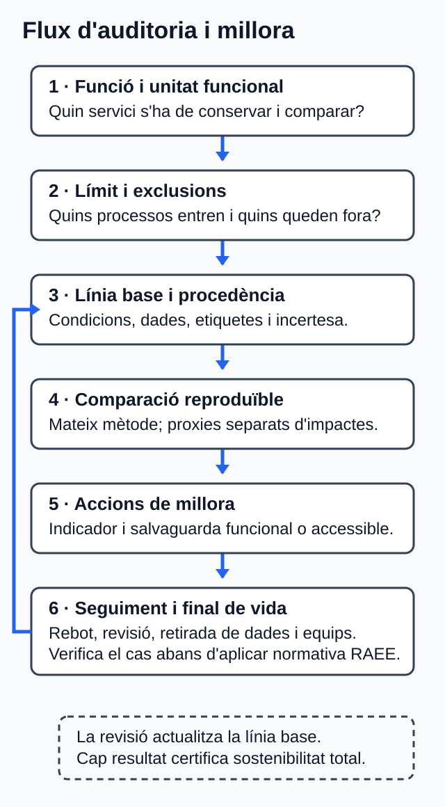

<!-- Fitxer generat per scripts/sincronitza_mkdocs.py; no l'edites manualment. -->

# U05. Pràctiques sostenibles en el cicle de vida web

## Com treballar esta unitat

<strong>Primer, orienta't; després, practica.</strong>
No cal memoritzar els detalls abans de saber quin producte elaboraràs.

1. **Orientació.** Consulta el propòsit, els prerequisits i el temps orientatiu.
2. **Idees clau.** Llig els blocs de contingut i contrasta'ls amb el cas guiat.
3. **Acció.** Revisa l'activitat i els criteris d'èxit abans de començar el producte.
4. **Comprovació.** Respon l'autoavaluació i obri el solucionari després.

!!! tip "Per a avançar:"
    conserva els dubtes i usa la proposta de tutoria o el treball
    autònom equivalent. El canal docent concret l'ha de confirmar el centre.

La informació curricular, la traçabilitat i les referències completes es pot
consultar al final de la pàgina en seccions desplegables.

!!! note "Idees clau per començar"
    Este resum procedeix literalment del material de la unitat; el desenrotllament complet apareix més avall.

## :material-text-box-check-outline: Resum

- Una auditoria DAW comença per la funció, la unitat funcional, el límit, la
  línia base i l'inventari.
- Economia verda inclusiva i economia circular són conceptes relacionats, però
  no sinònims.
- La comparació només és vàlida si conserva funció, condicions, unitat i mètode.
- Peticions, bytes, temps i CPU són indicadors intermedis, no impactes finals.
- RA5.d requerix una avaluació explícita, separada dels proxies, per a les
  activitats personals i professionals, amb categories, dades o absències,
  mètode, incertesa i conclusió delimitada.
- Les dades han d'identificar procedència, context, omissions i incertesa.
- L'ecodisseny vincula un problema, una decisió, un indicador i una salvaguarda.
- El pla de millora necessita seguiment i revisió de l'efecte rebot.
- El cicle de vida web inclou concepció, construcció, desplegament, operació,
  manteniment, retirada de dades i final de vida dels equips.
- La normativa RAEE només s'aplica després de verificar territori, objecte,
  estat i rol; no certifica la sostenibilitat del servici web.

Referències completes i fonts

### Referències

Dates de consulta: les indicades per a cada font en el dossier documental d'U05
(30.07.2026; i 31.07.2026 per a les reverificacions N-RES-01 i N-RAEE-02–04 i
06). Els identificadors entre claudàtors conserven els del dossier.

- **[CV-D114]** Consell de la Generalitat Valenciana. *Decret 114/2025, de 29
  de juliol*; DOGV-V-2025-29742. Annex IX, p. 119.
  <https://dogv.gva.es/datos/2025/08/04/pdf/2025_29742_va.pdf>
- **[EST-RD659]** Govern d'Espanya; Ministeri d'Educació i Formació
  Professional. *Reial decret 659/2023, de 18 de juliol*; BOE-A-2023-16889.
  Article 100 i annex VIII, mòdul 1708. Text consolidat amb última actualització
  publicada el 06.05.2025.
  <https://www.boe.es/eli/es/rd/2023/07/18/659/con>
- **[CV-D95]** Consell de la Generalitat Valenciana. *Decret 95/2026, de 19 de
  juny*; DOGV-V-2026-21170. Disposició final primera i annex IV, p. 97.
  <https://dogv.gva.es/datos/2026/06/25/pdf/2026_21170_va.pdf>
- **[N-RES-01; N-RES-02; N-RES-VIG]** Corts Generals; Prefectura de l'Estat.
  *Llei 7/2022, de 8 d'abril, de residus i sòls contaminats per a una economia
  circular*. Articles 8.1 i 18.1.a–e. Text consolidat del BOE, última
  actualització publicada el 02.04.2025.
  <https://www.boe.es/eli/es/l/2022/04/08/7/con>
- **[N-RAEE-01–06; N-RAEE-VIG]** Govern d'Espanya; Ministeri d'Agricultura,
  Alimentació i Medi Ambient. *Reial decret 110/2015, de 20 de febrer, sobre
   residus d'aparells elèctrics i electrònics*. Articles 2, 3, 4.a, 13.1–2,
   15.1–3, 17.2–3 i 28.1. Text consolidat del BOE, última actualització publicada
  l'01.04.2022. <https://www.boe.es/eli/es/rd/2015/02/20/110/con>
- **[O-GREEN]** Programa de les Nacions Unides per al Medi Ambient. *About green
  economy*, actualitzat el 24.02.2025, «Overview».
  <https://www.unep.org/explore-topics/green-economy/about-green-economy>
- **[O-CIRC]** Ministeri per a la Transició Ecològica i el Repte Demogràfic.
  *Estrategia Española de Economía Circular y Planes de Acción*, «Estrategia
  Española de Economía Circular».
  <https://www.miteco.gob.es/es/calidad-y-evaluacion-ambiental/temas/economia-circular/estrategia.html>
- **[T-EF-LCA]** Comissió Europea, DG Medi Ambient. *Life Cycle Assessment & the
  EF methods*, «Life Cycle Assessment» i «Environmental Impact Categories».
  <https://green-forum.ec.europa.eu/green-business/environmental-footprint-methods/lca-ef-methods_en>
- **[T-EF-PEF]** Comissió Europea, DG Medi Ambient. *Product Environmental
  Footprint method*, «PEF: How it works» i «Phases of a PEF study».
  <https://green-forum.ec.europa.eu/green-business/environmental-footprint-methods/pef-method_en>
- **[T-EF-DATA]** Comissió Europea, DG Medi Ambient. *Data for Environmental
  Footprint methods*, apartats 1–3; orientació actualitzada el juliol de 2026.
  <https://green-forum.ec.europa.eu/green-business/environmental-footprint-methods/data-ef-methods_en>
- **[T-SCI-ISO]** ISO/IEC JTC 1. *ISO/IEC 21031:2024*, edició 1, març de 2024.
  <https://www.iso.org/standard/86612.html>
- **[T-SCI]** Green Software Foundation, Standards Working Group. *Software
  Carbon Intensity (SCI) Specification*, versió 1.1.0, 2024, «Procedure» i
  apartats metodològics. <https://sci.greensoftware.foundation/>
- **[T-WSG-MET; T-WSG-DEV; T-WSG-LIFE; T-WSG-STAT]** W3C Sustainable Web
  Interest Group. *Web Sustainability Guidelines*, `Group Note Draft`,
  29.07.2026. És un esborrany no avalat pel W3C ni pels seus membres i no
  garantix compliment legal. <https://www.w3.org/TR/2026/DNOTE-web-sustainability-guidelines-20260729/>
- **[T-IPCC]** IPCC, Grup de Treball III. *Climate Change 2022: Mitigation of
  Climate Change*, capítol 5, especialment 5.3.1.2 i 5.3.4.1.
  <https://www.ipcc.ch/report/ar6/wg3/chapter/chapter-5/>
- **[T-WCAG]** W3C Accessibility Guidelines Working Group. *Web Content
  Accessibility Guidelines (WCAG) 2.2*, Recomanació W3C de 12.12.2024,
  criteris 1.1.1, 1.3.3 i 1.4.1.
  <https://www.w3.org/TR/2024/REC-WCAG22-20241212/>

Glossari de consulta

### Glossari

| Terme | Definició |
| --- | --- |
| AEE usat | Aparell elèctric o electrònic utilitzat que no és residu perquè no es rebutja i es pretén un ús posterior. |
| Cicle de vida | Etapes des dels recursos i la creació fins a ús, manteniment, disposició, reciclatge o recuperació. |
| Dada primària | Dada recollida, mesurada o estimada directament sobre un procés controlat, amb context i mètode. |
| Dada secundària | Dada externa emprada normalment per a processos no controlats, amb font i representativitat declarades. |
| Ecodisseny web | Integració de criteris ambientals i de cicle de vida en funció, experiència d'ús, codi, dades, infraestructura, manteniment i retirada. |
| Economia circular | Model que manté el valor de productes, materials i recursos i minimitza els residus. |
| Economia verda inclusiva | Economia que millora benestar i equitat social mentre reduïx riscos i escassetats ambientals. |
| Efecte rebot | Augment de demanda o consum que reduïx o anul·la el benefici esperat d'una millora d'eficiència. |
| Indicador intermedi | Variable de rendiment o activitat relacionada amb recursos, però no equivalent automàticament a impacte ambiental. |
| Jerarquia de residus | Orde que l'article 8.1 de la Llei 7/2022 dirigix a les autoritats competents en polítiques i legislació; pot orientar voluntàriament una decisió, però no és per si mateix un deure directe general de l'empresa usuària. |
| Límit del sistema | Components i processos que una avaluació inclou o exclou. |
| Línia base | Versió, configuració, càrrega, període i condicions de la situació inicial. |
| RAEE | AEE que ha passat a ser residu, inclosos els components, subconjunts i consumibles presents quan es rebutja. |
| SCI | Taxa d'emissions d'un sistema de programari per unitat funcional: `(O + M) per R`. |
| Unitat funcional | Mesura definida de la funció respecte de la qual s'expressa l'impacte o l'activitat. |

Solucionari raonat (obri'l després de respondre)

### Solucionari raonat

1. **Circular, però no necessàriament verda inclusiva.** La reutilització manté
   el valor del producte i evita o retarda el residu. Per a afirmar també la
   dimensió verda inclusiva caldria valorar benestar, equitat i riscos; no basta
   l'acció material [O-GREEN; O-CIRC].
2. **Prevenció → preparació per a la reutilització → reciclatge → una altra
   valorització → eliminació.** És l'orde que l'article 8.1 de la Llei 7/2022
   dirigix a les autoritats competents en polítiques i legislació; no imposa per
   si mateix este orde com a deure directe general a l'empresa usuària
   [N-RES-01].
3. **Només una reducció de l'indicador de transferència en les condicions
   declarades:** 1 MB absolut i 50 % relatiu. No pots convertir-la en energia,
   CO2e o impacte total sense mètode i dades addicionals [T-WSG-MET; T-SCI].
4. **No.** SCI necessita emissions operatives `O = E × I`, emissions
   incorporades assignades `M`, unitat funcional `R`, límit i mètode. Els
   indicadors disponibles poden registrar-se, però no omplir els buits per
   inferència [T-SCI].
5. **Per a comparar la mateixa funció.** Si canvien la funció, la càrrega o el
   mètode, el canvi observat podria deure's a eixes diferències i no a la millora.
6. **Exemple:** una pàgina més lleugera facilita més visites i augmenta la
   transferència total. Cal seguir transferència per visita i nombre total de
   visites o transferència total [T-IPCC].
7. **No.** Si no es rebutja i hi ha intenció d'ús posterior, continua sent AEE
   usat; l'antiguitat no el convertix per si sola en RAEE [N-RAEE-01–03].
8. **Lliurar-lo per una via habilitada.** Pot ser una entitat local,
   distribuïdor, xarxa del productor d'AEE o gestor autoritzat. No s'ha d'abandonar
   ni lliurar a un operador no registrat. Ser usuària professional no permet
   classificar-lo, sense més fets, com a RAEE professional. L'usuària pot exigir
   acreditació; si lliura a un gestor, este ha de subministrar justificant.
   Guardar-lo és una `RECOMANACIO_PRUDENT`, no un deure legal general
   [N-RAEE-01–04 i 06].
9. **Perquè perd una funció necessària per a part de les persones usuàries.**
   L'ecodisseny no justifica suprimir accessibilitat; els recursos no textuals
   requerixen una alternativa equivalent [T-WCAG, criteri 1.1.1].
10. **Com a mínim:** àmbit i activitat; categories d'impacte considerades; límit;
    dades disponibles i absències; mètode; incertesa, i conclusió qualitativa
    delimitada. Les peticions i la transferència s'hi poden anotar com a proxies,
    però no substituïxen l'avaluació ni permeten afirmar una reducció d'impacte
    total [T-EF-PEF; T-EF-DATA; T-WSG-MET].

Informació curricular i traçabilitat

### Orientació

### Què aprendràs

En esta unitat auditaràs una activitat vinculada a un servici web i prepararàs
un pla de millora. En acabar, podràs:

- caracteritzar el model de producció i consum d'una activitat DAW;
- distingir l'economia verda inclusiva de l'economia circular;
- delimitar el cicle de vida d'un servici web i els processos que l'integren;
- comparar una línia base i una alternativa amb un mètode reproduïble;
- diferenciar mesuraments, estimacions, models, dades secundàries i indicadors
  intermedis;
- aplicar ecodisseny i estratègies sostenibles sense perdre funció,
  accessibilitat o seguretat;
- detectar límits de les dades, impactes desplaçats i possibles efectes rebot;
- aplicar prudentment la normativa ambiental al final de vida d'un equip del
  cas, sense convertir l'anàlisi en assessorament legal.

El producte final és una **auditoria pràctica i un pla de millora**. No emetràs
cap certificació ni presentaràs una estimació com si fora un mesurament.

### Prerequisits

Abans de començar, convé recuperar d'U01–U04:

- la identificació d'impactes ambientals i socials;
- els principis d'economia circular;
- l'ecodisseny;
- la perspectiva de cicle de vida.

També necessitaràs fer percentatges senzills i interpretar una taula. No cal
cap ferramenta de telemetria: l'activitat inclou un conjunt de dades textual
alternatiu.

### Itinerari i temps estimat

Les huit hores són una estimació de treball, no huit sessions ni huit dates.

| Bloc | Què faràs | Temps |
| --- | --- | ---: |
| Preparació | Llegiràs el propòsit, els CA i els límits del treball. | 0,25 h |
| 1. Models i principis | Caracteritzaràs el model de partida i distingiràs economia verda i circular. | 0,5 h |
| 2. Auditoria | Definiràs funció, unitat funcional, límit, inventari, dades i comparació. | 0,75 h |
| 3. Cicle de vida i millora | Relacionaràs processos, ecodisseny, estratègies i efecte rebot. | 0,5 h |
| 4. Normativa | Aplicaràs el test RAEE al supòsit tancat. | 0,5 h |
| Cas guiat | Seguiràs una auditoria DAW resolta. | 0,5 h |
| Activitat asíncrona | Elaboraràs i revisaràs l'auditoria i el pla de millora. | 3,5 h |
| Autoavaluació | Respondràs i contrastaràs les deu qüestions amb el solucionari. | 0,5 h |
| Tutoria o alternativa autònoma | Contrastaràs límits, dades i aplicabilitat jurídica. | 1 h |
| **Total** | **15 + 30 + 45 + 30 + 30 + 30 + 210 + 30 + 60 min** | **480 min (8 h)** |

**Nota documental sobre la duració:** les 30 hores del currículum bàsic estatal
[EST-RD659], les 32 hores de l'annex IX curricular valencià [CV-D114] i les 34
hores de la seqüenciació específica de DAW [CV-D95] mesuren marcs diferents i
no es contradiuen. Per a planificar DAW s'usen 34 hores. Les 8 hores d'U05 són
una decisió interna dins d'eixa planificació i no equivalen a huit sessions.

**Ruta recomanada:** seguix l'orde de les seccions. No proposes millores abans
de fixar la funció que s'ha de conservar, la línia base i els límits. Si tens
poc de temps en una jornada, completa un bloc i registra els dubtes abans de
continuar.

### Organització semipresencial i accessibilitat

- Pots treballar només amb este document, un editor de text i una calculadora.
- Les taules no depenen del color: l'estat i la procedència de cada dada
  apareixen escrits.
- Si convertixes el mapa del cicle de vida en una figura, acompanya'l d'una
  llista ordenada equivalent. Text alternatiu proposat: «Etapes del servici web
  des de la concepció fins a la retirada, amb els processos inclosos, els
  exclosos i les dades disponibles en cada etapa».
- Si uses una explicació audiovisual pròpia, entrega també una transcripció o
  un guió textual amb el mateix contingut.
- Lliura les activitats digitalment en **Aules (Moodle)**. Mantín també un
  registre de dubtes i decisions per a consultar-lo en la tutoria o pel canal
  docent disponible en l'aula.

### Resultat i criteris treballats

**RA5.** «Du a terme activitats sostenibles i minimitza l'impacte que tenen en
el medi ambient» [CV-D114, annex IX, p. 119].

| CA | Què hauràs de demostrar en esta unitat |
| --- | --- |
| RA5.a | Caracteritzar el model de producció i consum de l'activitat web auditada. |
| RA5.b | Identificar principis d'economia verda i circular pertinents. |
| RA5.c | Contrastar el model de partida i una alternativa, amb beneficis i límits. |
| RA5.d | Avaluar impactes personals i professionals amb un mètode reproduïble. |
| RA5.e | Aplicar decisions d'ecodisseny a problemes observats. |
| RA5.f | Aplicar estratègies sostenibles i preveure el seguiment i l'efecte rebot. |
| RA5.g | Analitzar el cicle de vida del servici digital i del maquinari relacionat. |
| RA5.h | Vincular processos DAW, criteris de sostenibilitat, indicadors i fonts. |
| RA5.i | Aplicar prudentment la normativa ambiental al cas RAEE delimitat. |

La formulació oficial dels nou CA es troba en el Decret 114/2025 [CV-D114,
annex IX, p. 119]. Les etiquetes `RA5.a`–`RA5.i` s'usen ací només per a la
traçabilitat.

### Mapa de traçabilitat

| CA | Secció explicativa | Activitat o evidència | Font del dossier |
| --- | --- | --- | --- |
| RA5.a | 1.1 | Caracterització d'entrades, processos, eixides i decisions. | O-GREEN, O-CIRC, N-RES-01 |
| RA5.b | 1.2 | Principis verds i circulars diferenciats i vinculats al cas. | O-GREEN, O-CIRC, N-RES-01, N-RES-02 |
| RA5.c | 1.3 | Contrast base–alternativa amb benefici, límit i compensació possible. | T-EF-LCA, T-WSG-MET, T-IPCC |
| RA5.d | 2.1–2.5 i 5.2 | Fitxa metodològica i avaluació explícita separada dels proxies, amb categories, límits, dades o absències, mètode, incertesa i conclusió qualitativa per a activitat personal i professional. | T-EF-PEF, T-EF-DATA, T-SCI, T-WSG-MET |
| RA5.e | 3.2 | Almenys dos decisions d'ecodisseny amb indicador i salvaguarda dins d'un pla de tres accions. | T-WSG-DEV, T-WSG-LIFE, T-WCAG |
| RA5.f | 3.3 | Pla amb acció, efecte esperat, rebot i seguiment. | N-RES-01, N-RES-02, T-SCI, T-WSG-DEV, T-IPCC |
| RA5.g | 2.2 | Mapa textual del cicle de vida amb inclusions i exclusions. | T-EF-LCA, T-EF-PEF, T-WSG-LIFE, N-RAEE-01–05 |
| RA5.h | 3.1 | Matriu de tres processos representatius, criteris, indicadors i fonts. | T-SCI, T-WSG-DEV, T-WSG-LIFE, T-EF-LCA |
| RA5.i | 4.1–4.2 | Fitxa jurídica separada dels equips A i B, amb fets, articles, acció, classe de RAEE o dada absent, modalitat documental i límits. | N-RAEE-01–06, N-RAEE-VIG, N-RES-01 |

## 1. Del model de partida a una alternativa sostenible

### 1.1. Caracteritzar el model, no posar-li només una etiqueta

Un **model dominant o clàssic** afavorix la generació de residus i l'escassetat
de recursos i no manté necessàriament el valor de productes i materials. Un
**model circular** procura mantindre el valor de productes, materials i recursos
tant de temps com siga possible, minimitzar els residus i aprofitar els
inevitables [O-GREEN; O-CIRC].

En DAW, caracteritzar el model de partida exigix descriure fluxos i decisions:

| Element | Pregunta aplicada a un servici web |
| --- | --- |
| Entrades | Quins equips, dades, dependències, emmagatzematge i infraestructura s'usen? |
| Processos | Com es desenrotlla, prova, desplega, opera, manté i retira el servici? |
| Eixides | Quines funcions, transferències, registres, versions i residus es generen? |
| Conservació de valor | Es manté i actualitza allò que funciona o se substituïx sense anàlisi? |
| Final de vida | Hi ha reutilització, retirada ordenada de dades i lliurament responsable dels equips? |

Per exemple, «el projecte usa una dependència» no caracteritza cap model. En
canvi, «cada compilació descarrega dependències sense memòria cau, es mantenen
entorns de prova inactius i es preveu substituir un monitor encara funcional
sense valorar-ne el segon ús» identifica entrades, processos i decisions que es
poden auditar.

### 1.2. Economia verda i economia circular no són sinònims

Una **economia verda inclusiva** busca millorar el benestar humà i l'equitat
social mentre reduïx riscos i escassetats ambientals [O-GREEN]. L'economia
circular se centra a mantindre valor i minimitzar residus [O-CIRC]. Per tant,
una decisió pot ser circular —reutilitzar un equip—, però encara requerix valorar
si preserva la seguretat, l'accessibilitat i les condicions de les persones.

L'article 8.1 de la Llei 7/2022 establix que les **autoritats competents**, en
desenrotllar polítiques i legislació de prevenció i gestió de residus, apliquen
l'orde següent: prevenció, preparació per a la reutilització, reciclatge, una
altra valorització i eliminació. En determinats fluxos, eixes autoritats poden
adoptar un altre orde amb la justificació prevista en el precepte [N-RES-01,
Llei 7/2022, art. 8.1]. Per a una persona o empresa usuària del cas, esta
jerarquia és un **marc legal i un criteri voluntari de decisió**, no un deure
directe general de seguir l'orde ni de justificar-ne una desviació. Igualment,
l'article 18.1 dirigix a les autoritats competents mesures per a promoure
productes eficients en recursos, duradors, fiables, reparables, reutilitzables i
actualitzables, i per a fomentar la reparació, reutilització i actualització
d'AEE [N-RES-02, Llei 7/2022, art. 18.1.a–e].

### 1.3. Com fer el contrast

Per a contrastar el model de partida i l'alternativa, mantín la mateixa funció i
declara:

1. què canvia;
2. quin indicador permet observar-ho;
3. quin benefici s'espera dins del límit analitzat;
4. quina dada falta;
5. quin impacte podria desplaçar-se;
6. quin efecte rebot podria reduir el benefici.

Una reducció de peticions pot reduir activitat de xarxa dins del límit observat,
però no prova per si sola una reducció de CO2e, aigua o impacte total. L'impacte
digital també pot implicar materials, residus d'aparells elèctrics i electrònics
(RAEE), aigua i contaminació; a més, hi ha buits de dades en servidors, xarxes i
dispositius [T-WSG-MET].

## 2. Auditoria reproduïble d'una activitat web

Els mètodes de petjada ambiental i SCI i les orientacions WSG servixen per a
estructurar o reforçar l'avaluació, però no són obligacions legals generals. En
particular, la versió WSG citada és un `Group Note Draft`: pot canviar, no està
avalada pel W3C ni pels seus membres i no garantix compliment legal
[T-WSG-STAT].

### 2.1. Objectiu, funció i unitat funcional

L'**objectiu** explica la decisió que vols orientar. La **funció** és el servici
que no s'ha de perdre en comparar alternatives. La **unitat funcional** és una
mesura estable d'eixa funció, com ara una transacció completada, una petició
atesa o una tasca definida [T-SCI, «Functional unit»].

Exemple: si compares dos formularis, «una visita» pot ser insuficient. «Una
tramesa correcta del formulari amb confirmació accessible» conserva millor la
funció. La base i l'alternativa han d'usar la mateixa unitat.

### 2.2. Límit del sistema i cicle de vida

El **límit del sistema** enumera els components i processos inclosos i exclosos.
Segons el cas, pot incloure client, xarxa, CDN, servidor web, API, base de dades,
emmagatzematge, monitoratge, integració i desplegament continus (CI/CD), proves i
maquinari [T-SCI, «Software boundary»].

Una anàlisi de cicle de vida considera etapes des de l'extracció de matèries
primeres fins al final de vida, incloent processament, fabricació, distribució,
ús, manteniment, disposició, reciclatge i recuperació [T-EF-LCA]. Per a un
servici web, el mapa operatiu pot ordenar-se així:

1. concepció i requisits;
2. construcció, proves i integració;
3. desplegament;
4. allotjament, emmagatzematge i transferència;
5. ús en dispositius;
6. manteniment i actualització;
7. retirada del servici i de les dades;
8. reutilització o final de vida dels equips.

No sempre hi haurà dades de totes les etapes. Una exclusió declarada és una
limitació; una etapa omesa sense avisar impedix interpretar bé el resultat.

### 2.3. Línia base i inventari

La **línia base** fixa la versió, configuració, càrrega, període i condicions de
la situació inicial. La comparació ha de conservar metodologia i supòsits
[T-SCI, «Comparing an SCI score to a baseline»].

L'**inventari** registra entrades i eixides. En DAW pot incloure peticions, bytes
transferits, temps, CPU, memòria, emmagatzematge, operacions de base de dades i
execucions de compilació o prova. Només inclouràs kWh, intensitat de carboni,
aigua o emissions incorporades si estes dades consten amb la seua procedència i
el seu mètode [T-EF-DATA; T-SCI].

Classifica cada valor:

| Etiqueta | Significat | Registre mínim |
| --- | --- | --- |
| `MESURAMENT` | Observació instrumental o telemetria declarada. | Eina, versió, data, dispositiu, configuració i unitat. |
| `ESTIMACIO` | Càlcul amb hipòtesis o valors representatius. | Fórmula, factors, supòsits i incertesa. |
| `MODEL` | Resultat d'un model declarat. | Model, versió, entrades, conversions i abast. |
| `DADA_SECUNDARIA` | Dada externa per a un procés no controlat. | Font, versió, territori i representativitat. |
| `ESCENARI_SIMULAT` | Valor didàctic que no descriu un cas real. | Regla de càlcul i advertència que no és un mesurament. |

Per als processos controlats s'han de prioritzar dades primàries, mesurades o
estimades directament; per als externs poden usar-se dades secundàries. Cal
documentar procedència, omissions i limitacions, perquè la falta de dades pot
reduir la comparabilitat [T-EF-DATA].

### 2.4. Del rendiment a l'impacte: un límit essencial

Bytes, peticions, temps de càrrega o CPU són **indicadors intermedis**: poden
estar relacionats amb l'ús de recursos, però no equivalen automàticament a
energia ni a impacte ambiental [T-WSG-MET; T-SCI].

La metodologia SCI expressa una taxa d'emissions del programari per unitat
funcional: `SCI = (O + M) per R`, on les emissions operatives són `O = E × I`,
`M` representa emissions incorporades assignades i `R` la unitat funcional. El
mètode exigix, a més, límit, quantificació, càlcul i informe [T-SCI]. Si falten
`E`, `I`, `M` o `R`, no calcules SCI ni convertisques MB a CO2e. Registra els
indicadors disponibles i el buit de dades.

El carboni tampoc representa tot l'impacte: els mètodes de petjada ambiental
consideren setze categories [T-EF-LCA]. Un resultat parcial s'ha d'anomenar
parcial.

*Figura. Separació entre proxies de rendiment i avaluació d'impactes; el text d'U05 conserva els camps i límits complets. Il·lustració original, equip de disseny del projecte, CC0 1.0.*

### 2.5. Impacte personal i professional

En esta unitat distingirem:

- **activitat personal:** decisions de la persona que desenrotlla, com ara
  execucions locals, ús i manteniment del seu equip o descàrregues repetides;
- **activitat professional:** processos de l'organització o del servici, com ara
  CI/CD, allotjament, consultes de base de dades, transferència a persones
  usuàries, conservació de dades o renovació d'equips.

La distinció evita duplicar dades. Si una compilació local ja està inclosa en
l'inventari professional, no la tornes a sumar com a impacte personal. Avalua
només allò que pugues descriure amb unitat, procedència i límit.

#### Fitxa d'avaluació d'impactes: separada dels proxies

Els bytes, les peticions, les execucions o els minuts són **proxies o indicadors
intermedis**. Complementen l'avaluació, però no la substituïxen. Per a demostrar
RA5.d, redacta també una avaluació explícita, separada i qualitativa si no hi ha
dades suficients per a quantificar. Usa esta fitxa per a l'activitat personal i
per a la professional:

| Àmbit i activitat | Categoria d'impacte considerada | Límits i dades disponibles o absents | Mètode i incertesa | Conclusió qualitativa delimitada |
| --- | --- | --- | --- | --- |
| Personal: compilacions locals i ús de l'equip | Energia, materials/vida de l'equip, RAEE, aigua o contaminació | Declara què inclous i què exclous; identifica les dades que no consten. | Revisió de l'inventari i comparació de proxies; sense conversió a impacte final si falten dades. | Explica què pot valorar-se i què no pot concloure's. |
| Professional: CI, transferència, API, base de dades i allotjament | Energia i emissions si hi ha dades; també materials, RAEE, aigua i contaminació | Separa els processos dins del límit dels tercers o etapes sense dades. | Mateixa unitat funcional, línia base i condicions; registra procedència, omissions i incertesa. | Formula un resultat parcial, no una conclusió sobre impacte total. |

Les categories no es poden sumar ni comparar entre si sense un mètode comú. Si
només hi ha proxies, la conclusió admissible és sobre el canvi dels indicadors i
sobre les categories que continuen sense avaluació quantitativa; no sobre una
reducció ambiental total [T-EF-PEF; T-EF-DATA; T-WSG-MET].

## 3. Processos, ecodisseny i estratègies sostenibles

### 3.1. Matriu procés–criteri

Una auditoria útil vincula cada procés amb un criteri i una evidència:

| Procés DAW | Entrada o eixida observable | Criteri possible | Indicador |
| --- | --- | --- | --- |
| Requisits i interfície | Funcions i contingut | Necessitat, accessibilitat i suficiència | Funcions justificades; incidències d'accessibilitat |
| Codi client | Scripts, estils i dependències | Mantenibilitat i reducció de processament | KB, peticions, dependències |
| Mitjans | Imatges, àudio o vídeo | Adequació, compressió i càrrega condicionada | MB per unitat funcional |
| API i base de dades | Crides i operacions | Evitar treball redundant | Crides i operacions per unitat |
| CI/CD i proves | Execucions i entorns | Freqüència justificada i retirada d'entorns | Execucions i minuts |
| Allotjament i dades | Capacitat i retenció | Dimensionament i conservació limitada | Emmagatzematge; període justificat |
| Equips | Ús, manteniment i retirada | Durabilitat, reparació, reutilització i final de vida | Vida d'ús documentada; prova de lliurament |

Peticions, bytes i minuts no són impactes finals. Són indicadors que permeten
observar canvis en el procés mentre es declara què no s'ha mesurat.

### 3.2. Ecodisseny web aplicat

L'**ecodisseny web** integra criteris ambientals i de cicle de vida en les
decisions de funció, experiència d'ús, codi, dades, infraestructura,
manteniment i retirada. Entre les estratègies tècniques admissibles estan els
pressupostos de recursos, l'optimització i càrrega diferida de mitjans, la
minificació i eliminació de codi, la reducció de peticions i càlculs, la revisió
de dependències, la memòria cau, la compressió, la retirada d'entorns
innecessaris, el dimensionament de la infraestructura i la retenció limitada de
dades [T-WSG-DEV].

Cada decisió d'ecodisseny ha d'incloure quatre peces:

1. problema observat;
2. canvi proposat;
3. indicador de comprovació;
4. salvaguarda funcional, accessible o de seguretat.

Exemple: «carregar les imatges no essencials quan s'aproximen a l'àrea visible,
comparar els bytes transferits per pàgina i mantindre text alternatiu i
dimensions reservades». Suprimir el text alternatiu no seria una millora: els
recursos no textuals requerixen alternativa textual equivalent i la informació
no ha de dependre només de característiques sensorials o del color [T-WCAG,
criteris 1.1.1, 1.3.3 i 1.4.1].

### 3.3. Pla de millora i efecte rebot

El pla ha de relacionar línia base, acció, indicador, efecte esperat, risc de
rebot i condició de seguiment. Les estratègies poden combinar:

- prevenció i suficiència: evitar funcions, dades o renovacions no justificades;
- eficiència: reduir transferència, processament o execucions redundants;
- extensió de vida: mantindre, reparar, actualitzar o reutilitzar equips quan
  siga segur i funcional;
- final de vida responsable: usar la via habilitada quan l'equip siga residu.

L'**efecte rebot** apareix quan l'eficiència facilita més ús o demanda i reduïx
o anul·la el benefici esperat. La digitalització pot millorar l'eficiència, però
el resultat net depén del context, del cicle de vida, de la demanda induïda i
dels efectes rebot [T-IPCC, cap. 5]. Per exemple, una pàgina més lleugera podria
rebre molt més trànsit; cal seguir tant l'indicador per unitat funcional com el
volum total.

No hi ha una regla universal que obligue sempre a conservar o substituir un
equip: allargar-ne la vida encaixa amb la prevenció, però mantindre equips molt
ineficients pot augmentar els impactes nets segons el context. La decisió
requerix dades de cicle de vida i límits explícits [T-IPCC; N-RES-01].

## 4. Aplicació prudent de la normativa ambiental: cas RAEE

### 4.1. Abast jurídic del cas

En esta unitat la normativa s'aplica només a este supòsit:

> Una persona o empresa actua únicament com a usuària professional a Espanya
> d'un ordinador, monitor o altre equip emprat en DAW i decidix reutilitzar-lo o
> rebutjar-lo.

No atribuïm al cas obligacions de fabricant, importador, distribuïdor, gestor o
productor d'aparells elèctrics i electrònics (AEE). Tampoc afirmem que la norma
regule el codi, el rendiment o l'allotjament del web.

El Reial decret 110/2015 estava vigent en el text consolidat consultat el
30.07.2026 [N-RAEE-VIG]. Esta comprovació no substituïx la verificació que caldrà
fer en la data d'una actuació real.

### 4.2. Test d'aplicabilitat

Aplica els passos en orde i conserva els fets que justifiquen cada resposta:

| Pas | Comprovació | Acció o conclusió limitada |
| --- | --- | --- |
| 1. Territori | L'actuació ocorre a Espanya? | Només així s'aplica el reial decret estatal seleccionat. |
| 2. Objecte | Necessita corrent o camps electromagnètics, està dins dels límits de tensió i no cau en una exclusió? | Si es verifica, és AEE; dir només «ordinador» o «monitor» no basta [N-RAEE-01, arts. 2 i 3.a]. |
| 3. Estat | Hi ha intenció d'ús posterior o decisió de rebuig? | Amb ús posterior previst continua sent AEE usat; quan es rebutja passa a ser RAEE [N-RAEE-01–02, arts. 3.b, 3.f i 4.a]. |
| 4. Rol | El subjecte és només usuari professional? | S'apliquen només les obligacions d'usuari acreditades per als fets del cas. |
| 5. Prevenció | És possible un segon ús segur i funcional? | L'article 13 exigix a l'usuari destinar l'AEE usat a segon ús quan siga possible; si és inutilitzable per falta de components essencials, dany estructural difícilment reparable o causa semblant, ha de lliurar-lo com a RAEE [N-RAEE-03, art. 13.1–2]. |
| 6. Lliurament | Quin canal habilitat s'usarà? | Entitat local, distribuïdor, xarxa del productor d'AEE o gestor autoritzat; no la via pública ni un operador no registrat [N-RAEE-04, art. 15.1–3]. |
| 7. Classe i documentació | El RAEE és domèstic o professional segons naturalesa, quantitat i possible ús dual? Quin canal rep el lliurament? | El rol d'usuari professional no resol la classe. L'usuari pot exigir acreditació; si és RAEE domèstic la rep en els termes de l'article 15.2, i si lliura a un gestor este ha de subministrar un justificant. Guardar el document és `RECOMANACIO_PRUDENT`, no un deure general de l'usuari [N-RAEE-01, 02, 04 i 06]. |
| 8. Manipulació | Hi ha piles extraïbles sense intervenció professional? | L'usuari les extrau per a recollida separada; no obri ni desmunta el RAEE durant transport o emmagatzematge [N-RAEE-05, art. 17.2–3]. |

**Conclusió jurídica màxima que podem usar:** en el supòsit tancat d'una persona
usuària professional a Espanya que rebutja un AEE inclòs en el Reial decret
110/2015 i inutilitzable en els termes de l'article 13.2, esdevé productora del
RAEE i ha de lliurar-lo com a RAEE per una via habilitada. La responsabilitat
definida en l'article 4.a conclou amb el lliurament i l'usuari pot exigir-ne
acreditació documental. La classe domèstica o professional s'ha de determinar
separadament; guardar qualsevol document rebut és una `RECOMANACIO_PRUDENT`, no
un deure legal general [N-RAEE-01–04 i 06].

No extrapoles esta conclusió a altres territoris, rols, objectes o operacions.
El punt, l'horari, l'operador i el justificant concrets depenen del municipi i
del cas real i s'hauran de verificar abans d'actuar.

## :material-school-outline: Cas guiat DAW: optimització d'un formulari i retirada d'un monitor

*Fotografia de context sobre final de vida d'equips. Syced, 2024, [Wikimedia Commons](https://commons.wikimedia.org/w/index.php?title=File:Electronic_junk_separation_in_view_of_recycling.jpg&oldid=956498563), [CC0 1.0](https://creativecommons.org/publicdomain/zero/1.0/); còpia local redimensionada, sense retall.*

### 5.1. Enunciat i dades

Una empresa fictícia revisa el formulari de reserva d'una aplicació web i un
monitor emprat per l'equip de desenrotllament. Tots els valors següents són
`ESCENARI_SIMULAT`: servixen per a practicar i no són mesuraments reals ni dades
del centre.

- **Funció:** completar una reserva i rebre confirmació accessible.
- **Unitat funcional:** una reserva completada correctament.
- **Límit:** navegador, transferència, servidor web, API i base de dades. S'hi
  exclouen la fabricació dels dispositius, l'energia de xarxa i servidor, la
  intensitat de carboni, l'aigua i els servicis de tercers.
- **Condicions:** 100 reserves correctes amb la mateixa configuració de prova.

| Indicador | Línia base | Alternativa | Procedència |
| --- | ---: | ---: | --- |
| Peticions per reserva | 20 | 13 | `ESCENARI_SIMULAT` |
| Transferència per reserva | 1.600 KB | 850 KB | `ESCENARI_SIMULAT` |
| Crides API per reserva | 3 | 2 | `ESCENARI_SIMULAT` |
| Operacions de base de dades per reserva | 5 | 4 | `ESCENARI_SIMULAT` |

L'alternativa comprimix els mitjans, carrega de manera diferida els no
essencials, elimina una dependència i agrupa una consulta. Manté validació,
confirmació, navegació per teclat, etiquetes i missatges d'error textuals.

El monitor està a Espanya, necessita corrent dins dels límits de la norma, no
cau en una exclusió i l'empresa només n'és usuària professional. Té dany
estructural difícilment reparable, no pot prestar un segon ús segur i l'empresa
decidix rebutjar-lo.

### 5.2. Resolució de l'auditoria

**1. Model de partida (RA5.a).** Hi ha transferència i processament repetits i
un equip que arriba al final d'ús. El flux inclou requisits, codi, xarxa,
servidor, base de dades, ús, manteniment i retirada. Esta caracterització és més
precisa que dir només «model lineal».

**2. Principis (RA5.b).** L'eliminació de treball redundant i la conservació de
la funció responen a prevenció i eficiència. La valoració prèvia del segon ús i
la via separada per al residu són decisions alineades amb circularitat; la
jerarquia de residus només s'usa ací com a marc legal per a les autoritats i com
a criteri voluntari de decisió per al cas. La
salvaguarda d'accessibilitat incorpora el benestar i l'equitat de l'economia
verda inclusiva [O-GREEN; N-RES-01].

**3. Comparació (RA5.c i RA5.d).** Per a 100 reserves:

- peticions base: `20 × 100 = 2.000`;
- peticions alternatives: `13 × 100 = 1.300`;
- canvi absolut: `1.300 − 2.000 = −700` peticions;
- canvi relatiu: `(−700 / 2.000) × 100 = −35 %`;
- transferència base: `1.600 × 100 = 160.000 KB`;
- transferència alternativa: `850 × 100 = 85.000 KB`;
- canvi absolut: `85.000 − 160.000 = −75.000 KB`;
- canvi relatiu: `(−75.000 / 160.000) × 100 = −46,875 %`.

El resultat mostra una reducció dels dos indicadors intermedis dins del límit
simulat. No demostra una reducció de CO2e ni d'impacte total perquè falten
energia, intensitat de carboni, emissions incorporades i altres categories.
Tampoc permet una SCI [T-SCI; T-WSG-MET].

**Avaluació explícita d'impactes (RA5.d), separada dels proxies.**

| Àmbit | Categories | Límit, dades i absències | Mètode i incertesa | Conclusió delimitada |
| --- | --- | --- | --- | --- |
| Personal: execucions locals i equip de la persona desenrotlladora | Energia, materials/vida útil, RAEE, aigua i contaminació | El límit del cas no inclou l'equip ni les execucions locals. No hi ha dades d'energia, fabricació, aigua o retirada. | Revisió qualitativa de l'inventari: no hi ha cap proxy personal en este cas i no es modelitza cap categoria. Incertesa alta. | No es pot avaluar quantitativament l'impacte personal ni afirmar que disminuïsca. L'absència queda registrada, no ocultada. |
| Professional: formulari, transferència, API i base de dades | Energia i emissions; materials, RAEE, aigua i contaminació | S'inclouen proxies d'operació per a 100 reserves; s'exclouen energia, intensitat de carboni, emissions incorporades, aigua, fabricació i tercers. | Comparació simulada amb mateixa funció, unitat, condicions i línia base. Els proxies baixen, però no hi ha conversió a categories finals. Incertesa alta fora dels indicadors comptats. | Hi ha reducció simulada de peticions i transferència dins del límit. No es pot concloure una reducció d'energia, CO2e, aigua, materials, RAEE, contaminació ni impacte total. |

No se sumen categories incomparables. Esta avaluació és qualitativa perquè les
dades disponibles no permeten quantificar impactes finals [T-EF-PEF; T-EF-DATA;
T-WSG-MET].

**4. Ecodisseny i estratègies (RA5.e i RA5.f).** Cada canvi respon a un problema
observat i té indicador: compressió–KB, càrrega diferida–peticions i KB,
eliminació de dependència–peticions, agrupació de consulta–operacions. Es manté
la funció i l'accessibilitat. El seguiment repetirà les mateixes 100 reserves.
Risc de rebot: si la millora facilita molt més ús, la transferència total podria
créixer encara que baixe per reserva; cal observar també el nombre total de
reserves.

**5. Cicle de vida i processos (RA5.g i RA5.h).** El cas inclou concepció,
construcció, desplegament, operació, ús, manteniment i retirada. Les dades
disponibles se centren en operació; fabricació, energia i aigua queden excloses.
El monitor connecta el cicle del servici amb el del maquinari.

**6. Normativa (RA5.i).** S'han verificat territori, objecte, decisió de rebuig i
rol. Com que el dany impedix el segon ús en els termes del supòsit, el monitor
passa a RAEE i l'empresa ha de lliurar-lo a una entitat local, distribuïdor,
xarxa del productor d'AEE o gestor autoritzat; no l'ha de deixar en via pública
ni obrir o desmuntar durant el transport o l'emmagatzematge [N-RAEE-03–05]. No hi ha dades per a classificar-lo com a RAEE
domèstic o professional: ser usuària professional no ho decidix. L'empresa pot
exigir acreditació; si lliura a un gestor, este ha de subministrar el justificant.
Guardar-lo és una `RECOMANACIO_PRUDENT`, no una obligació legal de l'empresa
[N-RAEE-01, 02, 04 i 06]. No es tria un operador fictici ni s'atribuïx cap deure
de fabricant o gestor a l'empresa usuària.

### 5.3. Pla de millora resolt

| Problema | Acció | Indicador | Efecte esperat dins del límit | Risc o límit | Seguiment |
| --- | --- | --- | --- | --- | --- |
| Mitjans sobredimensionats | Comprimir i carregar de manera diferida sense perdre alternatives textuals. | KB i peticions per reserva | Menys transferència observada. | No equival a impacte total; possible augment d'ús. | Repetir 100 reserves i revisar funció i accessibilitat. |
| Dependència prescindible | Eliminar-la després de proves funcionals. | Peticions per reserva | Menys peticions observades. | Pot augmentar manteniment propi. | Revisar proves i temps de manteniment. |
| Consulta redundant | Agrupar-la sense alterar el resultat. | Operacions per reserva | Menys operacions observades. | Pot desplaçar càrrega o complicar la consulta. | Revisar operacions, errors i temps amb el mateix mètode. |
| Monitor rebutjat | Lliurar-lo per un canal habilitat. | Canal i document rebut, si escau | Compliment de l'acció exigible en el supòsit RAEE. | La classe domèstica o professional no consta; el document no certifica tot el tractament. | Verificar canal i classe; guardar el document és `RECOMANACIO_PRUDENT`. |

## Activitat d'aprenentatge asíncrona: auditoria i pla de millora

### 6.1. Objectiu i modalitat

**Objectiu:** elaborar una auditoria reproduïble d'una activitat web, proposar
millores i aplicar la normativa RAEE al supòsit delimitat.

**Modalitat:** individual i asíncrona. Pots usar dades pròpies si documentes
l'eina, la configuració i la procedència, o el conjunt textual següent. No cal
cap ferramenta específica.

**Temps orientatiu:** 3,5 hores.

### 6.2. Recursos i alternativa sense eines

Necessites este document, un editor de text i una calculadora. Si no disposes de
telemetria, usa íntegrament este `ESCENARI_SIMULAT` d'un catàleg web. Els valors
no descriuen el centre ni cap servici real.

- Funció que s'ha de conservar: mostrar el mateix catàleg, filtres, informació
  i navegació accessible.
- Unitat funcional: 100 visualitzacions completes del catàleg.
- Límit: recursos client, transferència comptada, API, base de dades, CI i
  compilacions locals. Queden exclosos kWh, intensitat de carboni, emissions
  incorporades, fabricació, aigua, xarxa física i dispositius de les persones
  usuàries.
- Base i alternativa usen la mateixa configuració de prova simulada.

| Indicador | Base | Alternativa | Procedència |
| --- | ---: | ---: | --- |
| Peticions per visualització | 24 | 16 | `ESCENARI_SIMULAT` |
| Transferència per visualització | 2,5 MB | 1,4 MB | `ESCENARI_SIMULAT` |
| Crides API per visualització | 4 | 3 | `ESCENARI_SIMULAT` |
| Operacions de base de dades per visualització | 7 | 5 | `ESCENARI_SIMULAT` |
| Execucions de CI per setmana | 20 | 12 | `ESCENARI_SIMULAT` |
| Minuts per execució de CI | 10 | 10 | `ESCENARI_SIMULAT` |
| Compilacions locals completes de la tasca | 8 | 4 | `ESCENARI_SIMULAT` |
| Minuts per compilació local | 2 | 2 | `ESCENARI_SIMULAT` |

L'alternativa proposada comprimix mitjans, aplica càrrega diferida sense
suprimir text alternatiu, usa memòria cau, elimina una dependència, agrupa una
crida API, optimitza una consulta i limita les execucions de CI a canvis
pertinents. La funció, la seguretat i l'accessibilitat s'han de verificar.

**Fets sobre equips per a la fitxa normativa:**

- l'actuació ocorre a Espanya i l'organització només és usuària professional;
- l'equip A és un portàtil que complix la definició d'AEE, funciona amb seguretat
  i es destinarà a un segon ús;
- l'equip B és un monitor que complix la definició d'AEE, té un dany estructural
  difícilment reparable i es rebutja;
- no s'ha identificat cap pila extraïble en el monitor;
- no consta encara el municipi, l'operador, el document concret de lliurament ni
  la informació necessària per a classificar el RAEE com a domèstic o professional.

### 6.3. Passos

*Figura. Vista general del procés que l'activitat desplega pas a pas; la llista numerada és l'alternativa textual completa. Il·lustració original, equip de disseny del projecte, CC0 1.0.*

La llista següent és l'alternativa textual completa del flux i distribuïx les
**3,5 hores (210 min)** en sis fases acumulatives:

1. **Model, principis i mètode — 35 min.** En una única taula, caracteritza
   entrades, processos, eixides, conservació o substitució i final de vida;
   identifica un principi d'economia verda i dos de circularitat; i fixa
   objectiu, funció, unitat funcional, límit, exclusions, línia base i
   procedència. Evidencia RA5.a i RA5.b i prepara la comparació.
2. **Comparació reproduïble — 30 min.** Tria **dos indicadors** del conjunt: un
   de l'activitat personal —compilacions locals— i un de la professional
   —catàleg, API, base de dades o CI—. Calcula total de base i alternativa,
   canvi absolut i canvi relatiu amb
   `((alternativa − base) / base) × 100`. Conserva la mateixa funció i explica
   un benefici i un límit. Evidencia RA5.c.
3. **Impactes, cicle i processos — 40 min.** Completa la fitxa d'impactes amb
   només dos files, personal i professional, separades dels proxies. En cada
   una indica categories, límit, dades i absències, mètode, incertesa i
   conclusió delimitada. Afig un mapa textual de les huit fases ja enumerades en
   2.2 i una matriu de **tres processos representatius** amb entrada o eixida,
   criteri, indicador, font i mesura. Evidencia RA5.d, RA5.g i RA5.h.
4. **Pla de millora — 35 min.** Formula **tres accions** vinculades a problemes
   observats; almenys dos han d'aplicar ecodisseny. Per cada acció registra
   estratègia, indicador, efecte esperat, salvaguarda funcional o accessible i
   revisió. Inclou almenys un risc de rebot del conjunt. Evidencia RA5.e i
   RA5.f.
5. **Fitxa RAEE — 35 min.** Resol l'equip A i l'equip B en dos files. Registra
   territori, objecte, estat, rol, segon ús o lliurament, classe o dada absent,
   canal i modalitat documental —deure, dret a exigir, recepció, obligació del
   gestor o `RECOMANACIO_PRUDENT`—, amb article i límit d'aplicabilitat.
   Evidencia RA5.i.
6. **Revisió i traçabilitat — 35 min.** Comprova els nou CA amb els criteris
   d'èxit; elimina conversions indegudes a impacte final; verifica que les
   dades simulades continuen etiquetades; afig les referències usades i un
   registre breu de dubtes. Les taules han de ser comprensibles sense color.

### 6.4. Lliurament

Prepara un únic document accessible en un format obert: `.odt` o `.md`. Pots
afegir una còpia `.pdf` com a suport de lectura, però el lliurament ha d'incloure
el fitxer obert editable. Lliura'l digitalment en **Aules (Moodle)**. No hi ha
una extensió obligatòria: usa les sis fases anteriors com a encapçalaments i
evita repetir l'enunciat o les definicions. El document ha de conservar les
taules compactes, les referències i el registre de dubtes.

No es fixa cap data de lliurament en esta unitat. Consulta en Aules (Moodle) la
informació que publique el professorat i conserva una còpia local del fitxer
obert.

### 6.5. Criteris d'èxit i retroacció prevista

| Criteri observable | Evidència esperada |
| --- | --- |
| Model i principis | Flux del cas caracteritzat; economia verda i circular diferenciades. |
| Comparació | Mateixa funció, unitat i condicions; dos càlculs absoluts i relatius reproduïbles; benefici i límit. |
| Qualitat de dades | Procedència etiquetada, exclusions i incerteses visibles; cap conversió indeguda a CO2e. |
| Impacte | Fitxa explícita i separada dels proxies per a activitat personal i professional, amb categories, límits, dades o absències, mètode, incertesa i conclusió delimitada; sense doble recompte. |
| Ecodisseny i estratègies | Tres accions vinculades a problemes, indicadors i salvaguardes; almenys dos apliquen ecodisseny. |
| Rebot i seguiment | Almenys un risc de rebot i una condició de revisió verificable. |
| Cicle de vida i processos | Etapes, inclusions i exclusions; tres relacions procés–criteri–indicador. |
| Normativa | Test complet per als dos equips, articles, acció, classe de RAEE o dada absent, modalitat documental i límits de rol, objecte i territori. |
| Accessibilitat i traçabilitat | Estructura jeràrquica, taules amb encapçalaments, alternativa textual i citacions pròximes. |

La retroacció docent, quan el centre n'indique el procediment, hauria de
centrar-se primer en errors de límit, comparabilitat o aplicabilitat jurídica;
després, en la qualitat de les millores. Mentrestant, usa la taula anterior i el
solucionari del cas guiat com a llista d'autorevisió.

## Tutoria col·lectiva quinzenal o treball autònom equivalent

Reserva **60 minuts complets** per a la tutoria col·lectiva quinzenal regular o
per al treball autònom equivalent. Este temps no inclou l'autoavaluació. La
tutoria servix per a contrastar decisions que
no tenen una resposta automàtica: límits del sistema, dades amb procedència
dubtosa, compensacions entre impactes i aplicabilitat del règim RAEE. No s'hi
fixen dates en estos apunts ni se'n pressuposa l'assistència. La tutoria no
s'usa per a substituir els càlculs ni per a introduir requisits de centre no
confirmats.

Porta a la tutoria:

- una frase amb l'objectiu i la unitat funcional;
- el límit amb dos inclusions i dos exclusions;
- un càlcul que vulgues contrastar;
- el pas del test RAEE que et genere dubtes.

Si no hi participes, dedica els mateixos 60 minuts a escriure dos notes de
decisió: una sobre límit o qualitat de dades i una altra sobre el test RAEE.
Cada nota inclourà pregunta, dos opcions, evidència disponible, límit, decisió
provisional i dada que podria canviar-la. Afig-les al registre de dubtes i, si
cal, trasllada-les per Aules (Moodle).

## :material-check-decagram-outline: Autoavaluació

1. Una empresa reutilitza un ordinador funcional. És una mesura necessàriament
   d'economia verda inclusiva, d'economia circular o de les dos? Justifica-ho.
2. Ordena estes opcions segons la jerarquia de residus: reciclatge, eliminació,
   prevenció, una altra valorització i preparació per a la reutilització.
3. Una pàgina passa de 2 MB a 1 MB. Què pots afirmar sense altres dades?
4. Pots calcular SCI si coneixes bytes, peticions i temps, però no `E`, `I`, `M`
   ni `R`?
5. Per què la base i l'alternativa han de mantindre la mateixa unitat funcional
   i condicions?
6. Dona un possible efecte rebot d'una aplicació més eficient i un indicador per
   seguir-lo.
7. Un portàtil antic funciona, és segur i es destina a un segon ús. És RAEE només
   per l'antiguitat?
8. Una empresa usuària professional rebutja a Espanya un monitor que s'ha
    verificat com a AEE inclòs i inutilitzable. Quina actuació correspon? Què pots
    afirmar sobre la classe de RAEE i la documentació si no tens més dades?
9. Per què eliminar el text alternatiu d'una imatge no és una mesura
    d'ecodisseny acceptable?
10. En una auditoria només hi ha dades simulades de peticions i transferència.
    Quins camps mínims ha de tindre l'avaluació explícita, separada dels proxies,
    de les activitats personals i professionals?