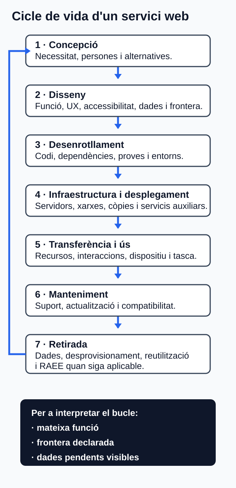

# Economia circular i ecodisseny de servicis web

## Orientació

### Propòsit i què aprendràs

En esta unitat aprendràs a proposar el redisseny responsable d'un servici web.
Partiràs de la funció que presta, caracteritzaràs el seu model actual, aplicaràs
principis d'economia circular i ecodisseny, i revisaràs les decisions al llarg
del cicle de vida.

El resultat serà un **prediagnòstic qualitatiu**, no una anàlisi del cicle de
vida (ACV) certificada. Tampoc afirmaràs que una alternativa és «més
sostenible» si no disposes d'una funció comparable, una frontera, un mètode i
dades suficients [TEC-03–TEC-05; TEC-10].

En acabar, podràs:

- descriure el model de partida d'un servici digital i els seus fluxos de
  recursos;
- distingir economia verda inclusiva, economia circular, reciclatge,
  ecodisseny i pensament de cicle de vida;
- contrastar beneficis potencials, compensacions, incerteses i efectes rebot;
- transformar un problema DAW en una decisió de redisseny comprovable;
- representar les fases d'un servici web des de la concepció fins a la
  retirada;
- relacionar cada procés DAW amb un criteri, una prova i un límit.

### Prerequisits

Necessites recuperar de les unitats U01–U03 estos aprenentatges:

- el significat de sostenibilitat i dels aspectes ambientals i socials;
- la identificació de reptes i impactes del sector digital;
- la formulació d'accions professionals justificades.

Per a l'activitat és suficient un editor de text. Les eines de desenvolupament
del navegador són opcionals: si no en disposes, pots treballar amb les
observacions qualitatives del cas proporcionat en estos apunts. No es requerix
programari privatiu.

### Itinerari i temps estimat

Les sis hores són una orientació de treball, no sis sessions ni dates del
centre.

| Bloc | Què faràs | Temps |
| --- | --- | ---: |
| 1 | Estudiaràs el model lineal, l'economia verda i la circular | 45 min |
| 2 | Aplicaràs ecodisseny i pensament de cicle de vida a DAW | 60 min |
| 3 | Seguiràs el cas guiat resolt | 75 min |
| 4 | Elaboraràs el redisseny autònom | 120 min |
| 5 | Faràs l'autoavaluació i revisaràs el lliurament | 30 min |
| 6 | Prepararàs la tutoria col·lectiva quinzenal o faràs el treball equivalent | 30 min |
| **Total** |  | **6 h** |

**Ruta recomanada:** llig primer els apartats 1–6; completa després el cas
guiat sense ometre els límits; elabora l'activitat; comprova-la amb els
criteris d'èxit; i tanca la unitat amb l'autoavaluació.

### Suport, tutoria i accessibilitat

- **Canal de dubtes:** registra cada dubte en una llista amb el context, la
  decisió que has de prendre i les alternatives considerades. Incorpora-la al
  lliurament en Aules (Moodle) si requerix confirmació docent.
- **Tutoria col·lectiva quinzenal (30 min orientatius):** prepara-hi dubtes
  sobre la unitat funcional, la frontera, una compensació entre criteris o una
  conclusió indeterminada. No cal dedicar-la a repetir definicions disponibles
  en els apunts. No es fixen dates ni se'n pressuposa l'assistència.
- **Treball equivalent si no participes en la tutoria:** completa el registre
  de decisions de l'activitat i respon per escrit les quatre preguntes de
  contrast de l'apartat 8.5.
- **Alternatives accessibles:** tot el contingut necessari és textual. Pots
  representar el cicle de vida com una llista ordenada o una taula en lloc
  d'un diagrama. Si el convertixes en figura, acompanya-la d'un text alternatiu
  que enumere les fases i les relacions rellevants. No uses només colors per a
  marcar millores, riscos o dades absents: afig les etiquetes «millora
  esperada», «risc» i «dada pendent».

## Resultats i criteris treballats

El resultat d'aprenentatge oficial és **RA4: «Proposa productes i servicis
responsables tenint en compte els principis de l'economia circular»**. La
literalitat següent procedix del Decret 114/2025, annex IX, p. 118 [CUR-01].

| CA | Criteri d'avaluació | Evidència en la unitat |
| --- | --- | --- |
| RA4.a | S'ha caracteritzat el model de producció i consum actual. | Caracterització del servici de partida i dels punts de pèrdua de valor. |
| RA4.b | S'han identificat els principis de l'economia verda i circular. | Principis diferenciats i aplicats a decisions del redisseny. |
| RA4.c | S'han contrastat els beneficis de l'economia verda i circular davant del model clàssic de producció. | Comparació homogènia amb beneficis condicionals, límits i rebot. |
| RA4.d | S'han aplicat principis d'ecodisseny. | Decisions vinculades amb problema, criteri, prova i límit. |
| RA4.e | S'ha analitzat el cicle de vida del producte. | Mapa qualitatiu del cicle de vida amb entrades, eixides i dades pendents. |
| RA4.f | S'han identificat els processos de producció i els criteris de sostenibilitat aplicats. | Matriu procés–decisió–criteri–prova–font–límit. |

## 1. Del model lineal al redisseny responsable

### 1.1 Com caracteritzar el model actual

El **model lineal o clàssic** és un model de referència basat en extracció,
producció, ús i disposició. Depén d'entrades noves i tendix a perdre el valor
dels productes i materials al final de l'ús [CON-02].

En un servici web, no n'hi ha prou amb observar la interfície. La funció depén
de programari, dispositius, xarxes i infraestructura. Per això, la
caracterització del model de partida ha de revisar:

1. **Necessitat i funció:** quin resultat obté la persona usuària i quines
   funcions són realment necessàries.
2. **Recursos digitals:** continguts, dades, peticions, consultes, càlcul,
   emmagatzematge i transferència.
3. **Infraestructura i equips:** dispositius, xarxa, servidors, entorns,
   còpies i servicis auxiliars que queden dins de la frontera.
4. **Duració:** compatibilitat, manteniment, dependències, vida de suport i
   causes de substitució prematura.
5. **Retirada:** destí de dades, desprovisionament de recursos i, quan siga
   aplicable, reutilització o gestió dels equips.

No digues que el codi, les dades o els bytes són «residus» en el sentit
jurídic. La legislació de residus i RAEE s'aplica als objectes i fluxos
materials inclosos en el seu àmbit [NOR-01–NOR-02]. En programari, és més
precís parlar de funcionalitat innecessària, duplicació de dades, transferència
evitable o recursos ociosos.

### 1.2 Una pauta DAW de lectura

Per a cada component, formula quatre preguntes:

| Pregunta | Exemple de resposta observable |
| --- | --- |
| Quina funció presta? | Permet completar una reserva. |
| Quin recurs usa? | Transferix contingut i consulta disponibilitat. |
| On es pot perdre valor? | Una dependència sense manteniment força una migració prematura. |
| Quina dada falta? | No consta el consum energètic del servidor. |

L'última columna és essencial: identificar una dada absent és millor que
substituir-la per una mitjana no comparable.

## 2. Economia verda, economia circular i reciclatge

### 2.1 Conceptes que no són sinònims

L'**economia verda inclusiva** és un marc ampli que busca millorar el benestar
humà i l'equitat social mentre reduïx significativament els riscos ambientals i
les escassetats ecològiques [CON-01]. En DAW obliga a considerar també la
inclusió: una reducció de recursos que impedix accedir al servici a part de la
població no és una solució responsable.

L'**economia circular** planteja una transició sistèmica des del model lineal
cap a l'ús circular dels recursos, la conservació de valor, la durabilitat i la
prevenció de residus [CON-02–CON-03]. En un servici web pot orientar decisions
que allarguen la compatibilitat segura, faciliten el manteniment o eviten la
substitució prematura d'equips. No demostra, per si sola, sostenibilitat total.

El **reciclatge** és una operació posterior a la prevenció i a la preparació per
a la reutilització en la jerarquia general de residus [NOR-01, art. 8]. Per
tant, circularitat no significa simplement reciclar. Quan un aparell elèctric o
electrònic es convertix en residu dins de l'àmbit normatiu, s'ha d'entregar pels
canals regulats; el programari no és un RAEE [NOR-02, arts. 12, 13 i 15].

### 2.2 Principis operatius per a un servici web

| Marc | Principi operatiu | Aplicació DAW possible |
| --- | --- | --- |
| Economia verda inclusiva | Benestar i equitat | Mantindre la informació, l'accessibilitat i el control de la persona usuària. |
| Economia verda inclusiva | Reducció de riscos ambientals | Evitar funcionalitat i ús de recursos sense necessitat demostrada. |
| Economia circular | Prevenció | No incorporar components, dades o equips innecessaris. |
| Economia circular | Conservació de valor | Mantindre el servici, les dades útils i els equips en ús segur durant més temps. |
| Economia circular | Durabilitat i actualització | Documentar dependències, compatibilitat, actualitzacions i retirada. |
| Economia circular | Reutilització abans del final de vida | Reutilitzar components o equips aptes quan el cas ho permeta, sense confondre-ho amb reciclatge. |

Estes aplicacions són hipòtesis de disseny que s'han de comprovar en el cas. No
són garanties automàtiques de reducció ambiental [CON-04].

## 3. Contrast de beneficis, límits i efecte rebot

Una comparació responsable manté equivalent la funció. Per exemple, no és
vàlid comparar una pàgina informativa amb un servici que permet completar una
reserva i concloure que la primera és superior només perquè transferix menys
dades.

### 3.1 Protocol mínim de comparació

Abans de concloure, declara:

1. **Necessitat i servici prestat.** Quina tasca equivalent es compara?
2. **Línia base.** Quina versió, configuració i escenari representen el punt de
   partida?
3. **Unitat funcional.** Quina unitat comuna representa la funció, com ara una
   reserva completada o una consulta resolta?
4. **Frontera.** Quins components s'inclouen i quins s'exclouen?
5. **Context.** Són equivalents el dispositiu, la connexió, la càrrega i la
   qualitat de servici quan resulten rellevants?
6. **Indicadors i mètode.** S'aplica el mateix procediment a la base i al
   redisseny?
7. **Incerteses i absències.** Quines dades són mesurades, modelitzades,
   hipotètiques o desconegudes?

Una ACV formal té fases d'objectiu i abast, inventari, avaluació d'impactes i
interpretació, a més de requisits d'informe, limitacions i, segons l'ús,
revisió crítica [TEC-03–TEC-05]. L'activitat breu d'esta unitat només aplica
pensament de cicle de vida.

### 3.2 Què es pot afirmar

| Observació | Conclusió prudent | Conclusió no admesa |
| --- | --- | --- |
| Baixen els bytes per a la mateixa tasca en la prova. | Ha millorat l'indicador tècnic de transferència dins de la prova. | Han baixat proporcionalment les emissions. |
| Una resposta reutilitzable usa memòria cau correctament. | S'han evitat transferències o càlculs repetits en l'escenari comprovat. | La memòria cau sempre reduïx l'impacte. |
| S'amplia la compatibilitat segura. | Pot reduir la pressió de substitució d'equips per incompatibilitat. | Allargar la vida sempre és ambientalment superior. |
| Falta informació energètica i d'equipament. | El resultat ambiental net queda indeterminat. | El servici és «verd». |

Bytes, peticions, consultes, temps, CPU o memòria són **indicadors tècnics
auxiliars**. No equivalen automàticament a energia, aigua o emissions de gasos
d'efecte d'hivernacle [TEC-09–TEC-10].

L'**efecte rebot** apareix quan l'estalvi per unitat facilita un augment d'ús
que recupera parcialment o totalment la millora esperada. La digitalització i
la circularitat poden millorar l'eficiència, però els beneficis nets depenen
del context, la demanda i els desplaçaments d'impacte [CON-04]. Per això convé
observar tant la intensitat per unitat funcional com l'activitat total.

## 4. Ecodisseny aplicat a DAW

L'**ecodisseny** integra sistemàticament en el disseny i desenrotllament els
aspectes ambientals relacionats amb el producte o servici que l'organització
pot controlar o influir. La norma ISO 14006 orienta la gestió del procés, però
no fixa valors universals de rendiment [TEC-02].

### 4.1 Registre d'una decisió d'ecodisseny

Una decisió queda justificada quan relaciona cinc elements:

1. **Problema:** què ocorre en la línia base.
2. **Decisió:** què es conserva, simplifica, reutilitza, modifica o retira.
3. **Criteri:** quin principi d'ecodisseny o circularitat orienta el canvi.
4. **Prova:** com es verificarà que la decisió funciona.
5. **Límit:** què no prova o quin risc pot introduir.

Exemple breu:

| Element | Registre |
| --- | --- |
| Problema | El frontend torna a demanar un recurs estàtic no modificat. |
| Decisió | Definir una política de memòria cau adequada al recurs i una estratègia d'invalidació. |
| Criteri | Evitar transferència repetida mantenint la funció. |
| Prova | Revisar les capçaleres HTTP i repetir la navegació en el mateix escenari. |
| Límit | No aplicar a dades personals o respostes que no siguen reutilitzables; controlar frescor, privacitat i seguretat. |

*Figura. Llista de control per justificar i provar una decisió d'ecodisseny sense atribuir-li un impacte final no mesurat. Il·lustració original, equip de disseny del projecte, CC0 1.0.*

La memòria cau HTTP pot reduir latència i sobrecàrrega de xarxa, però ha de
respectar cacheabilitat, frescor, validació, invalidació, privacitat i seguretat
[TEC-07]. La compressió és igualment contextual: HTTP en definix la semàntica,
però no acredita un resultat ambiental, i comprimir fitxers molt menuts pot ser
contraproduent [TEC-08–TEC-09].

### 4.2 Àrees de decisió

| Àrea | Pregunta d'ecodisseny | Prova possible |
| --- | --- | --- |
| Necessitat | La funció resol una necessitat demostrada? | Inventari necessitat–funció. |
| UX i contingut | La tasca és directa sense eliminar informació ni accessibilitat? | Prova de la mateixa tasca i criteris WCAG seleccionats. |
| Arquitectura | Cada component i servici de tercers té una funció justificada? | Diagrama de frontera i comparativa d'alternatives. |
| Frontend | Els recursos, formats, peticions i càrrega diferida són proporcionats? | Mesura reproduïble de recursos i comprovació visual i funcional. |
| Backend i dades | Es repetixen consultes o es retornen i conserven dades innecessàries? | Traça de consultes i inventari dada–finalitat–conservació. |
| Infraestructura | Hi ha capacitat, entorns o còpies sense ús justificat? | Inventari d'entorns i configuració base/alternativa. |
| Manteniment | El suport, les dependències i la compatibilitat estan planificats? | Política de suport i registre de dependències. |
| Retirada | Es poden exportar o eliminar dades i desprovisionar recursos? | Pla de retirada i comprovació del desprovisionament. |

RGESN v2 oferix criteris verificables per a estes àrees, però és una guia
pública francesa i no una obligació jurídica general a Espanya [TEC-01]. Les
Web Sustainability Guidelines citades en el dossier també són un esborrany de
nota de grup, poden canviar i no estan avalades pel W3C [TEC-06]. Servixen com
orientació, no com a certificació.

L'accessibilitat no és una característica prescindible per a reduir recursos.
WCAG 2.2 aporta criteris comprovables sota els principis perceptible, operable,
comprensible i robust, encara que no cobrix totes les necessitats de totes les
persones amb discapacitat [TEC-11].

## 5. Pensament de cicle de vida d'un servici digital

El **cicle de vida** reunix les etapes consecutives i relacionades del sistema
des de l'origen fins al final de vida. En TIC cal considerar programari,
equips, xarxes, servici i final de vida quan siguen materials per al cas
[TEC-03–TEC-05].

### 5.1 Mapa textual accessible

1. **Concepció:** necessitat, persones afectades i alternatives.
2. **Disseny:** funcions, UX, accessibilitat, arquitectura, dades i frontera.
3. **Desenrotllament:** codi, dependències, proves, integració i entorns.
4. **Infraestructura i desplegament:** servidors, xarxes, còpies, observabilitat
   i servicis auxiliars.
5. **Transferència i ús:** recursos enviats, interaccions, dispositiu, càlcul i
   qualitat funcional.
6. **Manteniment:** actualitzacions, incidències, compatibilitat, documentació i
   vida de suport.
7. **Retirada:** exportació o eliminació de dades, arxiu, desprovisionament,
   reutilització d'equips aptes i gestió de RAEE quan siga aplicable.

**Text alternatiu proposat si representes esta llista com una figura:**
«Cicle de vida d'un servici web en set fases relacionades: concepció, disseny,
desenrotllament, infraestructura i desplegament, transferència i ús,
manteniment, i retirada. Les decisions de cada fase poden traslladar impactes a
les següents i la interpretació retroalimenta el disseny.»

*Figura. Bucle qualitatiu del cicle de vida del servici web; la llista ordenada anterior és l'alternativa textual completa. Il·lustració original, equip de disseny del projecte, CC0 1.0.*

### 5.2 Fitxa d'anàlisi qualitativa

| Fase | Entrada o recurs | Eixida o possible impacte | Decisió | Dada pendent |
| --- | --- | --- | --- | --- |
| Concepció | Necessitats i requisits | Funcions necessàries o sobreres | Conservar, simplificar o retirar | Persones afectades |
| Desenrotllament | Codi, dependències i entorns | Càlcul, emmagatzematge, obsolescència | Reduir complexitat i planificar suport | Ús real dels entorns |
| Ús | Dispositiu, xarxa i infraestructura | Transferència, càlcul i qualitat del servici | Optimitzar sense perdre funció ni accessibilitat | Energia i equipament |
| Retirada | Dades, recursos i equips | Recursos ociosos, arxiu o residus materials | Exportar, eliminar i desprovisionar | Destí verificat |

Esta fitxa no quantifica una ACV. Si falten inventaris d'energia, maquinari,
xarxa, regió, aigua o final de vida, limita la conclusió a l'anàlisi qualitativa
o als indicadors tècnics disponibles [TEC-03–TEC-05; TEC-10].

## 6. Processos DAW i criteris de sostenibilitat

La matriu següent relaciona el procés amb una decisió verificable. No prescriu
una arquitectura concreta ni establix llindars universals.

| Procés | Criteri aplicat | Evidència o prova | Límit principal |
| --- | --- | --- | --- |
| Necessitat i especificació | Funció útil, unitat funcional, frontera, compatibilitat i suport | Inventari de funcions i requisits verificables | La utilitat declarada s'ha de contrastar amb les persones afectades. |
| UX, accessibilitat i contingut | Itinerari proporcionat, informació necessària i control d'usuari | Tasca equivalent i criteris WCAG seleccionats | Simplificar no justifica excloure persones ni funcions necessàries. |
| Arquitectura | Components i dependències justificats per funció i mantenibilitat | Diagrama de frontera i comparativa | Menys components no implica sempre millor resultat global. |
| Frontend i transferència | Recursos proporcionats, compressió i memòria cau contextuals | Bytes, peticions, capçaleres i prova funcional | Els indicadors tècnics no són impactes ambientals finals. |
| Backend, API i dades | Evitar consultes repetides i dades sense finalitat | Traça de consultes i inventari de dades | Cal preservar exactitud, privacitat i seguretat. |
| Infraestructura i operació | Capacitat i entorns ajustats a l'ús justificat | Inventari d'entorns, configuració i utilització | Les afirmacions del proveïdor necessiten període, regió, frontera i mètode. |
| Manteniment | Suport, compatibilitat, actualització i reparabilitat | Política de suport i registre de dependències | Prolongar l'ús pot tindre compensacions de seguretat o consum. |
| Retirada | Exportació, eliminació i desprovisionament; gestió material adequada | Pla de retirada i comprovants quan siguen aplicables | El codi no és RAEE; la norma s'aplica als equips dins del seu àmbit. |

Esta relació es basa en orientacions d'ecodisseny digital i de cicle de vida,
en els estàndards HTTP i en els límits documentats per a indicadors tècnics
[TEC-01; TEC-05; TEC-07–TEC-11].

## 7. Cas guiat DAW resolt: ReservaWeb

### 7.1 Escenari i límits del cas

**ReservaWeb és un cas hipotètic creat per a l'aprenentatge.** Les
característiques següents són supòsits de l'exercici, no dades d'una empresa o
administració real:

- el servici permet consultar disponibilitat, reservar i cancel·lar una cita;
- el frontend transferix en cada visita una imatge decorativa de gran resolució
  i torna a demanar recursos estàtics que no han canviat;
- l'API de disponibilitat retorna camps que la interfície no mostra i repetix
  una consulta quan la persona canvia i recupera la mateixa data;
- hi ha un entorn de prova sense ús justificat que continua aprovisionat;
- no hi ha una política documentada de suport, compatibilitat ni retirada;
- no consten dades d'energia, emissions, aigua, equips, regió ni proveïdor.

La funció comparada és **completar correctament una reserva accessible**. La
unitat funcional és **una reserva completada**. La frontera inclou dispositiu,
frontend, xarxa, API, base de dades, entorns de prova i producció, manteniment i
retirada. El cas exclou altres sistemes interns no descrits. Base i redisseny
s'han de provar amb la mateixa tasca i el mateix context; com que no hi ha dades
ambientals, la comparació serà qualitativa i usarà indicadors tècnics auxiliars
[TEC-05; TEC-10].

### 7.2 Pas 1. Caracterització del model de partida (RA4.a)

| Element | Caracterització |
| --- | --- |
| Necessitat | Consultar disponibilitat i gestionar una reserva. |
| Patró lineal | S'afigen recursos, camps i entorns sense un procés documentat de prevenció, manteniment o retirada. |
| Entrades | Contingut, dades, transferència, càlcul, emmagatzematge, infraestructura i dispositiu. |
| Pèrdues de valor | Peticions repetides, camps no utilitzats, entorn aprovisionat sense funció i risc d'obsolescència per falta de suport. |
| Final de vida | No està previst com s'exportaran o eliminaran dades ni com es desprovisionaran els recursos. |
| Dades absents | Energia, emissions, aigua, materials, equipament, escala d'ús i efectes totals. |

Esta caracterització descriu el cas, però no afirma que tot servici web seguisca
el mateix patró.

### 7.3 Pas 2. Principis seleccionats (RA4.b)

| Principi | Aplicació al cas |
| --- | --- |
| Benestar i equitat | Mantindre completa la tasca de reserva i comprovar-ne l'accessibilitat. |
| Prevenció | Retirar la imatge decorativa si no aporta una funció justificada i desprovisionar l'entorn sense ús després de verificar que no és necessari. |
| Conservació de valor | Mantindre compatibilitat segura i documentar les dependències per a prolongar el suport del servici i dels dispositius compatibles. |
| Ús circular de recursos | Reutilitzar respostes estàtiques amb memòria cau quan la frescor i la seguretat ho permeten. |
| Durabilitat i actualització | Definir responsables, criteris d'actualització, compatibilitat i retirada. |

La primera fila correspon al marc d'economia verda inclusiva; les altres
despleguen circularitat i prevenció. No s'han tractat com a sinònims
[CON-01–CON-03].

### 7.4 Pas 3. Decisions d'ecodisseny (RA4.d)

| Problema | Decisió | Criteri | Prova | Límit o risc |
| --- | --- | --- | --- | --- |
| Imatge decorativa desproporcionada | Retirar-la o substituir-la per un recurs proporcionat si es justifica la funció | Evitar recurs sense necessitat | Comparar la mateixa tasca i revisar la presentació | No retirar informació necessària; validar la classificació com a decorativa. |
| Recursos estàtics repetits | Configurar memòria cau i invalidació | Evitar transferències repetides | Inspeccionar capçaleres i repetir la navegació | Frescor, privacitat i seguretat. |
| Camps d'API no mostrats | Retornar només les dades necessàries per a la funció | Evitar transferència i tractament innecessaris | Comparar resposta i proves funcionals | No eliminar camps requerits per accessibilitat, integritat o altres funcions incloses. |
| Consulta repetida | Valorar memòria cau de dades freqüents amb invalidació | Evitar càlcul repetit | Traçar consultes i provar actualitzacions | La disponibilitat obsoleta podria causar errors de reserva. |
| Entorn sense ús | Verificar dependències i desprovisionar-lo | Prevenció de recursos ociosos | Inventari abans/després i registre de retirada | No retirar un entorn necessari per a continuïtat, proves o recuperació. |
| Suport no documentat | Crear política de compatibilitat, dependències i retirada | Durabilitat i mantenibilitat | Revisió periòdica del registre | Compatibilitat sense actualitzacions de seguretat no és una millora. |

### 7.5 Pas 4. Contrast amb el model de partida (RA4.c)

| Aspecte | Benefici esperat | Compensació o límit | Conclusió |
| --- | --- | --- | --- |
| Recursos de frontend | Menys recursos transferits per reserva en la prova | Pot requerir treball de redisseny i validació visual | Millora tècnica esperada; impacte ambiental net indeterminat. |
| Memòria cau | Menys peticions o consultes repetides en l'escenari | Emmagatzematge, invalidació, privacitat i risc d'obsolescència | Aplicar només a contingut adequat i provar la frescor. |
| Entorns | Menys infraestructura aprovisionada sense funció | Cal conservar capacitat necessària per a proves i recuperació | Desprovisionar només després de verificar dependències. |
| Compatibilitat | Pot prolongar l'ús segur de dispositius | Pot elevar el cost de manteniment o impedir millores de seguretat | Definir una política revisable, no suport il·limitat. |
| Escala | Pot baixar la intensitat tècnica per reserva | Més reserves totals poden reduir o anul·lar l'estalvi | Vigilar activitat total i possible efecte rebot. |

No es conclou que ReservaWeb siga «més sostenible». Sí que es pot afirmar, si
les proves ho confirmen, quins indicadors tècnics milloren per reserva dins de
la frontera declarada [CON-04; TEC-09–TEC-10].

### 7.6 Pas 5. Cicle de vida (RA4.e)

| Fase | Anàlisi del cas | Dada o comprovació pendent |
| --- | --- | --- |
| Concepció | La reserva és la necessitat; la imatge decorativa no té funció demostrada. | Contrastar necessitats de les persones usuàries. |
| Disseny | Cal conservar una tasca completa i accessible i delimitar dades i components. | Proves d'accessibilitat i qualitat funcional. |
| Desenrotllament | Les dependències i consultes requerixen documentació i proves. | Versions, manteniment i perfil de consultes. |
| Infraestructura | Hi ha un entorn de prova sense ús justificat en l'escenari. | Dependències, utilització, energia i equipament. |
| Transferència i ús | Hi ha recursos i dades repetits segons els supòsits. | Mesurar amb el mateix mètode abans i després. |
| Manteniment | No hi ha política documentada. | Responsables, compatibilitat segura i vida de suport. |
| Retirada | No hi ha pla de dades ni de desprovisionament. | Destí de dades, recursos i equips. |

### 7.7 Pas 6. Processos i criteris aplicats (RA4.f)

| Procés | Decisió | Criteri | Indicador o prova | Font | Límit |
| --- | --- | --- | --- | --- | --- |
| UX i contingut | Revisar la imatge decorativa sense alterar la tasca | Proporcionalitat i accessibilitat | Prova funcional i revisió WCAG seleccionada | TEC-01; TEC-11 | No acredita impacte ambiental final. |
| Frontend | Configurar memòria cau de recursos aptes | Evitar transferència repetida | Capçaleres i peticions repetides | TEC-07; TEC-09 | Controlar frescor i seguretat. |
| API i dades | Limitar camps i consultes repetides | Minimitzar recursos mantenint exactitud | Resposta de l'API i traça de consultes | TEC-01; TEC-06 | No retirar dades necessàries. |
| Infraestructura | Revisar i, si correspon, retirar l'entorn ociós | Ajustar recursos a la funció | Inventari i registre de desprovisionament | TEC-05; TEC-06 | Falta informació energètica. |
| Manteniment | Documentar suport i compatibilitat | Durabilitat i actualització | Política i registre de dependències | TEC-01; NOR-01 | Aplicació material de NOR-01 condicionada al cas. |
| Retirada | Planificar dades, servicis i equips | Prevenció i gestió responsable | Pla i comprovants aplicables | NOR-01–NOR-02; TEC-06 | El programari no és RAEE. |

## 8. Activitat asíncrona: redisseny circular d'un servici web

### 8.1 Objectiu i modalitat

Elabora individualment un redisseny justificat que integre els sis criteris
RA4.a–RA4.f. Pots analitzar un servici propi del qual conegues la configuració
o reutilitzar **ReservaWeb**. Si uses un projecte propi, no inclogues dades
personals, credencials ni informació confidencial.

### 8.2 Recursos

- estos apunts i la plantilla de l'apartat 8.4;
- un editor de text;
- opcionalment, eines de desenvolupament del navegador o registres del teu
  projecte;
- si no pots fer mesures, les observacions qualitatives de ReservaWeb.

No substituïsques dades absents per xifres inventades. Etiqueta cada dada com a
**mesurada**, **modelitzada**, **hipotètica** o **desconeguda**.

### 8.3 Passos

1. Identifica la necessitat i definix una unitat funcional.
2. Declara línia base, frontera, context, inclusions i exclusions.
3. Caracteritza el model de partida i els punts de pèrdua de valor.
4. Diferencia i aplica almenys un principi d'economia verda inclusiva i dos
   principis circulars.
5. Representa les set fases del cicle de vida i anota entrades, eixides,
   decisions i dades pendents.
6. Proposa decisions d'ecodisseny en almenys quatre processos DAW.
7. Per a cada decisió, registra problema, criteri, prova i límit.
8. Contrasta base i redisseny amb la mateixa funció i el mateix mètode.
9. Redacta una conclusió limitada: què millora, què pot empitjorar i què queda
   indeterminat.
10. Revisa el document amb els criteris d'èxit.

### 8.4 Plantilla de lliurament

Pots copiar esta estructura en un fitxer de text:

1. **Servici, necessitat i persones afectades.**
2. **Unitat funcional, línia base, frontera i context.**
3. **Caracterització del model de partida.**
4. **Principis verds i circulars seleccionats.**
5. **Mapa textual o taula del cicle de vida.**
6. **Matriu de decisions:** procés, problema, decisió, criteri, prova, font i
   límit.
7. **Contrast:** benefici esperat, compensació, rebot i dada pendent.
8. **Conclusió limitada.**
9. **Referències.**
10. **Registre de dubtes i decisions.**

### 8.5 Lliurament i ús de la tutoria

- **Producte:** un únic document en un format obert: `.md` o `.odt`. També pots
  adjuntar un PDF accessible com a còpia de lectura.
- **Canal i data:** lliura'l digitalment en **Aules (Moodle)**. La data o el
  termini no es fixa en estos apunts.
- **Figures opcionals:** acompanya qualsevol diagrama d'un text alternatiu
  equivalent. Les taules o llistes textuals són una alternativa completa.
- **Dubtes:** adjunta el registre de dubtes si hi ha decisions que requerixen
  confirmació docent.

Si participes en la tutoria col·lectiva quinzenal, porta preparades estes
preguntes. Si no hi participes, respon-les en el registre:

1. La unitat funcional representa realment la mateixa tasca abans i després?
2. La frontera omet algun component que podria canviar la conclusió?
3. Quina decisió presenta la compensació més important?
4. Quina dada faria falta per a passar d'una millora tècnica a una conclusió
   ambiental?

### 8.6 Criteris d'èxit i retroacció prevista

| Criteri d'èxit | Com comprovar-lo |
| --- | --- |
| Caracteritza el model actual (RA4.a). | Identifica funció, entrades, processos, pèrdues de valor i final de vida. |
| Diferencia els marcs (RA4.b). | No tracta economia verda, circularitat i reciclatge com a sinònims. |
| Contrasta amb prudència (RA4.c). | Manté funció i mètode, i explicita beneficis condicionals, compensacions, rebot i incertesa. |
| Aplica ecodisseny (RA4.d). | Cada decisió té problema, criteri, prova i límit. |
| Analitza el cicle de vida (RA4.e). | Inclou les fases des de concepció fins a retirada, amb dades pendents. |
| Vincula processos i criteris (RA4.f). | La matriu relaciona procés, decisió, criteri, indicador o prova, font i límit. |
| Respecta els límits de dades. | No convertix bytes o peticions en emissions ni inventa dades ambientals. |
| És accessible i traçable. | Té encapçalaments, taules simples, etiquetes no dependents del color, alternatives textuals i citacions. |

La retroacció docent, quan el centre concrete el procediment, hauria d'indicar
per a cada CA una evidència aconseguida i una millora accionable. Mentrestant,
usa el cas resolt, esta taula i el solucionari com a retroacció immediata. No
s'establixen ponderacions ni qualificacions perquè són decisions pendents del
centre.

## 9. Autoavaluació

Intenta respondre sense mirar el solucionari.

1. Quina diferència principal hi ha entre economia verda inclusiva i economia
   circular?
2. Ordena estes opcions segons la jerarquia general de residus: reciclatge,
   prevenció, eliminació, preparació per a la reutilització i altra valorització.
3. Per què «una web» sol ser una unitat funcional insuficient?
4. Una versió transferix menys bytes que l'anterior. Què pots afirmar sense
   dades addicionals?
5. És correcte activar memòria cau per a totes les respostes? Justifica-ho.
6. Quins quatre grans blocs estructuren una ACV segons ISO 14040/14044?
7. Completa el registre: «problema → decisió → ____ → prova → ____».
8. Indica una possible compensació d'ampliar la compatibilitat d'un servici.
9. En quin cas té sentit parlar de RAEE en el cicle de vida d'un servici web?
10. Un redisseny reduïx el recurs per reserva, però duplica el nombre total de
    reserves. Quin fenomen has de considerar i quina dada has d'observar?

## 10. Solucionari raonat

1. **L'economia verda inclusiva és un marc més ampli** de benestar, equitat i
   reducció de riscos ambientals; l'economia circular se centra en la transició
   sistèmica dels recursos, la conservació de valor, la durabilitat i la
   prevenció. Poden relacionar-se, però no són sinònims [CON-01–CON-03].
2. **Prevenció → preparació per a la reutilització → reciclatge → altra
   valorització → eliminació.** És l'ordre general de l'article 8 de la Llei
   7/2022 [NOR-01].
3. **Perquè no concreta una funció comparable.** Una unitat funcional ha de
   representar com escala el servici, com ara una reserva completada. Sense
   això es podrien comparar servicis que resolen necessitats diferents
   [TEC-05; TEC-10].
4. **Només que ha millorat l'indicador tècnic de transferència** dins de la
   prova, si la funció i el mètode són equivalents. No es pot convertir eixa
   dada automàticament en energia o CO2e [TEC-09–TEC-10].
5. **No.** La resposta ha de ser reutilitzable i cal controlar frescor,
   validació, invalidació, privacitat i seguretat. Una dada personal o una
   disponibilitat canviant pot requerir un tractament diferent [TEC-07].
6. **Objectiu i abast, inventari, avaluació d'impactes i interpretació.** Una
   ACV també comporta informe, limitacions i, segons l'ús, revisió crítica
   [TEC-03–TEC-05].
7. **Problema → decisió → criteri → prova → límit.** El criteri justifica la
   direcció del canvi i el límit evita conclusions excessives.
8. **Pot augmentar el treball de manteniment o entrar en conflicte amb la
   seguretat.** Allargar suport només és responsable si la compatibilitat
   continua sent segura i funcional [CON-04; TEC-01].
9. **Quan un aparell elèctric o electrònic inclòs en l'àmbit normatiu es
   convertix en residu.** Aleshores s'ha d'entregar pels canals regulats. Ni el
   codi ni les dades són RAEE [NOR-02].
10. **Cal considerar l'efecte rebot** i observar, a més de la intensitat per
    reserva, l'activitat i els recursos totals. L'eficiència unitària no
    garantix una reducció absoluta [CON-04].

## 11. Resum

- El model de partida d'un servici web inclou funció, programari, dades,
  dispositius, xarxa, infraestructura, manteniment i retirada.
- L'economia verda inclusiva incorpora benestar i equitat; l'economia circular
  busca conservar valor, prolongar l'ús i previndre residus. Reciclar és només
  una part posterior de la jerarquia material.
- L'ecodisseny integra aspectes ambientals en decisions controlables o
  influenciables del disseny i desenrotllament.
- Una decisió útil connecta problema, decisió, criteri, prova i límit.
- El pensament de cicle de vida evita optimitzar una fase traslladant el
  problema a una altra, però no equival a una ACV certificada.
- Una comparació necessita funció equivalent, unitat funcional, línia base,
  frontera, context, mètode i qualitat de dades.
- Bytes, peticions o temps són indicadors tècnics, no mesures automàtiques
  d'energia o emissions.
- La conclusió responsable diferencia què millora, què pot empitjorar i què
  queda indeterminat.

## 12. Glossari

| Terme | Definició |
| --- | --- |
| ACV | Metodologia estructurada d'anàlisi del cicle de vida amb objectiu i abast, inventari, avaluació d'impactes i interpretació, a més d'informe i limitacions. |
| Ecodisseny | Integració d'aspectes ambientals relacionats amb el producte o servici en el disseny i desenrotllament. |
| Economia circular | Transició cap a l'ús circular dels recursos, la conservació de valor, la durabilitat i la prevenció de residus. |
| Economia verda inclusiva | Marc orientat al benestar i l'equitat social amb reducció significativa de riscos ambientals i escassetats ecològiques. |
| Efecte rebot | Augment d'ús o demanda que reduïx o anul·la l'estalvi esperat d'una millora d'eficiència. |
| Frontera del sistema | Conjunt de processos i components inclosos o exclosos de l'anàlisi. |
| Indicador tècnic auxiliar | Mesura de recursos o rendiment, com bytes o peticions, que no representa necessàriament un impacte ambiental final. |
| Línia base | Estat de referència calculat amb la mateixa funció, frontera, mètode i supòsits que l'alternativa. |
| Memòria cau | Mecanisme de reutilització de respostes o dades per a evitar transferències o càlculs repetits quan la semàntica i la seguretat ho permeten. |
| Model lineal | Model de referència basat en extracció, producció, ús i disposició. |
| RAEE | Aparell elèctric o electrònic que s'ha convertit en residu dins de l'àmbit de la norma aplicable. |
| Unitat funcional | Unitat comuna que representa la funció comparada i a la qual es referixen els fluxos o la intensitat. |

## 13. Mapa de traçabilitat

| CA | Secció explicativa | Activitat o evidència | Font del dossier |
| --- | --- | --- | --- |
| RA4.a | 1 i 7.2 | Apartat 3 del lliurament: caracterització del model de partida | CON-01–CON-04; NOR-01; TEC-04 |
| RA4.b | 2 i 7.3 | Apartat 4: principis verds i circulars diferenciats | CON-01–CON-03; NOR-01 |
| RA4.c | 3 i 7.5 | Apartat 7: contrast, compensacions, rebot i dades pendents | CON-01–CON-04; TEC-03–TEC-06; TEC-10 |
| RA4.d | 4 i 7.4 | Apartat 6: decisions amb problema, criteri, prova i límit | TEC-01–TEC-02; TEC-07–TEC-11 |
| RA4.e | 5 i 7.6 | Apartat 5: mapa de cicle de vida amb dades pendents | TEC-03–TEC-05 |
| RA4.f | 6 i 7.7 | Apartat 6: matriu procés–decisió–criteri–prova–font–límit | TEC-01; TEC-05; TEC-07–TEC-11; NOR-01–NOR-02 |

## 14. Referències

Fonts identificades i admeses pel dossier documental d'U04. Data de consulta:
30 de juliol de 2026.

### Currículum

- **[CUR-01]** Consell de la Generalitat Valenciana. *Decret 114/2025, de 29
  de juliol, del Consell, pel qual s'establixen els currículums dels cicles
  formatius de grau mitjà i de grau superior de Formació Professional, en
  aplicació de la Llei orgànica 3/2022*. Annex IX, pp. 118–119.
  https://dogv.gva.es/datos/2025/08/04/pdf/2025_29742_va.pdf

### Marc conceptual i normativa

- **[CON-01]** Programa de les Nacions Unides per al Medi Ambient. *What is an
  “Inclusive Green Economy”?*, actualitzat el 19.03.2019, apartats «Green
  Economy» i «From GEI to an Inclusive Green Economy».
  https://www.unep.org/explore-topics/green-economy/why-does-green-economy-matter/what-inclusive-green-economy
- **[CON-02]** International Organization for Standardization. *ISO
  59004:2024, Circular economy — Vocabulary, principles and guidance for
  implementation*, 22.05.2024. Edició publicada i marcada per ISO «to be
  revised» en la data de tall. https://www.iso.org/standard/80648.html
- **[CON-03]** Agència Europea de Medi Ambient. *Accelerating the circular
  economy in Europe*, EEA Report 13/2023, publicat el 21.03.2024, resum de la
  publicació. https://www.eea.europa.eu/en/analysis/publications/accelerating-the-circular-economy
- **[CON-04]** IPCC, Grup de Treball III. *Climate Change 2022: Mitigation of
  Climate Change*, capítol 5, resum executiu i apartats 5.3.4–5.3.4.2.
  https://www.ipcc.ch/report/ar6/wg3/chapter/chapter-5/
- **[NOR-01]** Corts Generals. *Llei 7/2022, de 8 d'abril, de residus i sòls
  contaminats per a una economia circular*, text consolidat, articles 8 i
  18.1.a–e. https://www.boe.es/eli/es/l/2022/04/08/7/con
- **[NOR-02]** Govern d'Espanya. *Reial decret 110/2015, de 20 de febrer, sobre
  residus d'aparells elèctrics i electrònics*, text consolidat, articles 12,
  13 i 15. https://www.boe.es/eli/es/rd/2015/02/20/110/con

### Estàndards i orientacions tècniques

- **[TEC-01]** Arcep, Arcom, ADEME i Mission interministérielle numérique
  écoresponsable. *Référentiel général d'écoconception de services numériques
  (RGESN)*, versió 2, 28.05.2024; criteris actualitzats 24.09.2024.
  https://ecoresponsable.numerique.gouv.fr/publications/referentiel-general-ecoconception/
- **[TEC-02]** International Organization for Standardization. *ISO
  14006:2020, Environmental management systems — Guidelines for incorporating
  ecodesign*, 30.01.2020; confirmada en 2025.
  https://www.iso.org/standard/72644.html
- **[TEC-03]** International Organization for Standardization. *ISO
  14040:2006, Environmental management — Life cycle assessment — Principles
  and framework*, amb esmena 1:2020. https://www.iso.org/standard/37456.html
- **[TEC-04]** International Organization for Standardization. *ISO
  14044:2006, Environmental management — Life cycle assessment — Requirements
  and guidelines*, amb esmenes 1:2017 i 2:2020.
  https://www.iso.org/standard/38498.html
- **[TEC-05]** Unió Internacional de Telecomunicacions. *Recommendation ITU-T
  L.1410 (11/2024), Methodology for environmental life cycle assessments of
  information and communication technology goods, networks and services*,
  aprovada el 06.11.2024. https://www.itu.int/rec/T-REC-L.1410-202411-I/en
- **[TEC-06]** W3C Sustainable Web Interest Group. *Web Sustainability
  Guidelines*, W3C Group Note Draft, 29.07.2026. Esborrany no avalat pel W3C i
  susceptible de canvi.
  https://www.w3.org/TR/2026/DNOTE-web-sustainability-guidelines-20260729/
- **[TEC-07]** IETF; RFC Editor. *RFC 9111, HTTP Caching*, juny de 2022, STD 98,
  apartats 1–5 i 7. https://www.rfc-editor.org/rfc/rfc9111.html
- **[TEC-08]** IETF; RFC Editor. *RFC 9110, HTTP Semantics*, juny de 2022, STD
  97, apartats 8.4 i 12.5.3.
  https://www.rfc-editor.org/rfc/rfc9110.html#section-8.4
- **[TEC-09]** Arcep, Arcom, ADEME i Mission interministérielle numérique
  écoresponsable. *RGESN*, versió 2, criteris 6.1, 6.2 i 6.3.
  https://ecoresponsable.numerique.gouv.fr/publications/referentiel-general-ecoconception/#frontend
- **[TEC-10]** Green Software Foundation. *Software Carbon Intensity (SCI)
  Specification*, versió 1.1.0, 2024, apartats «Procedure», «Software boundary»,
  «Functional unit», «Quantification method» i comparació amb línia base.
  https://sci.greensoftware.foundation/
- **[TEC-11]** World Wide Web Consortium. *Web Content Accessibility Guidelines
  (WCAG) 2.2*, Recomanació de 12.12.2024, seccions 1–5.
  https://www.w3.org/TR/2024/REC-WCAG22-20241212/
