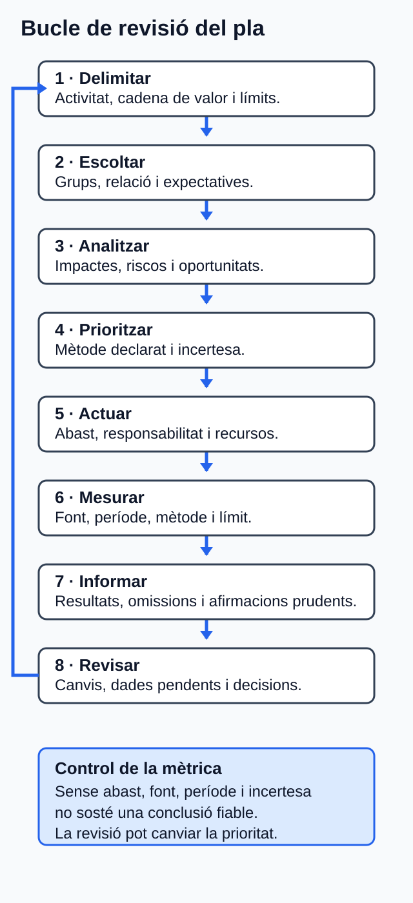

# Pla de sostenibilitat d'una empresa web

## Orientació

### Què aprendràs

En esta unitat analitzaràs un pla de sostenibilitat d'una empresa fictícia de
desenrotllament i manteniment web. El producte final serà un **informe acadèmic
de sostenibilitat** que:

1. identifique i justifique els grups d'interés principals;
2. prioritze aspectes ambientals, socials i de governança (ASG);
3. relacione estos aspectes amb expectatives, impactes, riscos, oportunitats i
   objectius empresarials;
4. propose accions concretes;
5. definisca indicadors traçables; i
6. comunique els límits, les omissions i les dades pendents.

L'informe és una evidència educativa sobre un cas fictici. No és un informe
legal, verificat o assegurat, ni permet afirmar conformitat amb un estàndard.
Tampoc es pot deduir que l'empresa estiga sotmesa a la CSRD: caldrien dades
corporatives i d'àmbit que el cas no proporciona [E08, E09].

### Prerequisits

Convé recuperar d'U01–U05 estos aprenentatges:

- significat dels aspectes ASG, dels impactes, dels riscos i de les
  oportunitats;
- identificació de grups d'interés i d'ODS rellevants;
- economia circular, ecodisseny i perspectiva de cicle de vida;
- avaluació prudent d'impactes d'un servici web; i
- formulació d'accions sostenibles amb evidència.

No cal conéixer prèviament ESRS, VSME, GRI, GHG Protocol, WCAG, WSG o SASB: la
funció i els límits que necessites apareixen explicats en esta unitat.

### Itinerari i temps estimat

Les cinc hores són temps orientatiu de treball, no cinc sessions ni cinc dates.

| Bloc | Què faràs | Temps |
| --- | --- | ---: |
| 1 | Llegir l'orientació i revisar els prerequisits | 15 min |
| 2 | Estudiar grups d'interés, materialitat, accions, mètriques i informe | 1 h |
| 3 | Seguir el cas guiat DAW | 45 min |
| 4 | Elaborar l'activitat asíncrona | 2 h |
| 5 | Fer l'autoavaluació i revisar el lliurament | 30 min |
| 6 | Tutoria col·lectiva quinzenal o contrast autònom equivalent | 30 min |
| **Total** |  | **5 h** |

**Ruta recomanada:** completa els blocs en orde. Si ja domines una part, usa el
resum i el glossari per a comprovar-la, però no comences l'activitat sense haver
revisat el cas guiat i els límits de les dades.

### Accessibilitat i autonomia

Tot el contingut necessari és textual i es pot completar sense vídeo, gràfics
interactius ni una aplicació concreta. Les taules es poden transformar en
llistes amb els mateixos encapçalaments. Cap instrucció depén exclusivament del
color. Si incorpores una figura a l'informe, acompanya-la d'un text alternatiu
que comunique la conclusió, les categories, el mètode i les excepcions; per
exemple: «Matriu de materialitat del cas fictici: accessibilitat i privacitat
queden prioritzades per impacte; continuïtat i dades també presenten efecte
empresarial; la resta d'aspectes queda pendent de més evidència».

## Resultats i criteris treballats

El RA6 i els cinc CA són prescriptius en el currículum valencià [E01].

**RA6.** Analitza un pla de sostenibilitat d'una empresa del sector, identifica
els seus grups d'interés i els aspectes ASG materials, i justifica accions per a
gestionar-los i mesurar-los.

| CA | Què hauràs de demostrar |
| --- | --- |
| RA6.a | Identificar els principals grups d'interés de l'empresa. |
| RA6.b | Analitzar els aspectes ASG materials, les expectatives dels grups i la relació amb els objectius empresarials. |
| RA6.c | Definir accions per a reduir impactes negatius i aprofitar oportunitats dels aspectes materials. |
| RA6.d | Determinar mètriques d'acompliment d'acord amb estàndards de sostenibilitat àmpliament utilitzats. |
| RA6.e | Elaborar un informe de sostenibilitat que integre el pla i els indicadors proposats. |

## 1. De la llista d'assumptes al pla coherent

Un pla de sostenibilitat no és una col·lecció d'accions benintencionades. Ha de
mantindre una cadena de raonament comprovable:

1. delimitar l'empresa, l'activitat i la cadena de valor analitzades;
2. identificar els grups afectats i els usuaris de la informació;
3. recollir expectatives sense confondre-les amb conclusions;
4. analitzar impactes, riscos i oportunitats;
5. prioritzar els aspectes materials amb un mètode declarat;
6. vincular cada aspecte amb objectius i accions; i
7. seguir les accions amb indicadors, resultats i límits.

*Figura. Cadena de traçabilitat des dels grups fins a l'informe, amb omissions i límits visibles. Il·lustració original, equip de disseny del projecte, CC0 1.0.*

ESRS 1 diferencia els grups afectats dels usuaris de la informació, definix la
doble materialitat i demana considerar la cadena de valor. ESRS 2 estructura la
informació sobre model de negoci, grups, procés de materialitat, polítiques,
accions, mètriques i objectius [E06]. En este exercici s'usa esta estructura com
a referència analítica; això no acredita obligació ni conformitat.

### 1.1 Conceptes que no s'han de confondre

- **Impacte:** efecte positiu o negatiu, real o potencial, sobre les persones o
  el medi ambient, també a través de la cadena de valor [E06, E13].
- **Risc de sostenibilitat:** condició ASG que pot produir un efecte negatiu
  material sobre l'empresa [E06, E21].
- **Oportunitat de sostenibilitat:** condició ASG que pot afavorir materialment
  l'empresa. No prova, per si sola, un impacte extern positiu [E06, E21].
- **Aspecte material:** assumpte prou rellevant per a orientar la gestió i la
  informació, segons la perspectiva i el mètode declarats.
- **Acció:** mesura concreta per a gestionar un impacte, risc o oportunitat; no
  és una aspiració genèrica [E06].
- **Indicador:** mesura qualitativa o quantitativa que permet seguir
  l'acompliment, l'acció o l'objectiu [E06, E10, E11].

Exemple DAW: «reduir dades innecessàries» és una intenció. «Revisar els recursos
de les pàgines prioritàries, aplicar compressió i memòria cau, repetir el mateix
escenari de prova i registrar MB transferits» és una acció mesurable. Els MB
transferits són un indicador operatiu, però no una prova directa d'emissions ni
de sostenibilitat total [E18].

## 2. Grups d'interés d'una empresa web — RA6.a

Un **grup d'interés** és una persona o un grup que pot afectar l'organització o
veure's afectat per les seues activitats. Cal explicar la relació, l'afectació,
la forma de participació i l'ús que es fa de la informació obtinguda [E06,
E12].

En una empresa web poden aparéixer els grups següents:

| Grup potencial | Relació amb el servici web | Assumptes que cal explorar |
| --- | --- | --- |
| Personal i persones col·laboradores | Dissenyen, desenrotllen i mantenen el servici | Càrrega, salut, igualtat, formació i participació |
| Clientela | Contracta el servici i en rep continuïtat i informació | Qualitat, costos, seguretat, rendiment i afirmacions ASG |
| Persones usuàries | Utilitzen pàgines, formularis i processos | Accessibilitat, privacitat, usabilitat i tercers |
| Persones afectades per dades | Poden quedar incloses en tractaments o registres | Minimització, conservació, control i seguretat |
| Proveïdors | Aporten núvol, allotjament, programari o equips | Energia, aigua, GEH, vulnerabilitats, equips i dependència |
| Direcció i finançadors | Decidixen objectius, recursos i controls | Viabilitat, continuïtat, reputació i qualitat de dades |
| Administracions i reguladors | Supervisen normes dins de l'àmbit aplicable | Dades personals, treball i comunicació comercial |
| Comunitats i medi ambient | Reben externalitats directes o de la cadena de valor | Energia, aigua, residus, minerals, ocupació i accés digital |

Esta relació és un repertori, no una jerarquia universal. Una expectativa
expressada per un grup s'ha de considerar, però no es convertix automàticament
en material: cal contrastar-la amb els impactes, la diligència deguda i les
obligacions aplicables [E06, E12, E13, E17].

Per a justificar la selecció, usa una fitxa mínima:

| Camp | Pregunta de control |
| --- | --- |
| Grup | Qui afecta o pot resultar afectat? |
| Relació | En quina part de l'activitat o la cadena de valor intervé? |
| Expectativa | Quina necessitat o preocupació consta i com s'ha obtingut? |
| Assumpte | Amb quin impacte, risc o oportunitat es relaciona? |
| Ús | Com influirà en l'anàlisi o en el pla? |

No afirmes que una consulta és representativa si no disposes de mostra i
mètode. En el cas fictici, indica «expectativa aportada per l'enunciat», no
«opinió de totes les persones usuàries».

## 3. Materialitat, expectatives i objectius — RA6.b

### 3.1 Les dos perspectives

La **materialitat d'impacte** examina efectes reals o potencials, positius o
negatius, sobre persones i medi ambient. En impactes negatius s'analitza la
severitat i, si són potencials, també la probabilitat. La **materialitat
financera** examina riscos i oportunitats que poden afectar el desenrotllament,
el rendiment, els fluxos, el finançament o el cost de capital de l'empresa. Un
assumpte pot ser material per una perspectiva o per les dos: això és la **doble
materialitat** [E06].

No sumes mecànicament una puntuació d'impacte i una de financera. Tampoc
interpretes «oportunitat comercial» com a «impacte positiu per a la societat».

### 3.2 Mètode qualitatiu per a l'exercici

Les fonts no imposen una escala universal d'1 a 5 ni pesos obligatoris [E06,
E13]. Per això, este material proposa una convenció pedagògica qualitativa:

- **A — prioritat alta:** hi ha evidència suficient d'un impacte significatiu o
  d'un efecte empresarial rellevant; requerix acció o investigació immediata.
- **M — prioritat mitjana:** hi ha indicis, però falten abast, dades o contrast;
  requerix obtindre evidència i revisar la conclusió.
- **B — prioritat baixa provisional:** l'evidència disponible no justifica
  prioritzar l'assumpte en este cas; no significa impacte nul.

La lletra, i no un color, comunica la categoria. En el lliurament has d'explicar
el llindar i les raons d'inclusió o exclusió.

Analitza cada assumpte amb esta seqüència:

1. descriu l'impacte, el grup o el medi afectat i la part de la cadena de valor;
2. indica si és real o potencial i l'horitzó considerat;
3. separa l'efecte sobre l'entorn de l'efecte sobre l'empresa;
4. relaciona les expectatives disponibles;
5. vincula'l amb un objectiu empresarial concret; i
6. assigna A, M o B amb una justificació i una incertesa.

Exemple de relació causal: una barrera de teclat pot excloure persones usuàries
(impacte), generar incidències contractuals (risc) i, si es corregix, ampliar
l'accés i millorar la robustesa del servici (oportunitat). Es pot vincular amb
l'objectiu empresarial fictici de prestar servicis inclusius i fiables. WCAG
2.2 aporta criteris comprovables, però una prova automàtica no acredita tota la
conformitat ni satisfà necessàriament totes les necessitats [E15].

## 4. Dels aspectes materials a les accions — RA6.c

Una acció justificada ha de poder seguir-se fins a l'aspecte material, l'impacte
o l'oportunitat, els grups afectats i l'objectiu. També ha de declarar abast,
responsabilitat funcional, recursos, horitzó, estat i mètrica [E06, E12, E13].

| Pregunta | Formulació útil |
| --- | --- |
| Què gestiona? | Aspecte, impacte negatiu o oportunitat concreta |
| Sobre què actua? | Pàgines, procés, equip, proveïdor o col·lectiu delimitat |
| Qui respon? | Funció, no nom personal: desenvolupament, QA, compres, direcció… |
| Amb quins recursos? | Temps, accés a dades, proves, formació o pressupost per decidir |
| Quan es revisa? | Horitzó o fita relativa, sense inventar calendari del centre |
| Com se seguix? | Indicador, font, freqüència i criteri de revisió |

Accions DAW admissibles, sempre condicionades al diagnòstic, inclouen:

- mesurar un escenari web abans i després d'ajustar recursos, compressió o
  memòria cau;
- avaluar pàgines i processos amb criteris WCAG, combinant proves automàtiques
  i manuals;
- minimitzar dades, aplicar protecció des del disseny i reforçar controls de
  seguretat en tractaments dins de l'àmbit del RGPD [E16];
- establir mesures de participació, formació, igualtat, salut i seguretat per al
  personal [E10, E20];
- incorporar criteris documentats de compra, manteniment, vida útil, final de
  vida i diligència sobre proveïdors crítics [E10, E17, E18]; i
- assignar supervisió i revisar les afirmacions ASG abans de publicar-les
  [E06, E11, E18, E19].

No hi ha base per a assegurar que qualsevol d'estes mesures produïsca sempre
una millora neta. Cal registrar tensions possibles: rendiment i accessibilitat,
energia i aigua, renovació i impacte incorporat dels equips, dades de mesura i
privacitat, o eficiència i efecte rebot [E14, E16-E18].

## 5. Indicadors i estàndards — RA6.d

### 5.1 Tria la referència segons la pregunta

| Referència | Ús pertinent en el cas | Límit que has de declarar |
| --- | --- | --- |
| ESRS | Doble materialitat i estructura de grups, IRO, accions, mètriques i objectius | No acredita que l'empresa fictícia hi estiga obligada [E06-E09] |
| VSME | Informació voluntària proporcionada per a pimes no cotitzades | És una recomanació voluntària [E10] |
| GRI | Impactes, grups, temes materials i qualitat de la informació | Citar-lo no permet afirmar conformitat [E11-E13] |
| GHG Protocol | Inventari de GEH amb límits, abasts, dades i factors | kWh, GB o visites no equivalen automàticament a CO2e [E14] |
| WCAG 2.2 | Criteris comprovables d'accessibilitat | Una puntuació automàtica no equival a conformitat [E15] |
| RGPD | Principis i requisits sobre dades personals, disseny i seguretat | És una norma jurídica, no una puntuació ASG [E16] |
| Directrius OCDE | Diligència basada en riscos i cadena de subministrament | Són orientacions, no una certificació [E17] |
| WSG | Pràctiques i mètriques operatives específiques de webs | És un esborrany de nota de grup, no una norma ni una Recomanació W3C [E18] |
| SASB *Software & IT Services* (`TC-SI`) | Referència sectorial, des de la perspectiva inversora, per a infraestructura de maquinari, privacitat i llibertat d'expressió, seguretat de dades, força laboral, conducta competitiva i disrupcions tecnològiques. Les sèries acreditades són `TC-SI-130a`, `220a`, `230a`, `330a`, `520a` i `550a`. | Estàndard tècnic sectorial, versió `2023-12`, efectiva per a períodes anuals iniciats l'01.01.2025 o després. No cobrix tots els impactes ASG ni acredita una obligació o conformitat de l'empresa fictícia [E21] |

### 5.2 Fitxa completa d'un indicador

Una mètrica només és interpretable si conserva el seu context. Per a cada
indicador quantitatiu, registra:

- nom i finalitat;
- unitat i fórmula;
- numerador i denominador, si pertoca;
- període i freqüència;
- límit organitzatiu i operatiu;
- escenari de prova o mostra;
- font de dades i responsabilitat funcional;
- any base i objectiu, si n'hi ha;
- exclusions, incertesa i comparabilitat [E06, E10, E11, E14].

Exemples adequats al cas:

| Assumpte | Indicador candidat | Precaució necessària |
| --- | --- | --- |
| Infraestructura de maquinari | Energia total, percentatge d'electricitat de xarxa i percentatge renovable; aigua retirada i percentatge en zones d'estrés hídric de base alt o extrem; o evidència de consideracions ambientals en la planificació de centres de dades (`TC-SI-130a.1`–`.3`) | Delimita la infraestructura pròpia i la dada aportada pel proveïdor. No atribuïsques al núvol consums, aigua o percentatges renovables que no haja aportat [E21] |
| Dades i rendiment | MB transferits per completar un flux, amb escenari, dispositiu, memòria cau, repeticions i data | És operatiu; no prova emissions ni una «web verda» [E18] |
| Accessibilitat | Criteris WCAG avaluats i incidències per severitat, pàgina o procés | Cal declarar versió, nivell, mostra i proves manuals i automàtiques [E15] |
| Privacitat i llibertat d'expressió | Polítiques i pràctiques sobre publicitat conductual i privacitat; persones usuàries amb informació usada per a finalitats secundàries; pèrdues monetàries per procediments sobre privacitat; sol·licituds governamentals i revelació; o països amb monitoratge, bloqueig, filtratge o retirada exigits pel govern (`TC-SI-220a.1`–`.5`) | Selecciona només la mètrica pertinent al cas i definix-ne l'abast. No exposes dades personals ni inferisques tractaments o sol·licituds inexistents [E16, E21] |
| Seguretat de dades | Violacions de dades, percentatge que implica informació personal identificable i persones usuàries afectades; o evidència de l'enfocament de gestió del risc de seguretat (`TC-SI-230a.1`–`.2`) | Zero violacions notificades no prova zero incidències; preserva la seguretat de la informació comunicada [E16, E21] |
| Personal | Hores mitjanes de formació, amb període, definició i denominador; o representació de gènere i racial o ètnica, percentatge de personal tècnic amb visat H-1B i implicació del personal (`TC-SI-330a.1`–`.3`) | Protegix l'anonimat en grups menuts i usa les mètriques sectorials només si són pertinents i hi ha dades disponibles [E10, E20, E21] |
| Proveïdors | Proveïdors crítics revisats amb criteris ASG / proveïdors crítics identificats | Una autodeclaració no prova l'absència d'impactes [E17, E18] |
| Conducta competitiva | Pèrdues monetàries per procediments jurídics associats amb regulació de conducta anticompetitiva (`TC-SI-520a.1`) | El valor no és una puntuació ASG ni acredita l'absència de pràctiques anticompetitives [E21] |
| Continuïtat | Incidències de rendiment, interrupcions de servici i temps total d'inactivitat de clientela; o riscos de continuïtat del negoci vinculats amb disrupcions operatives (`TC-SI-550a.1`–`.2`) | Definix «significativa», l'abast, les exclusions i la finestra temporal; la disponibilitat sense estes dades no és comparable [E18, E21] |
| Governança | Afirmacions ASG revisades amb evidència completa / afirmacions ASG publicades | Una revisió formal no prova un resultat sostenible [E06, E11, E19] |

Si vols informar de GEH, necessites límits, abasts, any base, dades d'activitat i
factors. No convertisques trànsit web, mida de pàgina o kWh a CO2e sense un
mètode i unes fonts justificats [E14].

## 6. L'informe i el control d'afirmacions — RA6.e

L'informe acadèmic ha d'integrar, com a mínim:

1. **base i abast:** caràcter fictici, període analitzat, límits, cadena de
   valor, referències, estimacions i omissions;
2. **activitat i objectius:** servicis, recursos, dependències i objectius
   necessaris per a entendre el pla;
3. **grups d'interés:** categories, afectació, expectativa, mètode i ús;
4. **materialitat:** mètode, perspectives, impactes, riscos, oportunitats,
   llindar i conclusions;
5. **pla d'acció:** traça des de l'aspecte fins a l'acció, responsable
   funcional, recursos, horitzó, estat i possibles tensions;
6. **indicadors:** definició, fórmula, font, període, límit, objectiu i
   incertesa;
7. **resultats i límits:** dades disponibles, dades pendents, resultats adversos
   i canvis metodològics; i
8. **índex de fonts:** correspondència entre afirmacions, dades i referències
   [E06, E10-E13].

Els principis de precisió, equilibri, claredat, comparabilitat, completesa,
context, puntualitat i verificabilitat impedixen seleccionar només èxits,
ocultar bases o barrejar períodes i límits sense explicació [E11].

### 6.1 Prova contra el blanqueig ecològic

Abans de publicar una afirmació, comprova:

- **abast:** parla d'una pàgina, un servici, un procés o tota l'empresa?;
- **mètrica:** inclou unitat, mètode, període, base, font i incertesa?;
- **proporcionalitat:** convertix una millora parcial en una conclusió total?;
- **comparabilitat:** manté límits, unitats i mètodes?;
- **compensacions:** separa reduccions pròpies, cadena de valor i
  compensacions?; i
- **conformitat:** s'han satisfet realment tots els requisits de l'estàndard?
  [E11, E14, E18, E19].

*Figura. Bucle de revisió per comprovar el pla i les afirmacions abans de publicar-les. Il·lustració original, equip de disseny del projecte, CC0 1.0.*

Substituïx «els nostres webs són verds» per una formulació verificable, com ara:
«En el flux i el període declarats, la versió revisada transferix menys dades
que la base mesurada amb el mateix mètode; no s'han calculat emissions ni els
impactes de tota la cadena de valor». Esta redacció no inventa una millora: és
un **model de forma** que només es pot completar si el resultat està acreditat.

## Cas guiat DAW

### 7.1 Enunciat i límits

**Estudi Web Fictici** és un cas creat exclusivament per a esta activitat. No
representa cap empresa, mitjana sectorial ni dada del centre. L'enunciat aporta
estos supòsits qualitatius:

- desenrotlla i manté aplicacions web allotjades per un proveïdor de núvol;
- usa analítica, biblioteques de tercers i equips adquirits externament;
- una persona usuària ha comunicat una barrera de teclat en un procés clau;
- no consta documentat l'abast ni la conservació d'alguns identificadors
  emprats en analítica;
- no hi ha dades consolidades d'energia, aigua o GEH del proveïdor de núvol;
- el personal ha plantejat necessitats de formació en accessibilitat i seguretat
  i dubtes sobre la càrrega de manteniment;
- les compres no documenten encara reparabilitat, vida útil, final de vida ni
  criteris ASG per a proveïdors crítics; i
- la direcció vol publicar «creem webs verdes» basant-se només en millores de
  velocitat, sense mètode ambiental.

Els objectius empresarials ficticis són prestar servicis inclusius i fiables,
protegir les dades, mantindre capacitat tècnica i controlar recursos sense fer
afirmacions no acreditades. No es coneixen forma jurídica, grandària,
cotització, mercats, consums, emissions, nombre de persones o obligacions
d'informació. Per tant, no s'inventen valors ni s'afirma aplicabilitat jurídica
individual.

### 7.2 Pas 1: grups principals

| Grup justificat | Expectativa aportada pel cas | Assumpte relacionat |
| --- | --- | --- |
| Persones usuàries, incloses persones amb discapacitat | Completar el procés sense barreres | Accessibilitat |
| Persones afectades pel tractament de dades | Conéixer i limitar l'ús dels identificadors | Privacitat i seguretat |
| Personal i persones col·laboradores | Disposar de competències i càrrega gestionable | Formació, salut i organització |
| Clientela | Rebre un servici fiable i informació veraç | Continuïtat, rendiment i comunicació |
| Proveïdors de núvol, programari i equips | Relació contractual i requisits definits | Energia, dades, equips i cadena de valor |
| Direcció | Controlar riscos, recursos i qualitat de les afirmacions | Governança i viabilitat |

La selecció és principal perquè cada grup té una relació directa amb els
supòsits del cas. No afirma que altres grups siguen irrellevants.

### 7.3 Pas 2: materialitat parcial resolta

El mètode aplicat és A/M/B, definit en l'apartat 3.2. La conclusió és provisional
perquè el cas no aporta dades quantitatives ni participació representativa.

| Aspecte | Anàlisi separada | Prioritat raonada |
| --- | --- | --- |
| Accessibilitat | Impacte: barrera comunicada en un procés clau. Risc: incidències en el servici. Oportunitat: inclusió i robustesa. Objectiu: servicis inclusius i fiables. | **A**, perquè consta una afectació concreta que requerix comprovació i correcció. |
| Privacitat | Impacte potencial: ús d'identificadors sense abast i conservació documentats. Risc: exposició de persones i govern deficient. Oportunitat: més control i confiança. Objectiu: protegir dades. | **A**, perquè el buit afecta drets i demana delimitació immediata; no s'afirma que haja existit una violació. |
| Energia, núvol i dades | Impactes potencials en la cadena de valor i possible sobreaprovisionament. Risc: costos i dependència informativa. Oportunitat: millor rendiment i control de recursos. | **M**, perquè no hi ha dades del proveïdor ni línia base; primer cal obtindre evidència. |
| Comunicació ASG | Impacte: l'afirmació absoluta pot induir a error. Risc: pèrdua de confiança. Oportunitat: rendició de comptes verificable. Objectiu: informació acreditada. | **A**, perquè la publicació proposada no té abast ni mètode. |

La falta de dades no equival a falta d'impacte. En energia i núvol, justifica una
acció d'investigació i una revisió posterior, no un càlcul inventat.

### 7.4 Pas 3: una acció i un indicador resolts

**Traça:** accessibilitat → barrera comunicada → persones usuàries → objectiu de
servici inclusiu i fiable.

- **Acció:** avaluar el procés complet amb criteris WCAG 2.2 pertinents,
  combinar proves manuals de teclat amb suport automàtic, corregir incidències
  prioritzades i repetir la prova.
- **Abast:** totes les pàgines i estats que integren el procés seleccionat,
  inclosos els components de tercers.
- **Responsabilitat funcional:** QA amb suport de desenrotllament i disseny.
- **Recursos:** accés al procés, casos de prova, temps de revisió i registre
  d'incidències.
- **Horitzó:** pròxim cicle de manteniment del cas; no és una data del centre.
- **Indicador:** incidències obertes i resoltes, classificades per criteri,
  severitat, pàgina o estat del procés.
- **Fitxa:** versió WCAG, nivell avaluat, mostra completa del procés, tipus de
  prova, data, resultat i excepcions.
- **Límit:** el resultat no permet afirmar conformitat de tot el lloc ni cobrir
  totes les necessitats de totes les persones [E15].
- **Tensió a vigilar:** una optimització de codi no pot eliminar etiquetes,
  missatges o controls necessaris per a l'accessibilitat.

### 7.5 Pas 4: integració en l'informe

La conclusió parcial adequada seria:

> En el cas fictici, accessibilitat, privacitat i comunicació ASG requerixen
> actuació prioritària. Energia i dades requerixen primer una línia base i dades
> del proveïdor. Les prioritats són provisionals: no hi ha mostra representativa,
> valors corporatius ni comprovació jurídica individual. Cap resultat permet
> descriure l'empresa o els seus servicis com a «sostenibles» en termes absoluts.

Esta conclusió integra decisions i límits. No oculta la falta de dades ni la
substituïx per estimacions.

## Activitats d'aprenentatge

### Activitat asíncrona: informe acadèmic de sostenibilitat del cas

**Objectiu.** Elaborar una evidència acadèmica integrada dels CA RA6.a–RA6.e a
partir únicament d'Estudi Web Fictici. El producte no és un report legal,
verificat o assegurat i no declara conformitat amb cap estàndard.

**Modalitat.** Individual i asíncrona. La tutoria col·lectiva quinzenal no
substituïx cap apartat del lliurament.

**Recursos.** Estos apunts, l'enunciat del cas guiat i un editor de text. No cal
accedir a webs, calculadores d'emissions ni programari propietari.

**Tasques.**

1. Declara el caràcter fictici, l'abast, els objectius i les dades absents.
2. Identifica almenys sis grups d'interés i justifica relació, expectativa,
   assumpte i ús de la informació.
3. Examina estos huit assumptes: energia i dades; accessibilitat; privacitat i
   seguretat; personal i competències; compres i equips; proveïdors i cadena de
   valor; continuïtat; i governança i comunicació.
4. Aplica el mètode A/M/B o un altre mètode declarat. Separa materialitat
   d'impacte i financera, relaciona expectatives i objectius i prioritza almenys
   quatre aspectes. Justifica també els ajornats.
5. Formula una acció per cada aspecte prioritzat. Inclou traça, abast,
   responsabilitat funcional, recursos, horitzó, estat, efecte esperat i tensió
   possible.
6. Definix un indicador per cada acció amb finalitat, fórmula o evidència,
   període, límit, font, freqüència, incertesa i referència tècnica.
7. Reescriu l'afirmació «creem webs verdes» com una afirmació condicionada i
   verificable, o explica per què encara no s'hauria de publicar.
8. Tanca l'informe amb resultats que es podrien comunicar, omissions, dades
   pendents i un índex breu de fonts.

**Plantilla accessible de lliurament.** Usa encapçalaments en este orde:

1. Base, abast i límits.
2. Activitat i objectius del cas.
3. Grups d'interés.
4. Mètode i anàlisi de materialitat.
5. Pla d'acció.
6. Indicadors i estàndards de referència.
7. Control d'afirmacions i resultats.
8. Dades pendents i fonts.

Pots presentar les taules com a llistes. Per exemple, repetix els camps
«aspecte», «impacte», «risc», «oportunitat», «objectiu», «prioritat» i
«justificació». Això és equivalent a la matriu visual.

**Lliurament.** Puja a **Aules (Moodle)** un únic fitxer en un format obert:
`U06_informe.md` o `U06_informe.odt`. No utilitzes formats propietaris.

**Temps orientatiu.** 2 h d'elaboració, més la part de revisió inclosa en els
30 min d'autoavaluació.

### Criteris d'èxit

| CA | Evidència observable d'èxit |
| --- | --- |
| RA6.a | Els grups principals estan justificats per relació, afectació, expectativa i assumpte DAW. |
| RA6.b | El mètode i el llindar són explícits; impacte i efecte financer estan separats; les prioritats es vinculen amb expectatives i objectius. |
| RA6.c | Cada acció respon a un aspecte material i declara abast, responsabilitat, recursos, horitzó, seguiment i possibles tensions. |
| RA6.d | Cada indicador té definició, fórmula o evidència, període, límit, font, incertesa i una referència usada amb el seu límit. |
| RA6.e | L'informe integra la cadena completa, comunica resultats adversos, omissions i dades pendents i evita afirmacions absolutes. |

### Revisió accessible abans d'entregar

- Hi ha un únic títol principal i encapçalaments jeràrquics.
- Les taules tenen capçaleres i no contenen cel·les combinades.
- Els enllaços, si n'afegixes, tenen un text descriptiu.
- Cap conclusió depén només del color, la posició o una icona.
- Cada figura opcional té text alternatiu i una explicació adjacent.
- El document es pot llegir en orde lineal.

### Tutoria col·lectiva quinzenal i alternativa autònoma

La tutoria col·lectiva quinzenal pot servir per a contrastar una decisió, com ara
distingir un impacte d'un risc, justificar una exclusió o revisar la fitxa d'un
indicador. Si hi participes, porta una pregunta, l'evidència disponible i dos
opcions raonades. No substituïx cap apartat del lliurament.

Si no pots participar-hi, dedica el mateix temps a esta alternativa:

1. tria una prioritat dubtosa;
2. escriu l'argument a favor i en contra;
3. comprova grup afectat, impacte, efecte empresarial, objectiu i incertesa; i
4. conserva la decisió raonada en l'annex del lliurament.

### Registre de dubtes

Conserva en el mateix fitxer una secció «Dubtes per a tutoria» amb: apartat
afectat, pregunta, evidència consultada, decisió provisional i efecte sobre
l'informe. Si necessites plantejar-la abans o després de la tutoria, usa Aules
(Moodle) segons l'espai habilitat pel professorat.

## Autoavaluació

Respon abans de consultar el solucionari.

1. Una petició repetida de la clientela convertix automàticament un assumpte en
   material? Justifica la resposta.
2. Quina diferència hi ha entre l'impacte d'una barrera d'accessibilitat i el
   risc empresarial associat?
3. En el cas guiat no hi ha dades energètiques del núvol. Quina decisió és més
   rigorosa?
   a) declarar impacte nul; b) aplicar un factor universal per GB; c) registrar
   el buit, demanar dades amb mètode i revisar la materialitat.
4. Detecta què falta en l'acció «millorar la sostenibilitat del web».
5. Una reducció de MB transferits permet informar directament de tCO2e evitades?
6. Una prova automàtica sense errors permet afirmar conformitat WCAG 2.2 de tot
   el servici?
7. Per què «hem publicat una política de compres» no és un indicador suficient
   de resultat?
8. Escriu quatre límits que ha d'incloure l'informe d'Estudi Web Fictici.
9. Quin CA s'evidencia principalment amb la selecció justificada de mètriques?
10. Reescriu «som una empresa sostenible» de manera que no invente cap resultat
    del cas.

## Solucionari raonat

1. **No.** L'expectativa és una evidència que cal considerar, però s'ha de
   contrastar amb impactes i, segons el marc, efectes financers, cadena de valor
   i obligacions aplicables [E06, E12, E13].
2. **L'impacte** és l'efecte sobre les persones que no poden completar el
   procés; **el risc** és l'efecte possible sobre l'empresa, com incidències en
   el servici. Separar-los evita reduir els drets de les persones a un problema
   de reputació.
3. **c).** La falta de dades és un límit, no un zero. Sense límits, dades
   d'activitat i factors no es poden calcular GEH amb rigor [E14].
4. Falten, almenys, aspecte i efecte gestionats, abast, grup afectat,
   responsabilitat funcional, recursos, horitzó, estat, indicador i possible
   tensió. L'enunciat és una aspiració, no una acció traçable [E06].
5. **No.** Els MB són un indicador operatiu. Convertir-los a CO2e requerix
   mètode, sistema, energia, geografia, període, factors i incertesa [E14, E18].
6. **No.** WCAG 2.2 exigix satisfer requisits de conformitat en l'abast complet;
   l'avaluació automàtica no substituïx totes les comprovacions humanes [E15].
7. La política acredita una intenció o un control, però no l'aplicació ni els
   resultats. Caldrien abast, proveïdors revisats, criteris, evidència,
   incidències i seguiment [E06, E11-E13, E17].
8. Resposta possible: cas fictici; absència de valors corporatius; falta de
   mostra representativa; falta de dades del proveïdor; aplicabilitat jurídica
   no comprovada; prioritats provisionals; cap verificació externa; cap
   conformitat declarada. Qualsevol quatre, ben explicats, són adequats.
9. **RA6.d**, sempre que les mètriques siguen coherents amb els aspectes i les
   accions i s'acompanyen de definició, font i límits.
10. Resposta possible: «L'empresa fictícia ha definit un pla per a investigar i
    gestionar els aspectes prioritzats; encara no disposa de resultats suficients
    per a afirmar que l'empresa siga sostenible». És equilibrada perquè separa
    el pla dels resultats.

## Resum

- Els grups d'interés es justifiquen per afectació, relació, expectativa i ús de
  la informació; no tenen pesos universals.
- La doble materialitat separa impactes sobre persones o medi ambient i efectes
  financers sobre l'empresa.
- La materialitat necessita context, cadena de valor, mètode, llindar,
  justificació i incertesa.
- Cada acció ha de traçar-se fins a un aspecte material i declarar abast,
  responsabilitat, recursos, horitzó i seguiment.
- Cada indicador necessita unitat o evidència, fórmula, període, límit, font i
  incertesa. Una mètrica operativa no demostra sostenibilitat total.
- L'informe integra grups, materialitat, accions, indicadors, resultats i límits.
- Una millora parcial, una política o una puntuació no justifiquen afirmacions
  absolutes ni conformitat amb un estàndard.

## Glossari

| Terme | Definició |
| --- | --- |
| Acció | Mesura concreta per a gestionar un impacte, risc o oportunitat material, amb abast, responsabilitat, recursos, horitzó i seguiment. |
| Aspecte ASG | Assumpte ambiental, social o de governança que pot generar impactes, riscos o oportunitats. |
| Blanqueig ecològic | Comunicació que fa creure que una entitat protegix més el medi ambient del que realment acredita [E18, E19]. |
| Cadena de valor | Activitats, recursos i relacions vinculats amb el model de negoci, aigües amunt, en operacions pròpies i aigües avall [E06, E17]. |
| CO2e | Unitat que expressa gasos d'efecte d'hivernacle segons el potencial d'escalfament en equivalència de CO2 [E14]. |
| Doble materialitat | Anàlisi d'un assumpte des de la materialitat d'impacte, la financera o les dos [E06]. |
| Grup d'interés | Persona o grup que pot afectar l'organització o veure's afectat per les seues activitats [E06, E12]. |
| Impacte | Efecte positiu o negatiu, real o potencial, sobre persones o medi ambient, també a través de la cadena de valor [E06, E13]. |
| Indicador | Mesura qualitativa o quantitativa per a seguir l'acompliment, una acció o un objectiu [E06, E10, E11]. |
| Informe de sostenibilitat | Informació estructurada sobre context, assumptes materials, accions, mètriques, objectius, resultats i límits [E06, E10-E13]. |
| Oportunitat de sostenibilitat | Condició ASG que pot produir efectes empresarials positius materials; no equival necessàriament a impacte extern positiu [E06, E21]. |
| Risc de sostenibilitat | Condició ASG que pot produir un efecte empresarial negatiu material [E06, E21]. |

## Mapa de traçabilitat

| CA | Secció explicativa | Activitat o evidència | Font del dossier |
| --- | --- | --- | --- |
| RA6.a | 2 i 7.2 | Identificació justificada d'almenys sis grups | E01, E06, E12, E17, E20 |
| RA6.b | 3 i 7.3 | Anàlisi de huit assumptes i priorització argumentada | E01, E06, E10-E13, E17, E21 |
| RA6.c | 4 i 7.4 | Una acció traçable per cada aspecte prioritzat | E01, E06, E10, E12-E20 |
| RA6.d | 5 i 7.4 | Indicadors complets i referències justificades, inclosa, si és pertinent, la selecció traçable de mètriques SASB `TC-SI-130a`, `220a`, `230a`, `330a`, `520a` o `550a` | E01, E06-E18, E20, E21 |
| RA6.e | 6 i 7.5 | Informe integrat amb pla, indicadors, límits i fonts | E01, E06, E10-E19 |

## Referències

Totes les fonts es van consultar el 30 de juliol de 2026. Els identificadors
conserven la traçabilitat del dossier documental d'U06.

- **E01.** Consell de la Generalitat Valenciana. *Decret 114/2025, de 29 de
  juliol*. Annex IX, pp. 118-119.
  https://dogv.gva.es/datos/2025/08/04/pdf/2025_29742_va.pdf
- **E06.** Comissió Europea. *Reglament delegat (UE) 2023/2772*, annex I, ESRS
  1 i ESRS 2. https://eur-lex.europa.eu/eli/reg_del/2023/2772/oj/eng
- **E07.** Comissió Europea. *Reglament delegat (UE) 2025/1416*.
  https://eur-lex.europa.eu/eli/reg_del/2025/1416/oj/eng
- **E08.** Parlament Europeu i Consell. *Directiva (UE) 2022/2464*.
  https://eur-lex.europa.eu/eli/dir/2022/2464/oj/eng
- **E09.** Parlament Europeu i Consell. *Directiva (UE) 2025/794*.
  https://eur-lex.europa.eu/eli/dir/2025/794/oj/eng
- **E10.** Comissió Europea. *Recomanació (UE) 2025/1710 sobre l'estàndard
  voluntari VSME*. https://eur-lex.europa.eu/eli/reco/2025/1710/oj/eng
- **E11.** Global Sustainability Standards Board. *GRI 1: Foundation 2021*.
  https://www.globalreporting.org/pdf.ashx?id=12334
- **E12.** Global Sustainability Standards Board. *GRI 2: General Disclosures
  2021*. https://www.globalreporting.org/pdf.ashx?id=12358
- **E13.** Global Sustainability Standards Board. *GRI 3: Material Topics
  2021*. https://www.globalreporting.org/pdf.ashx?id=12453
- **E14.** World Resources Institute i World Business Council for Sustainable
  Development. *The Greenhouse Gas Protocol: A Corporate Accounting and
  Reporting Standard*, edició revisada, 2004.
  https://ghgprotocol.org/sites/default/files/standards/ghg-protocol-revised.pdf
- **E15.** World Wide Web Consortium. *Web Content Accessibility Guidelines
  (WCAG) 2.2*, Recomanació de 12.12.2024.
  https://www.w3.org/TR/2024/REC-WCAG22-20241212/
- **E16.** Parlament Europeu i Consell. *Reglament (UE) 2016/679 (RGPD)*.
  https://eur-lex.europa.eu/eli/reg/2016/679/oj/eng
- **E17.** Organització per a la Cooperació i el Desenrotllament Econòmics.
  *OECD Guidelines for Multinational Enterprises on Responsible Business
  Conduct*, 2023.
  https://www.oecd.org/content/dam/oecd/en/publications/reports/2023/06/oecd-guidelines-for-multinational-enterprises-on-responsible-business-conduct_a0b49990/81f92357-en.pdf
- **E18.** W3C Sustainable Web Interest Group. *Web Sustainability Guidelines
  (WSG)*, W3C Group Note Draft, 29.07.2026.
  https://www.w3.org/TR/2026/DNOTE-web-sustainability-guidelines-20260729/
- **E19.** Parlament Europeu i Consell. *Directiva (UE) 2024/825*.
  https://eur-lex.europa.eu/eli/dir/2024/825/oj/eng
- **E20.** Organització Internacional del Treball. *ILO Declaration on
  Fundamental Principles and Rights at Work*, esmenada en 2022.
  https://www.ilo.org/sites/default/files/wcmsp5/groups/public/@ed_norm/@declaration/documents/normativeinstrument/wcms_716594.pdf
- **E21.** International Sustainability Standards Board (ISSB); IFRS Foundation.
  *SASB Standard: Software & IT Services*, indústria `TC-SI`, versió `2023-12`,
  desembre de 2023, efectiva per a períodes anuals iniciats l'01.01.2025 o
  després. *Table 1. Sustainability Disclosure Topics & Metrics*, pp. 3-4; i
  *Table 2. Activity Metrics*, p. 5. PDF oficial directe distribuït pel SASB
  Standards Navigator: https://d3flraxduht3gu.cloudfront.net/latest_standards/software-and-it-services-standard_en-gb.pdf
  Portal de l'IFRS Foundation sobre l'autoria, la custòdia ISSB i l'accés al
  navegador: https://www.ifrs.org/issued-standards/sasb-standards/
